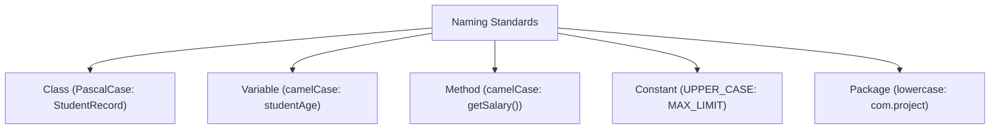

# Naming Conventions in Java

## Introduction

Writing Java programs is not only about making code work; it is also about making code readable, maintainable, and professional. Imagine working in an organization where hundreds of developers collaborate on the same codebase. If everyone uses different naming styles, understanding the code becomes difficult.

To solve this problem, Java follows a set of standard naming conventions. Naming conventions are guidelines that help developers write consistent and understandable code.

---

## What are Naming Conventions?

Naming conventions are rules and recommendations used for naming:
* Classes
* Methods
* Variables
* Constants
* Packages
* Interfaces
* Enums

These conventions improve readability, consistency, maintainability, and team collaboration.

---

## Why Are Naming Conventions Important?

### Without Conventions:
```java
class a {
    int X;
    void ABC() {
        // Unclear purpose
    }
}
```
The code compiles and runs, but understanding its purpose is difficult.

### With Conventions:
```java
class Student {
    int age;
    void displayDetails() {
        // Self-explanatory
    }
}
```
The code becomes self-documenting and easy to read.

---

## Java Naming Standards Overview

| Element | Convention | Example |
| :--- | :--- | :--- |
| **Class** | PascalCase | `Student` |
| **Method** | camelCase | `calculateTotal()` |
| **Variable** | camelCase | `studentAge` |
| **Constant** | UPPER_CASE | `MAX_SIZE` |
| **Package** | lowercase | `com.company.project` |
| **Interface** | PascalCase | `Printable` |
| **Enum** | PascalCase | `Day` |

---

## Class Naming Convention

Classes should use **PascalCase** (also called **Upper Camel Case**), where every word starts with a capital letter.

* **Correct Examples**: `Student`, `BankAccount`, `EmployeeManagementSystem`
* **Incorrect Examples**: `student`, `BANKACCOUNT`, `bank_account`

---

## Variable Naming Convention

Variables should use **camelCase** (also called **Lower Camel Case**), where the first word starts with a lowercase letter, and every following word starts with an uppercase letter.

* **Correct Examples**: `int age`, `double accountBalance`, `String studentName`
* **Incorrect Examples**: `int Age`, `double ACCOUNTBALANCE`, `String student_name`

---

## Method Naming Convention

Methods should use **camelCase** and generally begin with action verbs.

* **Correct Examples**: `calculateSalary()`, `displayStudentDetails()`, `printReport()`, `withdrawMoney()`

---

## Constant Naming Convention

Constants use **UPPER_CASE** with words separated by underscores. They are marked with `final` and `static`.

* **Correct Examples**:
  ```java
  final int MAX_SIZE = 100;
  final double PI_VALUE = 3.14159;
  final String COMPANY_NAME = "OpenAI";
  ```

---

## Package Naming Convention

Packages should always use unique lowercase letters, usually prefixed by a reverse domain name.

* **Correct Examples**: `com.company.project`, `java.util`, `student.management`
* **Incorrect Examples**: `Student.Management`, `JAVA.UTIL`

---

## Boolean Naming Convention

Boolean variables should read naturally like questions (e.g. using `is`, `has`, `can`, `should`).

* **Correct Examples**: `boolean isActive`, `boolean hasPermission`, `boolean canVote`, `boolean shouldExit`

---

## Interface & Enum Naming Conventions

* **Interfaces**: Follow PascalCase and are often named as adjectives describing capabilities.
  ```java
  interface Printable { }
  interface Runnable { }
  ```
* **Enums**: Follow PascalCase.
  ```java
  enum Day {
      MONDAY, TUESDAY, WEDNESDAY
  }
  ```

---

## File Naming Convention

The source file name must exactly match the public class name contained within it, including capitalization.

* **Correct**: `public class Student { }` $\rightarrow$ File: `Student.java`
* **Incorrect**: `public class Student { }` $\rightarrow$ File: `Example.java` (results in compiler error)

---

## Code Example: Good vs. Bad Naming

### Bad Naming Style:
```java
class a {
    int x;
    void abc() {
        // ...
    }
}
```

### Good Naming Style:
```java
class Employee {
    int employeeId;
    void calculateSalary() {
        // ...
    }
}
```

---

## Common Mistakes

1. **Using Single Character Names**: Avoid naming variables `int a;` or `int b;`. Use descriptive names like `int age;` or `int marks;`.
2. **Using Reserved Keywords**: Trying to name a variable `int class;` will cause a compile-time error.
3. **Using Spaces**: Variable names cannot contain spaces (e.g. `int student age;` is incorrect; use `int studentAge;`).

---

## Naming Convention Diagram



---

## Interview Questions (FAQ)

### What naming style is used for classes?
PascalCase (Upper Camel Case).

### What naming style is used for methods?
camelCase (Lower Camel Case).

### How are constants named?
UPPER_CASE separated by underscores.

### How are packages named?
Always in lowercase.

---

## Practice Challenges

1. Create a class `BankAccount` with correct naming conventions.
2. Create camelCase variables for `studentName`, `studentAge`, and `studentMarks`.
3. Create method signatures for `calculateGrade()`, `displayDetails()`, and `printReport()`.
4. Define constant values for `MAX_SPEED`, `MIN_AGE`, and `COMPANY_NAME`.

---

## Key Takeaways

* Classes, interfaces, and enums use PascalCase.
* Variables and methods use camelCase.
* Constants use UPPER_CASE.
* Packages use lowercase.
* Meaningful names improve readability, reducing documentation overhead.

---

**Back to Module Home:** [Naming Conventions & Packages](README.md)
