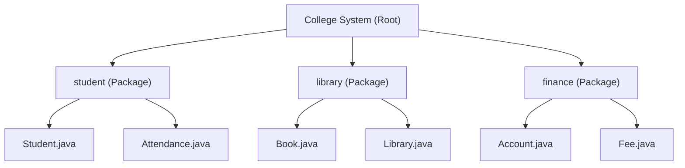
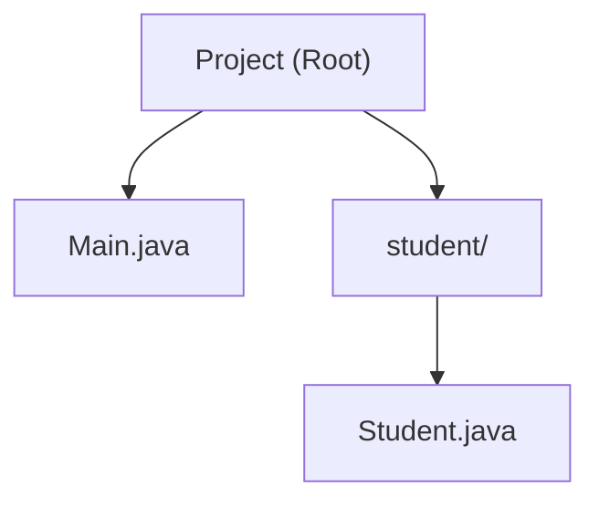
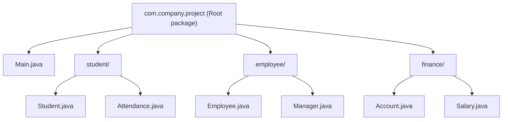

# Packages in Java

## Introduction

As applications grow larger, managing hundreds or thousands of classes in a single folder becomes extremely difficult. Imagine a college management system with several dozen classes:
* `Student.java`
* `Teacher.java`
* `Department.java`
* `Attendance.java`
* `Library.java`
* `Book.java`
* `Account.java`
* `Fee.java`

If all these files are stored in a single folder, the project becomes disorganized. To solve this scalability problem, Java provides **Packages**, which help organize related classes and interfaces into separate namespace directories.

---

## What is a Package?

A **Package** is a container that groups a set of related classes, interfaces, enums, and sub-packages. Think of a package like a folder on your computer's storage drive.



Each subdirectory represents a namespace package.

---

## Why Do We Need Packages?

Packages provide key advantages:
1. **Better Code Organization**: Related items stay in designated folders.
2. **Name Conflict Prevention**: Two classes in different packages can share the same name (e.g. `student.Student` vs `teacher.Student`).
3. **Access Control**: Packages form access boundaries; package-private (default) access limits visibility to elements in the same package.
4. **Reusability**: Grouped packages can be easily imported into other software projects.

---

## Types of Packages

Java supports two types of packages:

### 1. Built-in Packages
These are standard library packages provided by Java SE (JRE).
* `java.lang`: Core classes automatically imported (e.g., `String`, `System`, `Math`).
* `java.util`: Collections framework, date-time utilities, and scanners.
* `java.io`: Input-output stream handlers for files.
* `java.time`: Java 8 modern date and time APIs.
* `java.sql`: Database connectivity drivers and utilities.

### 2. User-Defined Packages
These are custom packages created by developers for organizing their own application code.
* `student.management`
* `college.library`
* `com.company.project`

---

## Package Naming Conventions

Packages should always be written in **all lowercase letters** to prevent conflicts with class names. When publishing globally, use your company's reverse domain name:
* **Correct**: `student.management`, `college.library`, `com.company.project`
* **Incorrect**: `Student.Management`, `COLLEGE.LIBRARY`, `PACKAGE1`

---

## Creating Your First Package

### Step 1: Create a Folder
Create a physical folder named `student` on your system.

### Step 2: Create a Java File (`Student.java`)
Declare the package at the very first line of the file:
```java
package student;

public class Student {
    public void display() {
        System.out.println("Hello from the Student Class!");
    }
}
```

---

## Importing and Using a Package Class

To use a class defined in another package, you must import it using the `import` statement.

### Creating the Entry Point (`Main.java`):
```java
import student.Student; // Import statement

public class Main {
    public static void main(String[] args) {
        Student s = new Student();
        s.display(); // Prints: Hello from the Student Class!
    }
}
```

### Corresponding Folder Hierarchy:


---

## Star Wildcard Imports vs. Specific Imports

To import all public classes inside a package, use the asterisk wildcard symbol `*`:
```java
import java.util.*; // Imports Scanner, ArrayList, HashMap, etc.
```

> [!TIP]
> Explicit imports (e.g. `import java.util.Scanner;`) are preferred over wildcard imports in production because they improve compilation efficiency and make class dependencies explicit.

---

## Fully Qualified Names

Instead of importing a class, you can refer to it directly using its fully qualified name:
```java
public class Main {
    public static void main(String[] args) {
        // No import statement required
        java.util.Scanner sc = new java.util.Scanner(System.in);
        System.out.println("Hello");
    }
}
```
Fully qualified names are helpful when two classes with identical names from different packages are needed in the same file (e.g. `java.util.Date` and `java.sql.Date`).

---

## Sub-Packages

Packages can contain other packages nested inside them, separated by dots:
```java
package college.student;

public class Student {
    // Stored in the path: college/student/Student.java
}
```

---

## Real-World Project Structure



---

## Common Mistakes

### 1. Forgetting the Package Statement
If you place a file inside a package folder (e.g. `student/`), you must declare `package student;` at the top of the file, otherwise Java assumes the class belongs to the default unnamed package.

### 2. Mismatched Folder Structures
If your file declares `package com.project;`, the class file must physically reside in the folder structure `com/project/`.

---

## Interview Questions (FAQ)

### What is the default package in Java?
If no package is specified, the class is placed in the default, unnamed package. It is recommended to always use packages for real-world projects.

### What is the difference between `import package.*` and `import package.Class`?
`import package.*` imports all classes in that package, whereas `import package.Class` imports only the specific class, reducing name collisions.

### Which package is automatically imported by Java?
`java.lang` is imported implicitly into every Java source file.

---

## Practice Challenges

1. Create a package `library` containing class `Book`. Import and instantiate it from a `Main` class outside the package.
2. Initialize a `java.util.Scanner` using its fully qualified name inside a program without importing it.
3. Establish nested sub-packages `college.student` and `college.library`.

---

## Key Takeaways

* Packages organize classes, preventing naming collisions.
* User-defined package naming conventions suggest using a reverse domain name (`com.company.module`).
* Star wildcard imports import everything inside a package but not inside its sub-packages.
* The `java.lang` package is imported automatically.

---

**Back to Module Home:** [Naming Conventions & Packages](README.md)
