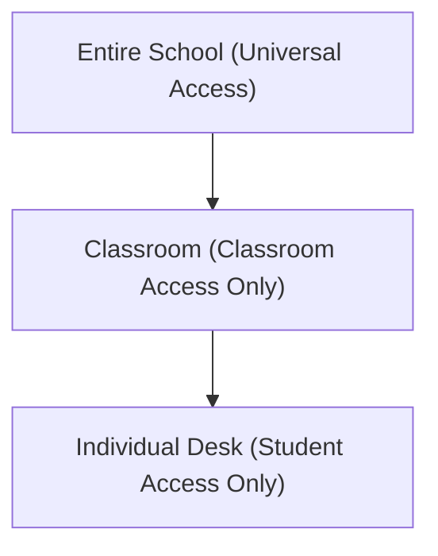
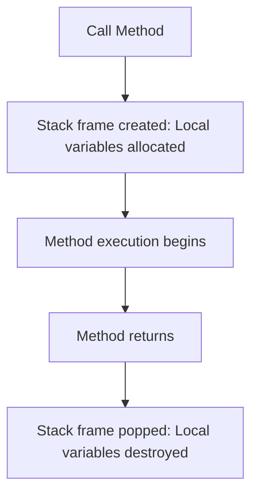

# Scope in Java

## Introduction

In Java, variables are not accessible everywhere in your program. Every variable has a specific boundary or region within the source code where it is visible and can be accessed. This region is called the variable's **Scope**.

Understanding scope is essential for:
* **Preventing Data Corruption**: Ensuring components only modify data they own.
* **Improving Readability**: Defining clear scopes makes class dependencies obvious.
* **Debugging**: Minimizing naming overlaps and accidental state modifications.
* **Memory Management**: Allowing JVM garbage collection to reclaim memory as soon as variables fall out of scope.

---

## What is Scope?

Scope defines the visibility boundaries of variables, methods, and class objects.

```java
public class Main {
    public static void main(String[] args) {
        int age = 21;
        System.out.println(age); // Valid: age is within this scope
    }
}
```
In this example, the variable `age` is declared inside `main()` and cannot be accessed outside of it.

---

## Real-World Analogy: Security Access

Imagine access boundaries within a school building:



In Java classes, scopes are structured in a similar nested hierarchy:
* **Class Scope**: Variables accessible by any method in the class (like the school Principal).
* **Method Scope**: Variables accessible only within the declaring method (like the class teacher).
* **Block Scope**: Variables restricted to a specific loop or condition block (like the student's desk).

---

## Types of Scope in Java

The three primary scopes in Java are:

### 1. Class Scope (Instance Variables / Fields)
Variables declared inside a class but outside any methods belong to Class Scope. These are called **Instance Variables** or **Fields** and are accessible to all non-static methods in the class.

```java
public class Student {
    String name = "Sanjay"; // Class Scope variable

    public void display() {
        System.out.println(name); // Valid
    }

    public void print() {
        System.out.println(name); // Valid
    }
}
```

---

### 2. Local Scope (Method Scope)
Variables declared inside a method belong to Local Scope. They are allocated when the method is called and destroyed when the method exits.

#### Valid Local Scope:
```java
public class Main {
    public static void main(String[] args) {
        int age = 21; // Local variable
        System.out.println(age);
    }
}
```

#### Invalid Local Scope (Compiler Error):
```java
public class Main {
    public static void main(String[] args) {
        int age = 21;
    }

    public static void display() {
        System.out.println(age); // Compiler Error: age cannot be resolved
    }
}
```

---

### 3. Block Scope
Variables declared inside loops (`for`, `while`), branch checks (`if`, `switch`), or arbitrary brace blocks `{}` exist only within those braces.

#### Valid Block Scope:
```java
public class Main {
    public static void main(String[] args) {
        if (true) {
            int marks = 95; // Block scope variable
            System.out.println(marks); // Valid
        }
    }
}
```

#### Invalid Block Scope (Compiler Error):
```java
public class Main {
    public static void main(String[] args) {
        if (true) {
            int marks = 95;
        }
        System.out.println(marks); // Compiler Error: marks is out of scope here
    }
}
```

---

## Nested Block Rules

Java scopes are nested:
* **Inner scopes can access outer variables.**
* **Outer scopes cannot access inner variables.**

```java
public class Main {
    public static void main(String[] args) {
        int outerVar = 10;

        if (true) {
            int innerVar = 20;
            System.out.println(outerVar); // Valid: Inner blocks access outer variables
            System.out.println(innerVar); // Valid
        }
        // System.out.println(innerVar); // Invalid: Outer blocks cannot access inner variables
    }
}
```

---

## Variable Shadowing

If a local scope variable shares the same name as a class field, the local variable hides (or **shadows**) the class field within that method.

```java
public class Student {
    String name = "Sanjay"; // Class field

    public void display() {
        String name = "Rahul"; // Shadows the class field
        System.out.println(name); // Prints: Rahul
    }
}
```

### Accessing Shadowed Fields using `this`:
To reference the shadowed class field, prefix it with the **`this`** keyword:
```java
public class Student {
    String name = "Sanjay";

    public void display() {
        String name = "Rahul";
        System.out.println(name);      // Prints local: Rahul
        System.out.println(this.name); // Prints class field: Sanjay
    }
}
```

---

## Scope Lifecycle Flow



---

## Common Mistakes

### 1. Accessing Block Variables Outside Loops
```java
for (int i = 0; i < 5; i++) {
    // i is in scope here
}
System.out.println(i); // Compiler Error: i is out of scope
```

### 2. Redeclaring Variables in the Same Scope
You cannot define two variables with the same identifier in the exact same scope:
```java
int age = 20;
int age = 25; // Compiler Error: variable age is already defined
```

---

## Interview Questions (FAQ)

### Can outer blocks access inner variables?
No. Scope only travels downwards into nested blocks, not upwards.

### What is the lifetime of a local variable vs an instance variable?
A local variable lives on the stack frame and is destroyed when its declaring method returns. An instance variable lives on the heap within its containing object and persists until the object is garbage-collected.

### Does Java support global variables?
Java does not support global variables to enforce encapsulation. Instead, you use public static variables (class variables) if a globally accessible state is necessary.

---

## Practice Challenges

1. Write a code example demonstrating how variable shadowing affects parameter values inside constructors.
2. Build an `if` block nesting inside a `for` loop and access a variable declared at the method root.
3. Call a shadowed class variable inside an instance method using `this`.

---

## Key Takeaways

* Scope governs the accessibility and lifetime of variable references.
* Instance variables are available throughout the class body.
* Local variables are confined to method execution frames.
* Block variables are restricted to local braces `{}`.
* Shadowing occurs when local names collide with outer names.

---

**Back to Module Home:** [Naming Conventions & Packages](README.md)
