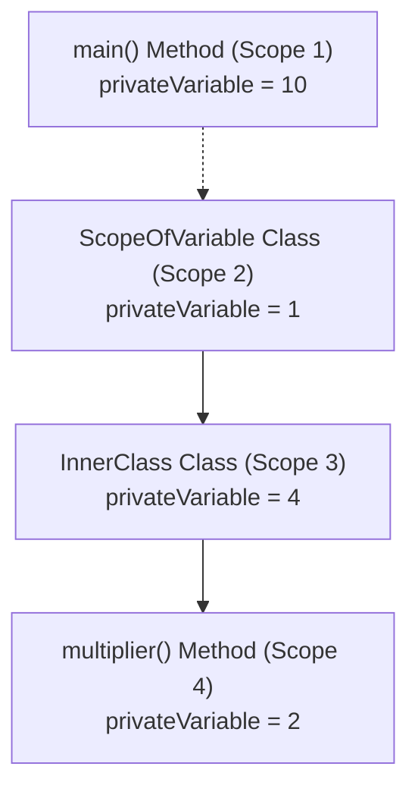
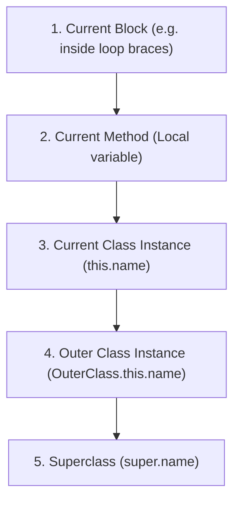

# Scope Resolution Example in Java

## Introduction

In this chapter, we will examine a practical Java program that demonstrates how the JVM resolves scope and handles naming conflicts when the same variable identifier exists in multiple nested scopes.

Understanding these scoping rules is critical for diagnosing variable shadowing issues and is a frequent topic in Java technical interviews.

This program demonstrates:
* Class-level fields (Instance scope)
* Method-level variables (Local scope)
* Nested loop variables (Block scope)
* Variable Shadowing (Scope collision)
* The `this` keyword (Current instance reference)
* Outer class reference using `OuterClass.this` within inner classes

---

## The Problem Statement

Create a program that defines a duplicate variable name (`privateVariable`) across multiple nested levels:
1. Inside the `main()` method of the runner class.
2. Inside an outer class `ScopeOfVariable`.
3. Inside an instance method `multiplier()` of the outer class.
4. Inside an inner class `InnerClass` of the outer class.
5. Inside the inner class's method `multiplier()`.

The program must demonstrate how to retrieve each specific variable value, highlighting how Java's compiler resolves variable namespace shadowing.

---

## Code Implementation

### `ScopeOfVariable.java` (Including `InnerClass` and `Main` runner):
```java
public class ScopeOfVariable {
    public int publicVariable = 1;
    private int privateVariable = 1; // Outer Class Field

    public void checkingScope() {
        System.out.println("Outer Class Variables -> Private: " + privateVariable + 
                           " | Public: " + publicVariable);
    }

    public int getPrivateVariable() {
        return privateVariable;
    }

    public void multiplier() {
        int privateVariable = 3; // Shadows Outer Class Field inside this method

        for (int i = 0; i < 5; i++) {
            // this.privateVariable refers to the outer class field (value: 1)
            // privateVariable refers to the local method variable (value: 3)
            System.out.println(i + " multiplied by " + this.privateVariable + 
                               " is: " + (i * this.privateVariable));
        }
    }

    // Member Inner Class
    public class InnerClass {
        int privateVariable = 4; // Inner Class Field

        public InnerClass() {
            System.out.println("InnerClass Constructor -> privateVariable: " + privateVariable);
        }

        public void multiplier() {
            int privateVariable = 2; // Shadows Inner Class Field inside this method

            for (int i = 0; i < 5; i++) {
                // ScopeOfVariable.this.privateVariable resolves to the Outer class field (value: 1)
                // this.privateVariable resolves to the InnerClass field (value: 4)
                // privateVariable resolves to the local method variable (value: 2)
                System.out.println(i + " multiplied by outer field " + 
                                   ScopeOfVariable.this.privateVariable + " is: " + 
                                   (i * ScopeOfVariable.this.privateVariable));
            }
        }
    }
}
```

### `Main.java` (Runner Class):
```java
public class Main {
    public static void main(String[] args) {
        int privateVariable = 10; // Local variable inside main()

        ScopeOfVariable scopeCheck = new ScopeOfVariable();
        ScopeOfVariable.InnerClass innerClass = scopeCheck.new InnerClass();

        innerClass.multiplier();
    }
}
```

---

## Expected Output

```text
InnerClass Constructor -> privateVariable: 4
0 multiplied by outer field 1 is: 0
1 multiplied by outer field 1 is: 1
2 multiplied by outer field 1 is: 2
3 multiplied by outer field 1 is: 3
4 multiplied by outer field 1 is: 4
```

---

## Nested Variable Scope Hierarchy

Below is the hierarchy of variables named `privateVariable` defined across different scopes:



---

## Variable Resolution Search Order

When resolving an identifier, the compiler searches from the closest local scope outwards:



The JVM resolves to the first matching name it finds in this upward search.

---

## How Names are Disambiguated

### 1. `this.privateVariable`
When evaluated inside the context of `InnerClass`, the keyword `this` points to the `InnerClass` instance, resolving `privateVariable` to the value `4`.

### 2. `ScopeOfVariable.this.privateVariable`
Because an inner class contains an implicit reference to its outer class creator instance, `ScopeOfVariable.this` allows the inner class to reference the outer class scope directly, resolving `privateVariable` to the value `1`.

---

## Key Takeaways

* Local method variables shadowing instance variables can be bypassed by using the keyword `this`.
* Member inner classes have direct access to private members of the enclosing outer class.
* When names collide in nested classes, the syntax `OuterClassName.this.fieldName` resolves enclosing parent fields.
* Variable shadowing does not overwrite memory; it temporarily hides visibility in local scope.

---

**Back to Module Home:** [Naming Conventions & Packages](README.md)
