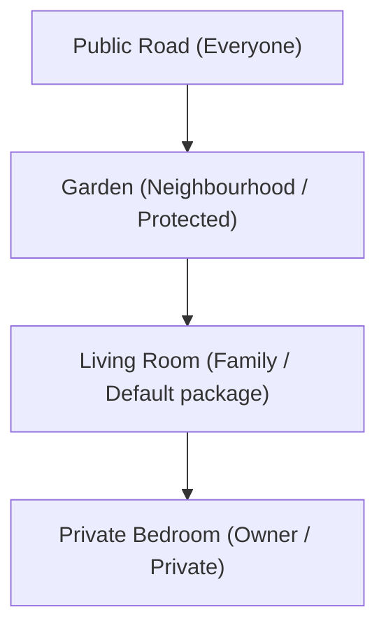
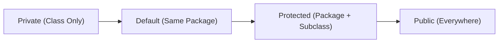

# Visibility and Access Control in Java

## Introduction

When developing Java applications, controlling **who can access your variables, methods, constructors, and classes** is essential for maintaining application security and stability.

Imagine a bank account. You do not want arbitrary class objects to modify your balance directly. Instead, you restrict access and provide public, checked methods for depositing or withdrawing funds.

Java provides **Access Modifiers** to control the visibility of class members. Visibility determines **where a member can be accessed**.

---

## What is Visibility?

Visibility defines the accessibility boundary of a class, variable, method, or constructor. Java provides four levels of access:
* **Public**: Accessible from any class in any package.
* **Protected**: Accessible within the same package and by child subclasses in other packages.
* **Default (Package-Private)**: Accessible only within the same package.
* **Private**: Accessible only within the declaring class.

---

## Why Do We Need Access Control?

Suppose we declare a simple class:
```java
class BankAccount {
    double balance = 50000;
}
```
Any external code could change this value directly:
```java
account.balance = -100000; // Dangerous direct modification
```

To prevent this, make the field `private` and regulate updates through accessor methods:
```java
public class BankAccount {
    private double balance = 50000;

    public void withdraw(double amount) {
        if (amount > 0 && amount <= balance) {
            balance -= amount;
        }
    }
}
```

---

## Access Modifiers Matrix

| Access Modifier | Same Class | Same Package | Subclass (Diff Package) | Different Package |
| :--- | :---: | :---: | :---: | :---: |
| **`public`** | Yes | Yes | Yes | Yes |
| **`protected`** | Yes | Yes | Yes | No |
| **`default`** (no keyword) | Yes | Yes | No | No |
| **`private`** | Yes | No | No | No |

---

## Access Levels Deep-Dive

### 1. Public Access Modifier
A public member can be accessed from any class or package.

```java
package student;

public class Student {
    public String name = "Sanjay";
}
```
```java
package main;
import student.Student;

public class Main {
    public static void main(String[] args) {
        Student s = new Student();
        System.out.println(s.name); // Valid: name is public
    }
}
```

---

### 2. Private Access Modifier
Private members are accessible only within the declaring class. They are used to implement **Encapsulation**.

```java
public class Student {
    private int age = 20;

    public int getAge() {
        return this.age; // Exposes read access safely
    }
}
```
```java
Student s = new Student();
// System.out.println(s.age); // Compiler Error: age has private access in Student
```

---

### 3. Default Access (Package-Private)
If no access modifier is specified, Java defaults to package-private. Members are visible to all classes inside the same package, but hidden from external packages.

```java
package student;

class Student {
    String name = "Sanjay"; // Default access
}
```
```java
package student;

public class Main {
    public static void main(String[] args) {
        Student s = new Student();
        System.out.println(s.name); // Valid: Same package
    }
}
```

---

### 4. Protected Access Modifier
Protected members are accessible inside the same package, and by child subclasses (via inheritance) even if the subclass is in a different package.

```java
package parent;

public class Animal {
    protected void sound() {
        System.out.println("Generic Animal Sound");
    }
}
```
```java
package child;
import parent.Animal;

class Dog extends Animal {
    public void bark() {
        sound(); // Valid: Inherited protected method
    }
}
```

---

## Real-World Analogy: Access Boundaries

Imagine the levels of privacy in a residential home:



---

## Access Modifier Scoping Hierarchy

Visibility ranges from the most restrictive (`private`) to the most open (`public`):



---

## Best Practices

1. **Default to Private**: Make all class variables private. Expose them only when necessary via getters and setters.
2. **Encapsulate Mutable State**: Avoid exposing public fields unless they are marked `final` and `static`.
3. **Use Protected for Extension**: Use `protected` for fields or helper methods intended to be overridden or accessed by child classes.

---

## Interview Questions (FAQ)

### What is package-private access?
It is the default access level in Java when no modifier is written. It restricts visibility to classes residing in the same package.

### Can a top-level outer class be declared `private` or `protected`?
No. Top-level classes can only be declared `public` or `default` (package-private). Inner member classes, however, can be declared with any of the four access levels.

### Why should you avoid public fields?
Public fields break encapsulation, allowing external code to bypass validation rules and corrupt state variables.

---

## Practice Challenges

1. Create a `BankAccount` class with encapsulated private fields. Implement checks inside getters and setters.
2. Create two classes in separate packages. Try accessing a default-access field and document the compiler error.
3. Subclass a class in another package and invoke a protected helper method.

---

## Key Takeaways

* Java features four access levels: public, protected, default, and private.
* Access modifiers regulate encapsulation boundaries.
* Default access (package-private) does not require a keyword.
* Protected access extends package-level access to child subclasses across other packages.

---

**Back to Module Home:** [Naming Conventions & Packages](README.md)
