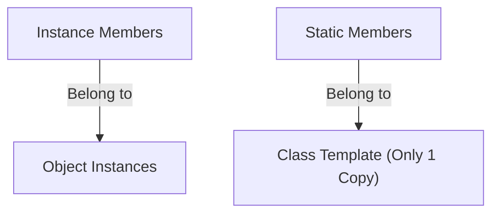
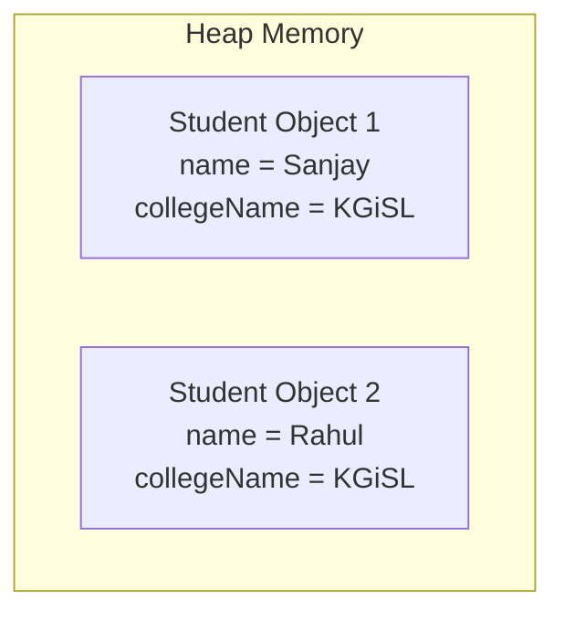
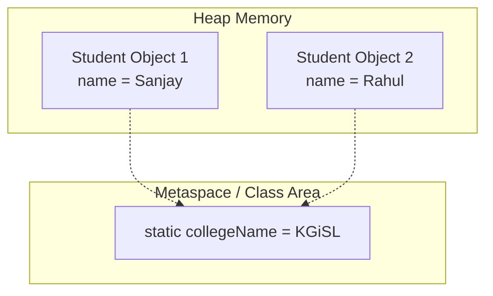

# Static Keyword in Java

## Introduction

So far, we have explored instance variables, methods, constructors, and inheritance. When we create an object, Java allocates a distinct block of memory on the Heap for its instance variables.

However, we sometimes need a variable or method that belongs to the **class itself** rather than to individual object instances. Java provides the **`static`** keyword for this purpose.

---

## What is the Static Keyword?

The `static` keyword in Java is a non-access modifier used to declare fields, methods, initialization blocks, or nested classes that belong to the **class template** rather than to object instances.



---

## Why Do We Need Static?

Imagine a college with 10,000 students. Every student belongs to the same college. 

### Without static:
```java
class Student {
    String name;
    String collegeName = "KGiSL"; // Duplicated in memory 10,000 times
}
```

### With static:
```java
class Student {
    String name;
    static String collegeName = "KGiSL"; // Stored once in Class Area
}
```

---

## Memory Representation: Instance vs. Static Variables

### 1. Instance Variables (No `static` keyword)
Every object contains its own duplicate copy of the field, increasing Heap consumption:



### 2. Static Variables (With `static` keyword)
Only a single shared copy of the variable exists in the Class Area (Metaspace):



---

## Static Variables

A static variable (also called a **Class Variable**) is shared among all instances of a class.

```java
public class Student {
    String name;
    static String college = "KGiSL"; // Shared static field

    Student(String name) {
        this.name = name;
    }

    public void display() {
        System.out.println(name + " studies at " + college);
    }

    public static void main(String[] args) {
        Student s1 = new Student("Sanjay");
        Student s2 = new Student("Rahul");

        s1.display(); // Sanjay studies at KGiSL
        s2.display(); // Rahul studies at KGiSL
    }
}
```

---

## Instance Variables vs. Static Variables

| Feature | Instance Variables | Static Variables |
| :--- | :--- | :--- |
| **Ownership** | Belong to the object instance | Belong to the class template |
| **Memory Copies** | A copy is created per object | Only one copy exists in Metaspace |
| **Access Syntax** | Accessed via reference (`object.field`) | Accessed via Class name (`Class.field`) |
| **Allocation Time** | Allocated when calling `new` | Allocated once when the class is loaded |

---

## Static Methods

A method declared with `static` belongs to the class itself and can be called directly without instantiating the class.

```java
public class MathUtility {
    public static int square(int n) {
        return n * n;
    }

    public static void main(String[] args) {
        // Invoked directly without creating an object
        System.out.println(MathUtility.square(5)); // Prints: 25
    }
}
```

---

## Rules of Static Methods

* **Can access static variables** and call other static methods directly.
* **Cannot access instance variables** or invoke instance methods directly (must instantiate an object first).
* **Cannot use the `this` or `super` keywords**, since they point to active object instances.

### Invalid Static Access (Compiler Error):
```java
public class Student {
    String name = "Sanjay"; // Instance variable

    public static void display() {
        // System.out.println(name); // Compiler Error: static context cannot access non-static field
    }
}
```

### Correct Static Access:
```java
public class Student {
    static String college = "KGiSL"; // Static variable

    public static void display() {
        System.out.println(college); // Valid
    }
}
```

---

## Why is `main()` Static?

The entry point of every Java program is:
```java
public static void main(String[] args)
```
If `main()` were not static, the JVM would have to instantiate the containing class before executing the program. Declaring it `static` allows the JVM to boot the program directly:
```text
JVM Starts -> Loads Class -> Resolves main() -> Launches Program
```

---

## Static Blocks (Static Initializers)

A static block runs automatically **only once** when the class is first loaded into JVM memory. It is typically used to initialize static fields or load native drivers.

```java
public class Main {
    static {
        System.out.println("Static Block Executed");
    }

    public static void main(String[] args) {
        System.out.println("Main Method Executed");
    }
}
```

### Output:
```text
Static Block Executed
Main Method Executed
```

---

## Static Nested Classes

A class defined inside another class can be declared `static`. Unlike inner member classes, a static nested class does not hold an implicit reference to its outer class instances and cannot access outer instance fields directly.

```java
class Outer {
    static class Inner {
        void display() {
            System.out.println("Inside Static Nested Class");
        }
    }
}

// Instantiation: does not require an Outer class instance
Outer.Inner nestedObj = new Outer.Inner();
```

---

## Static Imports

Static imports allow accessing static members directly without prefixing them with their class names:

```java
import static java.lang.Math.*; // Static Import

public class Main {
    public static void main(String[] args) {
        // sqrt() instead of Math.sqrt()
        System.out.println(sqrt(25.0)); // Prints: 5.0
    }
}
```

---

## Common Mistakes

1. **Accessing Instance Variables directly inside Static Methods**: Always instantiate the class if you need non-static variables inside static methods.
2. **Accessing Static Members via Object Instances**: Writing `s1.collegeName` compiles but is bad practice. Always write `Student.collegeName` to indicate class-level scope.

---

## Interview Questions (FAQ)

### What is the static keyword in Java?
It designates a member (variable, method, or class) as belonging to the class template itself, meaning it is shared across all class objects.

### Can we override a static method?
No. Static methods are resolved using static binding at compile time, not dynamic dispatch at runtime. Defining a static method with the same signature in a child class is called **Method Hiding**, not method overriding.

---

## Practice Challenges

1. Create a `Student` class containing a static field `objectCount` that increments inside constructors to track object creation count.
2. Build a utility class `Converter` containing static methods `celsiusToFahrenheit` and `fahrenheitToCelsius`.
3. Chain multiple `static` blocks and examine their sequential execution order.

---

## Key Takeaways

* Static members belong to the class template, not to instances.
* Only a single copy of a static variable is stored in Metaspace.
* Static methods cannot access instance variables or use `this` / `super`.
* Static initializers execute when the class is first loaded.

---

**Back to Module Home:** [Naming Conventions & Packages](README.md)
