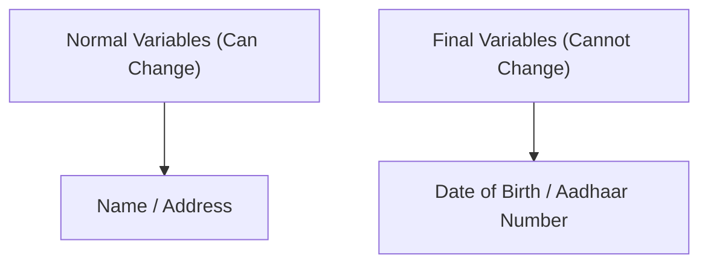
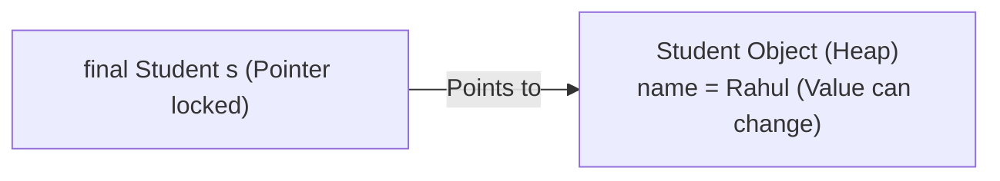
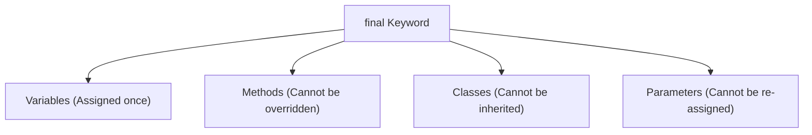

# Final Keyword in Java

## Introduction

While developing Java applications, there are situations where we want to prevent modifications to variables, methods, or classes.

For example:
* A student's Roll Number should never change once allocated.
* The mathematical constant $\pi$ (PI) should remain constant.
* A security validation class should not be inherited by child subclasses.
* A core calculation method should not be overridden.

To achieve this, Java provides the **`final`** keyword. The `final` keyword is a non-access modifier used to restrict modifications.

---

## What is the Final Keyword?

The `final` keyword can be applied to four distinct locations:
* **Variables**: Prevents value changes.
* **Methods**: Prevents method overriding.
* **Classes**: Prevents class inheritance.
* **Parameters**: Prevents reassignment inside the method body.

---

## Real-World Analogy: Personal Identity

Compare variables with personal characteristics:



---

## Final Variables

A final variable can be assigned a value only once. Attempting to reassign it throws a compile-time error.

```java
public class Main {
    public static void main(String[] args) {
        final int AGE = 20;
        // AGE = 30; // Compiler Error: cannot assign a value to final variable AGE
        System.out.println(AGE);
    }
}
```

---

## Final Variables with Object References

When an object reference is marked `final`, it means the **reference pointer** cannot change to point to a different object. However, the **fields (data) inside the object can still be modified** (unless those internal fields are also marked final).

```java
class Student {
    String name = "Sanjay";
}

public class Main {
    public static void main(String[] args) {
        final Student s = new Student(); // s is a final reference

        s.name = "Rahul"; // Valid: modifies internal data
        System.out.println(s.name); // Prints: Rahul

        // s = new Student(); // Compiler Error: cannot reassign final variable s
    }
}
```

### Reference Pointer Visualization:



---

## Final Methods

A method marked `final` cannot be overridden by subclasses. This is useful for locking core algorithms and security policies.

```java
class Animal {
    public final void sound() {
        System.out.println("Animal Sound");
    }
}

class Dog extends Animal {
    // @Override
    // public void sound() { } // Compiler Error: cannot override final method from Animal
}
```

---

## Final Classes

A class marked `final` cannot be extended. This prevents other developers from inheriting it and changing its behavior.

```java
final class Animal {
    // Class body
}

// class Dog extends Animal { } // Compiler Error: cannot inherit from final class Animal
```

> [!NOTE]
> Java's standard `java.lang.String` class is final. This is a security measure to ensure nobody can subclass `String` and alter basic string behaviors in the JVM.

---

## Final Parameters

Marking a parameter as `final` prevents it from being re-assigned another value inside the method body.

```java
public class Main {
    public void display(final int number) {
        // number = 100; // Compiler Error: final parameter number cannot be assigned
        System.out.println(number);
    }
}
```

---

## Blank Final Variables

A final variable that is not initialized at its declaration is called a **Blank Final Variable**. It must be initialized in every constructor of the class, otherwise the compiler throws an error.

```java
class Student {
    final int rollNo; // Blank final variable

    // Initialized inside constructor
    Student(int rollNo) {
        this.rollNo = rollNo;
    }
}
```

---

## Final vs. Static Final

* **`final` variable**: Belongs to an individual object instance. Each object can have a different constant value initialized via constructors.
* **`static final` variable**: Belongs to the class. There is only one copy in memory, initialized at class load. It is used to define global constants.

```java
class MathConstants {
    static final double PI = 3.14159; // Global Constant
}
```

---

## Final vs. Finally vs. Finalize()

| Term | Category | Purpose |
| :--- | :--- | :--- |
| **`final`** | Keyword | Non-access modifier restricting modification of variables, methods, and classes. |
| **`finally`** | Block | Try-catch handler block that always executes for cleanup code. |
| **`finalize()`** | Method | Legacy garbage-collection method called by JVM before reclaiming object memory (deprecating). |

---

## Final Keyword Scope Diagram



---

## Interview Questions (FAQ)

### Can we initialize a blank final variable inside an instance method?
No. Blank final variables can only be initialized at declaration or inside constructors.

### Are all methods inside a final class implicitly final?
Yes. Since the class itself cannot be extended, none of its methods can be overridden, effectively making all its methods final.

---

## Practice Challenges

1. Create a class `Circle` containing a `static final` constant for `PI`. Calculate the area of a circle.
2. Implement a class containing a blank final variable for `accountNumber` and initialize it via the constructor.
3. Write a parent class with a final method and verify the compiler output when trying to override it.

---

## Key Takeaways

* `final` restricts changes to variables, methods, and classes.
* Final variables are read-only after initialization.
* Final methods prevent child subclass overrides.
* Final classes prevent inheritance.
* `static final` is used to declare immutable global constants.

---

**Back to Module Home:** [Naming Conventions & Packages](README.md)
