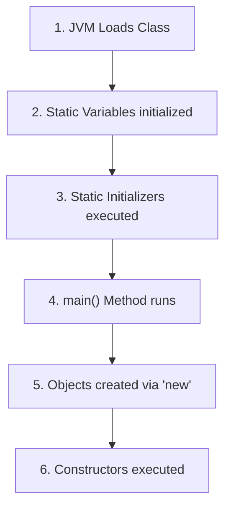

# Static Initializers in Java

## Introduction

In Java, we occasionally need to execute initialization logic **before the `main()` method runs**.

For example:
* Loading configuration properties from a file.
* Establishing a shared database connection.
* Initializing complex static arrays or static mappings.
* Printing diagnostic startup or license messages.
* Loading native library drivers (`.dll` / `.so`).

Instead of cluttering the `main()` method with these concerns, Java provides **Static Initializers** (also called **Static Blocks**). A static block executes **exactly once** when the class is first loaded into JVM memory.

---

## What is a Static Initializer?

A **Static Initializer** is a block of code marked with the `static` keyword that is run automatically by the class loader before constructors or the `main()` method are executed.

```java
static {
    // Initialization code goes here
}
```

---

## Startup Execution Sequence Flow

When a Java program starts, the JVM loads classes and executes members in a strict sequence:



---

## Code Example: First Static Block Program

```java
public class Main {
    // Static block
    static {
        System.out.println("Static Block Executed");
    }

    public static void main(String[] args) {
        System.out.println("Main Method Executed");
    }
}
```

### Output:
```text
Static Block Executed
Main Method Executed
```

---

## Multiple Static Blocks

A class can define multiple static blocks. They are executed **sequentially from top to bottom** as they appear in the source code.

```java
public class Main {
    static {
        System.out.println("First Static Block");
    }

    static {
        System.out.println("Second Static Block");
    }

    public static void main(String[] args) {
        System.out.println("Main Method");
    }
}
```

### Output:
```text
First Static Block
Second Static Block
Main Method
```

---

## Static Blocks and Object Creation

Static blocks run **only once** when the class loader loads the class. Constructors, however, execute **every time** a new object instance is created.

```java
public class Main {
    static {
        System.out.println("Static Block Executed (Once)");
    }

    public Main() {
        System.out.println("Constructor Executed");
    }

    public static void main(String[] args) {
        Main obj1 = new Main();
        Main obj2 = new Main();
    }
}
```

### Output:
```text
Static Block Executed (Once)
Constructor Executed
Constructor Executed
```

---

## Static Initializer Limits

* **Can access static variables** and invoke static methods.
* **Cannot access instance variables** or call instance methods directly, because no object instance has been instantiated yet.
* **Cannot throw checked exceptions** directly. They must be wrapped inside a `try-catch` block inside the static initializer.

### Invalid Instance Variable Access (Compiler Error):
```java
public class Student {
    int age = 20; // Instance field

    static {
        // System.out.println(age); // Compiler Error: non-static field access in static block
    }
}
```

---

## Static Blocks vs. Constructors

| Metric | Static Initializers | Constructors |
| :--- | :--- | :--- |
| **Execution Frequency** | Executes exactly once per class load | Executes once per object creation |
| **Boot Order** | Runs before `main()` and object creation | Runs after object creation |
| **Context** | Class-level (cannot use `this` / `super`) | Instance-level (can use `this` / `super`) |
| **Purpose** | Initializing class-wide constant configurations | Initializing unique object instance fields |

---

## Real-World Case Study: Database Driver Load

Static blocks are commonly used to load configuration drivers. This ensures the driver is prepared and loaded once before any database transactions occur:

```java
class DatabaseManager {
    static {
        System.out.println("Oracle JDBC Driver loaded successfully.");
        // Driver registration logic goes here...
    }
}
```

---

## Common Mistakes

### 1. Trying to reuse static blocks for instance data
Instance variables change per object; static blocks execute before objects exist. Always use constructors for instance data.

### 2. Throwing exceptions from static blocks
If a static block throws an uncaught exception, it will fail to load the class, resulting in a `java.lang.ExceptionInInitializerError`.

---

## Interview Questions (FAQ)

### What happens if a class only contains a static block and no `main()` method?
Prior to Java 7, you could execute static blocks without a `main()` method using a workaround, but in modern Java versions, the JVM requires a `main()` method to start execution. The class loader will fail with `NoSuchMethodError` before static blocks are executed if `main()` is missing.

### Can we call a static block explicitly?
No. Static blocks are called implicitly by the JVM class loader.

---

## Practice Challenges

1. Create a class containing static blocks, static variables, instance variables, and a constructor. Document their console print sequence.
2. Initialize a static `HashMap` containing country codes (e.g. `US -> United States`) inside a static initializer block.
3. Write a static block that loads configurations and safely handles potential exceptions using `try-catch`.

---

## Key Takeaways

* Static initializers run when the class loader loads the class.
* They run before `main()` and any object instantiation.
* Multiple static blocks execute sequentially from top to bottom.
* They can only access static fields and methods.

---

**Back to Module Home:** [Naming Conventions & Packages](README.md)
