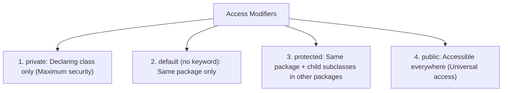

# Module 07: Naming Conventions & Packages in Java

Welcome to the **Naming Conventions, Packages, Scopes, and Modifiers** module! This guide outlines the learning objectives, lesson structure, core concepts, and interview FAQs for organizing, securing, and naming elements in professional Java applications.

---

## Learning Objectives

By the end of this module, you will understand:
1. **Naming Conventions**: Standard Java syntax styles (PascalCase, camelCase, UPPER_CASE).
2. **Packages**: How to structure files, prevent naming conflicts, and use standard APIs.
3. **Scopes**: The differences between local, block, class, and outer scopes.
4. **Access Control**: Regulating member visibility (public, protected, default, private).
5. **Class Modifiers**: Utilizing the `static` and `final` keywords to control memory allocation and mutability.

---

## Lessons Map

| Lesson | Title | Description |
| :---: | :--- | :--- |
| **01** | [Naming Conventions in Java](01_Naming-Conventions-in-Java.md) | Standard coding formatting styles for classes, variables, methods, and packages. |
| **02** | [Packages in Java](02_Packages-in-Java.md) | Folder-level organisation, namespaces, built-in vs. user-defined packages, and imports. |
| **03** | [Scope in Java](03_Scope-in-Java.md) | Boundary levels, variable shadow rules, and stack frame lifecycles. |
| **04** | [Scope Resolution Example](04_Scope-Example-in-Java.md) | Practical walk-through of outer classes, member inner classes, and pointer resolution using `this` and `OuterClass.this`. |
| **05** | [Visibility & Access Control](05_Visibility-and-Access-Control.md) | Detailed comparison of public, protected, default, and private modifiers. |
| **06** | [Static Keyword in Java](06_Static-Keyword-in-Java.md) | Class-level variables and methods, Metaspace allocation, and static binding rules. |
| **07** | [Final Keyword in Java](07_Final-Keyword-in-Java.md) | Immutability rules for variables, final methods, final classes, and final parameters. |
| **08** | [Static Initializers](08_Static-Initializers.md) | One-time startup configuration execution using `static {}` initializers. |

---

## Core Concepts Overview

### Access Modifiers Matrix:

### Static vs. Instance Variable Memory:
* **Instance variables**: Reside on the Heap inside individual object allocations.
* **Static variables**: Reside in Metaspace (Class Area). Only one shared copy exists, allocated when the class is loaded.

---

## Interview Questions (FAQ)

### What is the default access modifier in Java?
If no modifier is specified, Java defaults to package-private (no keyword). Members are accessible to all classes in the same package.

### Why is the `main` method declared `static`?
Declaring `main()` as `static` allows the JVM to execute it immediately upon class load without instantiating the class.

### What is a blank final variable?
A final variable that is not initialized at declaration. It must be initialized inside the class constructors.

---

*Consistency. Clarity. Scope control.*
