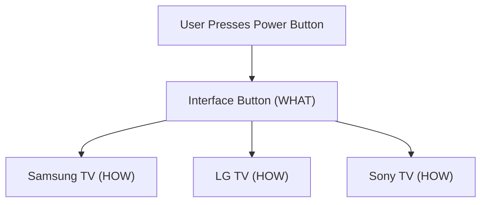
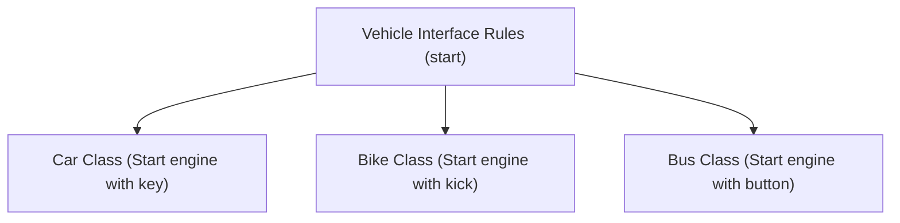
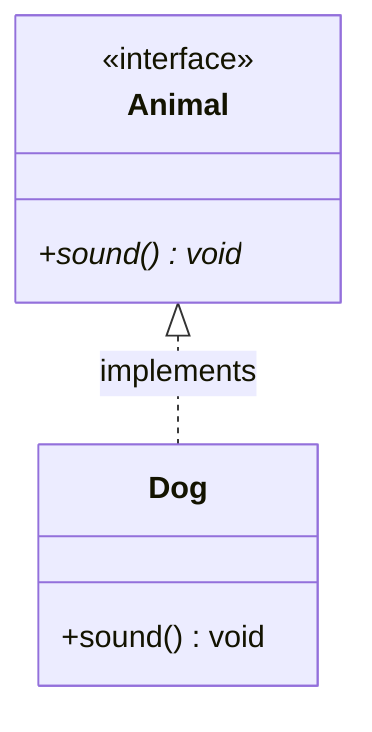
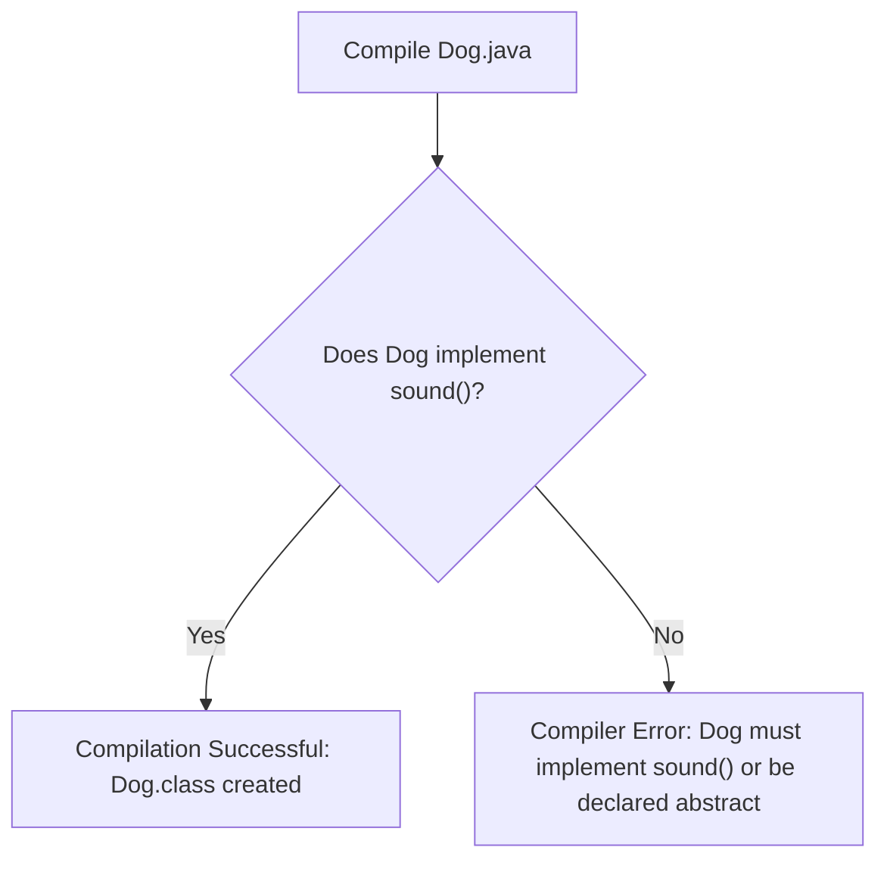
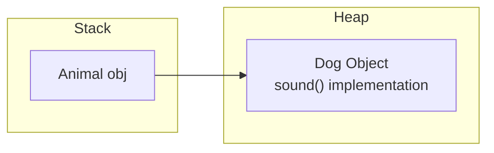
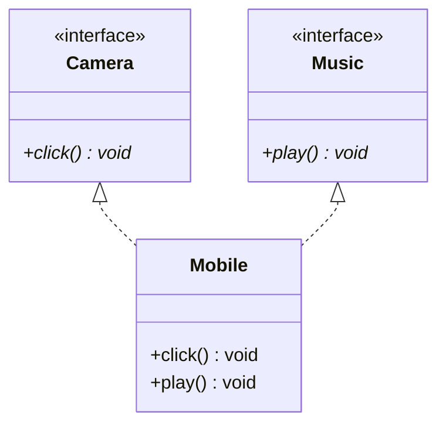
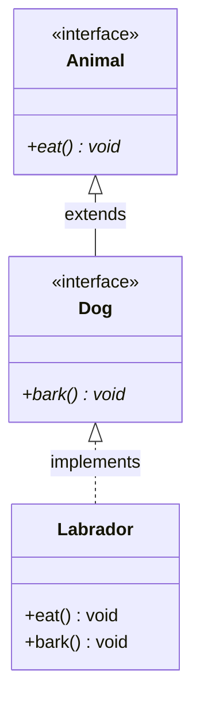

# Interfaces in Java (Part 1)

## Introduction

Interfaces are one of the most important concepts in Java. They provide a mechanism to achieve **100% abstraction**, enable **multiple inheritance** across types, and define a **contract** that implementing classes must follow.

Almost every enterprise-level Java application uses interfaces extensively. Frameworks like **Spring**, **Hibernate**, **JDBC**, and **Servlet API** are fundamentally built around interfaces. Mastering interfaces is essential for writing scalable, maintainable, and loosely coupled code.

---

## Problem Statement: Loose Coupling

Suppose we are building software that handles payment processing. The system must support:
* Credit Cards
* UPI (Unified Payments Interface)
* Net Banking
* PayPal

Each payment method executes a payment, but their internal workflows differ. Without a unified contract, code calling these payment methods becomes tightly coupled to each individual class (e.g., calling class-specific methods like `payByCreditCard()` or `processUPI()`), making future expansion difficult. 

To resolve this, we need a common interface contract that all payment classes implement, allowing the caller code to interact with them uniformly.

---

## Why Do We Need Interfaces?

An interface defines **what** a class must do, but not **how** it does it.

### The Remote Control Analogy:
When you press the Power button on a remote control, you expect the TV to turn on. You do not need to know the internal hardware details of the TV (Samsung, LG, Sony, etc.). The button represents the **interface** (the contract), and the TV contains the **implementation**.



Similarly, in code, vehicles must implement a generic `start()` method:



---

## Key Characteristics of Interfaces

* **100% Abstraction**: An interface cannot contain instance variables or concrete method bodies (except for default, static, or private methods introduced in newer Java versions).
* **Multiple Type Inheritance**: A single class can implement multiple interfaces.
* **Non-Instantiable**: You cannot create an object using `new InterfaceName()`.
* **Implied Variables**: Every variable in an interface is implicitly `public static final` (a constant).
* **Implied Methods**: Every method signature is implicitly `public abstract` (no body, to be overridden).
* **Implements Syntax**: Classes utilize the `implements` keyword to inherit an interface.
* **Extends Syntax**: An interface can inherit another interface using the `extends` keyword.

---

## Syntax and Basic Example

### 1. Interface Declaration:
```java
interface Animal {
    void sound(); // Implicitly public and abstract
}
```

### 2. Implementation:
```java
class Dog implements Animal {
    @Override
    public void sound() {
        System.out.println("Dog Barks");
    }
}
```



### 3. Execution Runner (`Main.java`):
```java
public class Main {
    public static void main(String[] args) {
        Animal obj = new Dog(); // Upcasting reference
        obj.sound(); // Prints: Dog Barks
    }
}
```

---

## Compiler and JVM Internal Workings

When compiling, Java checks whether the implementing class provides concrete overrides for all abstract methods declared in the interface.



### Memory Allocation:
The reference variable lives on the Stack, pointing to the subclass instance allocated on the Heap:



---

## Interface Variables (Constants)

Every field declared in an interface is implicitly `public static final`. 

```java
interface College {
    int FEES = 50000; // Implicitly public static final
}
```

This means:
1. The field can be accessed directly using the interface name: `College.FEES`.
2. The field is immutable. Reassigning it throws a compiler error:
   ```java
   // College.FEES = 60000; // Compiler Error: cannot assign a value to final variable
   ```

---

## Interface Methods

By default, standard interface methods are implicitly `public abstract`. You must declare them with `public` visibility inside the implementing class. Reducing visibility (e.g. using package-private default scope in the subclass) causes a compiler error.

```java
interface Shape {
    void draw(); // Implicitly public abstract
}

class Circle implements Shape {
    // Overriding method must be declared public
    public void draw() {
        System.out.println("Drawing Circle");
    }
}
```

---

## Multiple Interface Implementation

While Java does not allow multiple inheritance of classes (to avoid the Diamond Problem), it permits a class to implement multiple interfaces.



### Code Example:
```java
interface Camera {
    void click();
}

interface Music {
    void play();
}

class Mobile implements Camera, Music {
    public void click() {
        System.out.println("Photo Captured");
    }

    public void play() {
        System.out.println("Playing Music");
    }
}
```

---

## Interface Inheritance

An interface can inherit another interface using the `extends` keyword. Implementing classes at the bottom of the chain must override all methods from both interfaces.



### Code Example:
```java
interface Animal {
    void eat();
}

interface Dog extends Animal {
    void bark();
}

class Labrador implements Dog {
    public void eat() {
        System.out.println("Eating dog food...");
    }

    public void bark() {
        System.out.println("Labrador barking...");
    }
}
```

---

## Key Takeaways

* Interfaces establish structured behavioral contracts.
* All variables inside an interface are implicitly constants (`public static final`).
* All default method declarations are implicitly `public abstract`.
* A single class can implement multiple interfaces cleanly.
* Interfaces can extend other interfaces to build modular hierarchies.

---

**Back to Module Home:** [Abstract Features](README.md)
