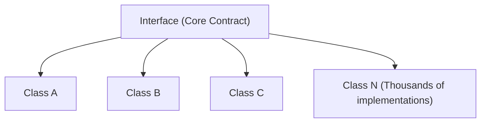
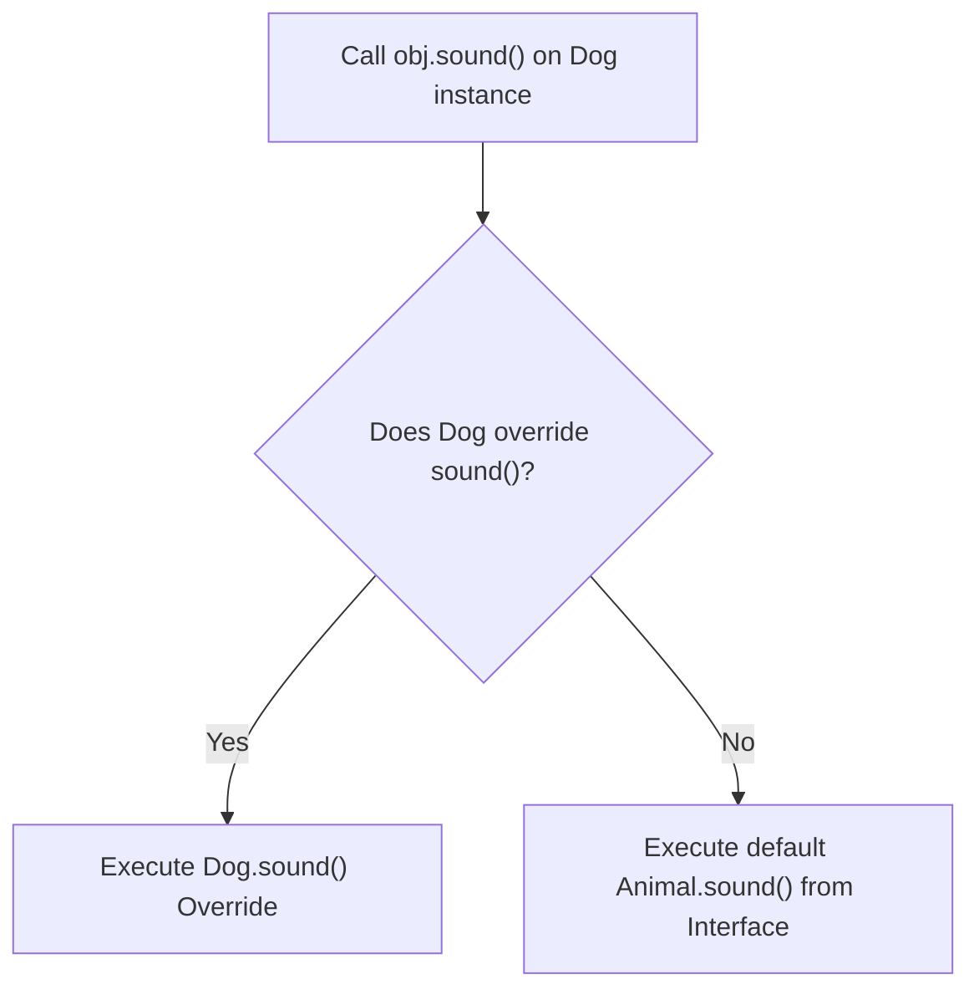
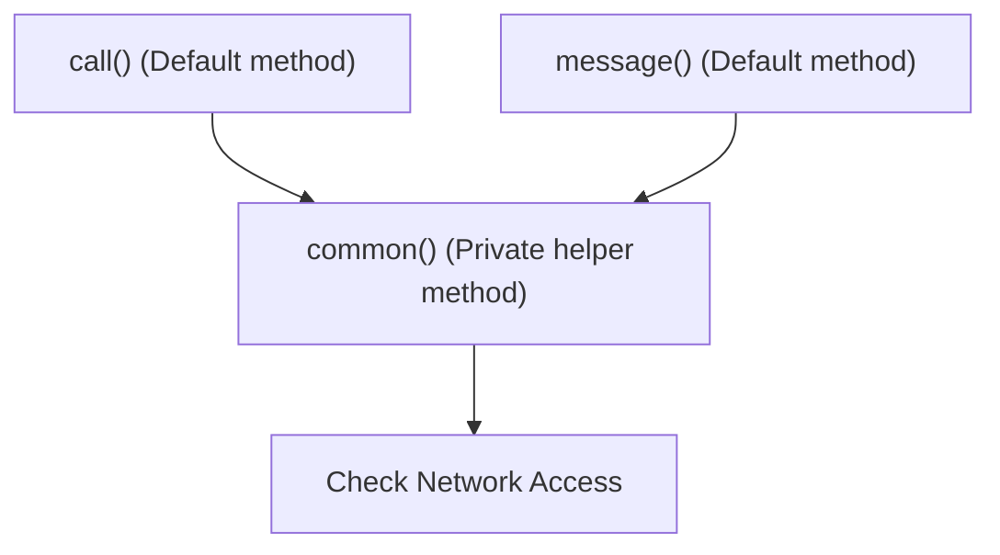
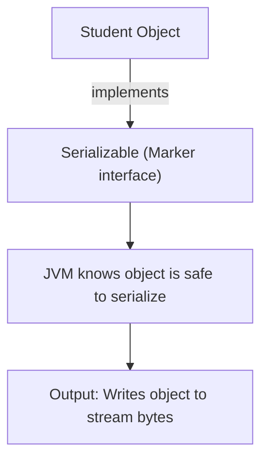

# Interfaces in Java (Part 2)

## Default Methods in Interfaces (Java 8)

Prior to Java 8, every method inside a Java interface was required to be strictly `abstract` (no method body allowed). This design created a significant maintenance challenge when maintaining large APIs:



If we added a single new abstract method to this interface, **every implementing class was forced to implement it immediately**, otherwise compilation failed. Updating thousands of classes in client codebases was virtually impossible.

To resolve this API evolution problem, **Java 8 introduced Default Methods**.

---

## What is a Default Method?

A **Default Method** is an interface method declared with the `default` modifier that contains a default body implementation. Implementing classes automatically inherit this method and can:
1. **Use it directly** without writing any local implementation.
2. **Override it** to provide custom logic.

### Syntax:
```java
interface InterfaceName {
    default void methodName() {
        // Default implementation body
    }
}
```

---

## Default Method Example

```java
interface Animal {
    default void sleep() {
        System.out.println("Animal is sleeping...");
    }
}

class Dog implements Animal {
    // No need to implement sleep()
}

public class Main {
    public static void main(String[] args) {
        Dog obj = new Dog();
        obj.sleep(); // Prints: Animal is sleeping...
    }
}
```

### Method Resolution Lookup Flow:
When invoking a method, the JVM searches the class hierarchy starting at the concrete instance:



---

## Static Methods in Interfaces (Java 8)

Java 8 also introduced **Static Methods** inside interfaces. Static interface methods belong to the interface class itself, rather than to instances of implementing classes.

* They are commonly used for utility helper methods.
* **Important Rule**: Unlike static class fields, static interface methods **are not inherited** by implementing subclasses.

### Code Example:
```java
interface Vehicle {
    static void rules() {
        System.out.println("Vehicles must follow local traffic rules.");
    }
}

public class Main {
    public static void main(String[] args) {
        Vehicle.rules(); // Valid: Called directly on the interface
        
        // Car.rules(); // Compiler Error: static interface methods cannot be inherited
    }
}
```

---

## Private Methods in Interfaces (Java 9)

Java 9 introduced **Private Methods** (both instance and static) inside interfaces. 

### Why do we need private methods in an interface?
If multiple default or static methods share duplicate initialization code, we can extract the common logic into a private helper method inside the interface. This hides internal helper code from implementing classes.



### Code Example:
```java
interface Mobile {
    default void call() {
        commonNetworkCheck();
        System.out.println("Placing call...");
    }

    default void message() {
        commonNetworkCheck();
        System.out.println("Sending message...");
    }

    private void commonNetworkCheck() {
        System.out.println("Checking cell tower network signal...");
    }
}

class Samsung implements Mobile { }
```

---

## Summary: Methods Permitted in Java Interfaces

| Method Type | Modifier Keyword | Java Version | Can be Inherited? |
| :--- | :--- | :--- | :--- |
| **Abstract** | none (implicit) | Java 1.0 | Yes (Must override) |
| **Default** | `default` | Java 8 | Yes (Optional override) |
| **Static** | `static` | Java 8 | No |
| **Private** | `private` | Java 9 | No |
| **Private Static**| `private static` | Java 9 | No |

---

## Functional Interfaces

A **Functional Interface** is an interface that contains **exactly one abstract method**. It is also referred to as a Single Abstract Method (SAM) Interface. It can contain any number of default, static, or private methods, as long as it has only one abstract method.

### Why do we use them?
Functional interfaces are the foundation for **Lambda Expressions** in Java.

### The `@FunctionalInterface` Annotation:
This annotation tells the compiler to validate that the interface has exactly one abstract method. If a developer accidentally adds a second abstract method, a compilation error occurs.

```java
@FunctionalInterface
interface Calculator {
    int calculate(int a, int b); // Single Abstract Method
}
```

---

## Lambda Expressions Introduction

Lambda expressions provide a highly concise way to instantiate functional interfaces without writing verbose anonymous inner classes.

### 1. Verbose Anonymous Class (Before Java 8):
```java
Runnable r = new Runnable() {
    @Override
    public void run() {
        System.out.println("Running in thread...");
    }
};
```

### 2. Concise Lambda Expression (Java 8+):
```java
Runnable r = () -> System.out.println("Running in thread...");
```

---

## Marker Interfaces

A **Marker Interface** (also called a **Tagging Interface**) contains **no methods and no fields**. Its sole purpose is to serve as metadata, marking or tagging a class as possessing a specific capability or license for the JVM or framework.

### Popular Built-in Marker Interfaces:
* `java.io.Serializable`: Tells the JVM that the object is safe to be serialized into bytes.
* `java.lang.Cloneable`: Permits the use of `Object.clone()` on the class.



---

## Functional Interface vs. Marker Interface

| Feature | Functional Interface | Marker Interface |
| :--- | :--- | :--- |
| **Abstract Methods** | Exactly one abstract method | Zero methods |
| **Primary Purpose** | Enables Lambda expressions | Provides metadata/license to JVM |
| **Behavior** | Contains active abstract/default methods | Holds no code logic or properties |
| **Introduced** | Java 8 | Since early Java 1.0 |

---

## Key Takeaways

* Default methods allow interfaces to evolve without breaking existing implementations.
* Static interface methods belong to the interface itself and cannot be inherited.
* Private methods serve as private helpers inside the interface block.
* Functional interfaces contain exactly one abstract method.
* Marker interfaces act as structural metadata labels with no methods.

---

**Back to Module Home:** [Abstract Features](README.md)
