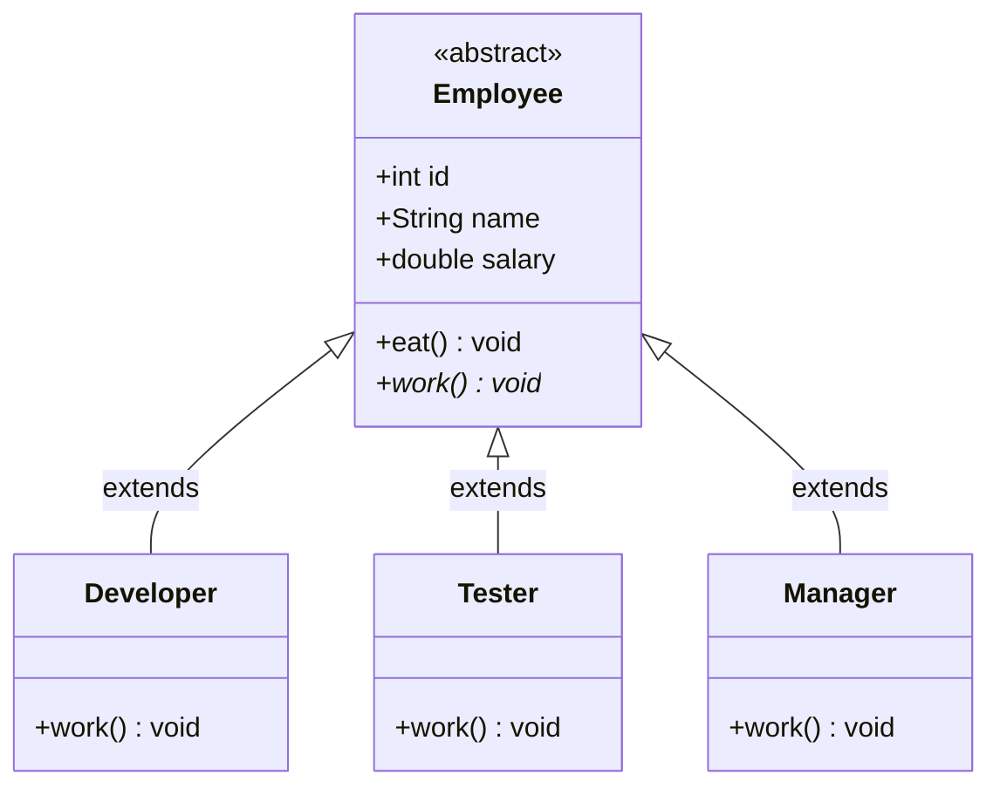
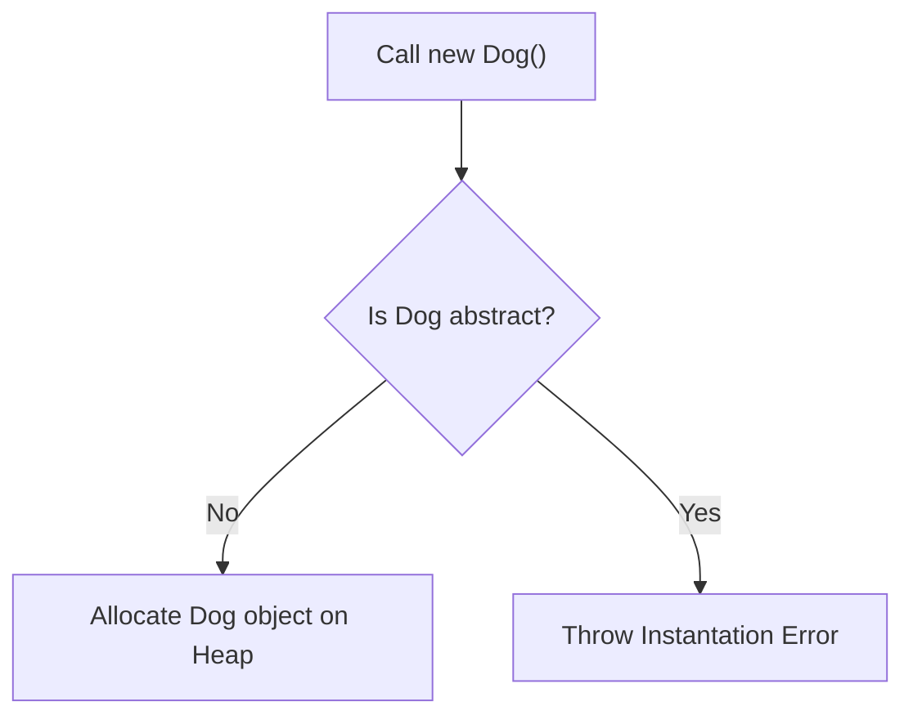
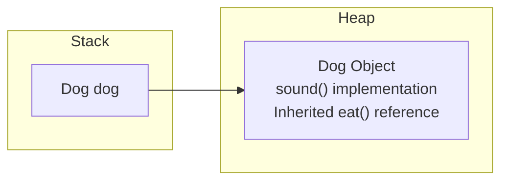

# Abstract Classes in Java (Part 1)

## Introduction

An **Abstract Class** is one of the most important concepts in Object-Oriented Programming (OOP). It serves as a partially implemented common template or **blueprint** for a group of closely related child subclasses.

An abstract class allows us to define:
* **Common Properties**: Shared state variables (fields).
* **Common Behavior**: Concrete methods with default implementation.
* **Incomplete Behavior**: Abstract methods defining *what* actions must exist, leaving child subclasses to define *how* they occur.

> **Definition**: An abstract class is a template meant to be inherited via parent-child hierarchies; it cannot be instantiated directly.

---

## Problem Statement: Code Redundancy

Suppose you are developing software that manages corporate Employee records. The system has:
* Developer
* Tester
* Manager

Every employee possesses common properties:
* Employee ID
* Employee Name
* Salary

Every employee also performs work. However, the specific action of working differs:
* A Developer writes source code.
* A Tester validates software.
* A Manager directs teams.

Without abstract classes, we would duplicate fields and copy standard method definitions (like `eat()` or `sleep()`) inside every single class. By using an abstract `Employee` class, we inherit common implementations and only override the specific method signatures that differ:



---

## Why Do We Need Abstract Classes?

Consider animal behaviors:
* Every animal eats and sleeps in a similar way.
* Every animal makes a different sound (Dog barks, Cat meows, Lion roars).

If we define `eat()` and `sleep()` separately in `Dog`, `Cat`, and `Lion` classes, we create duplicate code. By moving `eat()` and `sleep()` into a parent `Animal` class, we achieve code reuse. We mark `sound()` as an abstract method because a generic "Animal" cannot make a specific sound on its own.

---

## Syntax and Basic Example

### 1. Declaring an Abstract Class:
Use the **`abstract`** keyword on the class signature and any incomplete methods:
```java
abstract class Animal {
    // Abstract method: has no body, ends with a semicolon
    abstract void sound();

    // Concrete method: has a normal method body
    void eat() {
        System.out.println("Animal is eating...");
    }
}
```

### 2. Implementing the Subclass:
```java
class Dog extends Animal {
    @Override
    void sound() {
        System.out.println("Dog Barks");
    }
}
```

### 3. Execution Runner:
```java
public class Main {
    public static void main(String[] args) {
        Dog dog = new Dog();
        dog.eat();   // Inherited: prints "Animal is eating..."
        dog.sound(); // Overridden: prints "Dog Barks"
        
        // Animal a = new Animal(); // Compiler Error: Animal is abstract and cannot be instantiated
    }
}
```

---

## Compiler and JVM Internal Workings

When compiling, the compiler generates `.class` files for both the abstract parent and concrete children. The compiler adds an `ACC_ABSTRACT` metadata flag to the abstract class header. 



Because `Animal` is marked abstract, the JVM blocks direct instantiation calls like `new Animal()`.

### Memory Allocation:
The stack reference points to the concrete `Dog` instance. No independent `Animal` object exists on the Heap:



---

## Rules of Abstract Classes

1. **Keyword Required**: Must be declared using the `abstract` keyword.
2. **Non-Instantiable**: Cannot be instantiated directly using the `new` operator.
3. **May Contain Concrete Members**: Can contain instance variables, concrete methods, static methods, final methods, and constructors.
4. **Abstract Methods are Optional**: An abstract class is not forced to contain abstract methods. However, any class containing at least one abstract method **must** be declared abstract.
5. **Subclass Requirement**: Subclasses must implement all inherited abstract methods, or be declared abstract themselves.

---

## Advantages and Disadvantages

### Advantages:
* **Eliminates Redundancy**: Moves common fields and method definitions to a shared location.
* **Partial Implementation**: Allows sharing concrete code while forcing custom overrides for specific details.
* **Organized API Blueprints**: Establishes a template for future subclasses.

### Disadvantages:
* **Single Inheritance Limit**: A Java class can only extend a single abstract parent class.
* **Increased Class Count**: Requires creating subclasses to instantiate class-wide states.

---

## Common Mistakes

### 1. Instantiating an Abstract Class:
```java
Animal a = new Animal(); // Compiler Error
```

### 2. Failing to Override Abstract Methods:
If `Dog` extends `Animal` but fails to provide a concrete `sound()` implementation:
```java
class Dog extends Animal { } // Compiler Error: Dog must implement inherited abstract methods
```

### 3. Adding Bodies to Abstract Methods:
```java
abstract void sound() {
    System.out.println("Sound"); // Compiler Error: abstract methods cannot have bodies
}
```

---

## Key Takeaways

* Abstract classes serve as blueprints and cannot be instantiated.
* Concrete methods inside abstract classes provide code reusability.
* Abstract methods declare method signatures without bodies.
* Implementing child subclasses must override all inherited abstract methods to compile.

---

**Back to Module Home:** [Abstract Features](README.md)
