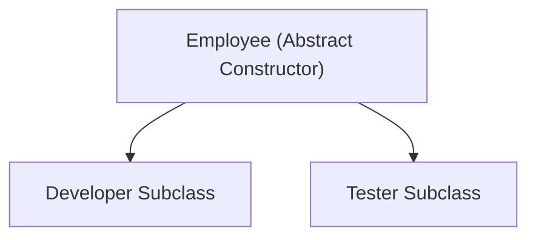
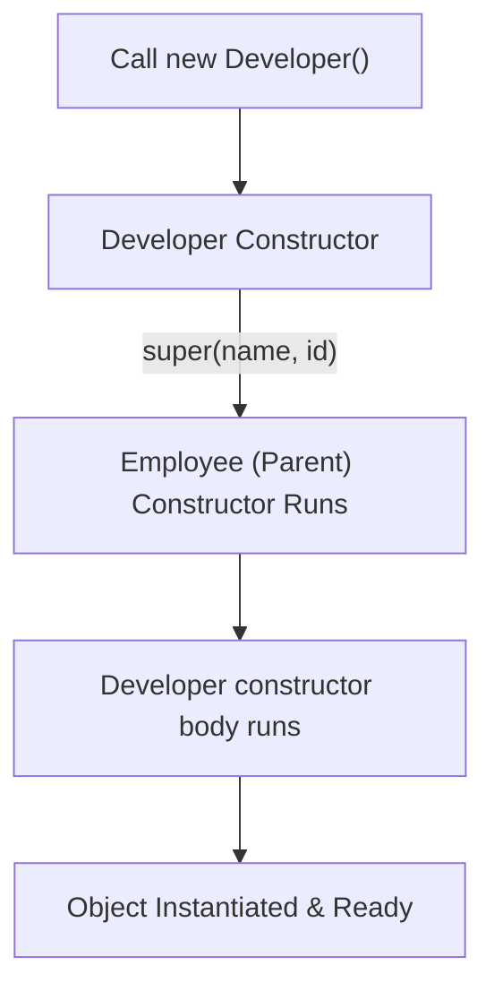

# Abstract Classes in Java (Part 2)

## Constructors in Abstract Classes

One of the most common Java interview questions is:
> **Can an abstract class have a constructor?**
> **Answer**: Yes. 

Even though we cannot instantiate an abstract class directly using the `new` keyword, it can contain constructors. These constructors are called automatically when a concrete child class is instantiated, ensuring the parent class's state is properly initialized.

### Why Do We Need Constructors in an Abstract Class?
If all subclasses share common fields (such as `id` and `name` in an `Employee` class), initializing them once inside the abstract class's constructor avoids duplicate initialization code in every subclass.



### Code Example: Constructor Chaining
```java
abstract class Employee {
    String name;
    int id;

    // Abstract class constructor
    Employee(String name, int id) {
        this.name = name;
        this.id = id;
        System.out.println("Employee (Abstract Parent) Constructor Called");
    }
}

class Developer extends Employee {
    String programmingLanguage;

    Developer(String name, int id, String programmingLanguage) {
        super(name, id); // Chaining to the abstract constructor
        this.programmingLanguage = programmingLanguage;
        System.out.println("Developer (Child) Constructor Called");
    }
}
```

### Execution Flow:
When invoking `new Developer("Sanjay", 101, "Java")`, the instantiation triggers parent constructor delegation:



---

## Fields/Variables in Abstract Classes

Unlike interfaces (where fields are implicitly static constants), abstract classes can declare normal instance variables. Child classes automatically inherit these variables:

```java
abstract class Animal {
    String type = "Mammal"; // Instance variable inherited by child classes
}

class Dog extends Animal {
    void display() {
        System.out.println("Animal Type: " + type); // Valid: Inherited field
    }
}
```

---

## Concrete Methods

A concrete method is a standard method that contains an implementation body. Subclasses can invoke concrete methods directly without overriding them:

```java
abstract class Animal {
    void eat() {
        System.out.println("Animal is eating food...");
    }
    
    abstract void sound();
}

class Dog extends Animal {
    @Override
    void sound() {
        System.out.println("Dog Barks");
    }
}
```

---

## Static Methods in Abstract Classes

Abstract classes can contain static methods. Because static methods belong to the class template rather than specific object instances, they can be called directly without creating any class object:

```java
abstract class Animal {
    static void displayInfo() {
        System.out.println("Animals belong to Kingdom Animalia.");
    }
}

public class Main {
    public static void main(String[] args) {
        Animal.displayInfo(); // Valid: No object instantiation required
    }
}
```

---

## Final Methods in Abstract Classes

An abstract class can contain `final` methods. Marking a parent method `final` allows child subclasses to inherit and execute it, but prevents them from overriding or altering its behavior:

```java
abstract class BankAccount {
    // Shared security method that subclasses cannot change
    final void displaySecurityHeader() {
        System.out.println("=== SECURE TRANSACTION ===");
    }
}
```

---

## Runtime Polymorphism & Dynamic Method Dispatch

Abstract classes support **Runtime Polymorphism** through **Dynamic Method Dispatch**. By declaring a parent abstract reference pointing to a child subclass object, the JVM dynamically decides which method implementation to run at execution time:


### Code Example:
```java
abstract class Animal {
    abstract void sound();
}

class Dog extends Animal {
    void sound() { System.out.println("Dog Barks"); }
}

class Cat extends Animal {
    void sound() { System.out.println("Cat Meows"); }
}

public class Main {
    public static void main(String[] args) {
        Animal a1 = new Dog(); // Parent reference to Dog object
        Animal a2 = new Cat(); // Parent reference to Cat object

        a1.sound(); // Prints: Dog Barks
        a2.sound(); // Prints: Cat Meows
    }
}
```

---

## Abstract Class vs. Interface

| Feature | Abstract Class | Interface |
| :--- | :--- | :--- |
| **Object Instantiation**| ❌ No | ❌ No |
| **Constructors** | ✅ Yes (Called via subclasses) | ❌ No |
| **Instance Variables** | ✅ Yes | ❌ No (Only `public static final` constants) |
| **Multiple Inheritance**| ❌ No (Can only extend one class) | ✅ Yes (Can implement multiple interfaces) |
| **Method Types** | Abstract and Concrete methods | Abstract, Default, Static, Private methods |

---

## Key Takeaways

* Abstract class constructors run when subclass objects are instantiated.
* Subclasses inherit instance fields, concrete methods, and static methods from abstract parents.
* Final methods in abstract classes cannot be overridden by subclasses.
* Parent abstract references support dynamic method dispatch at runtime.

---

**Back to Module Home:** [Abstract Features](README.md)
