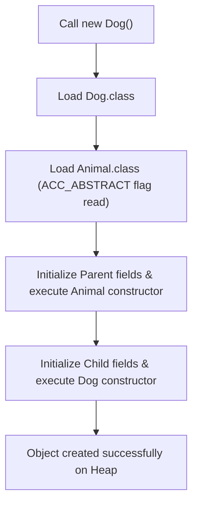
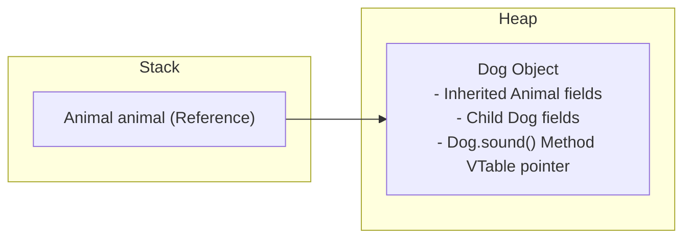
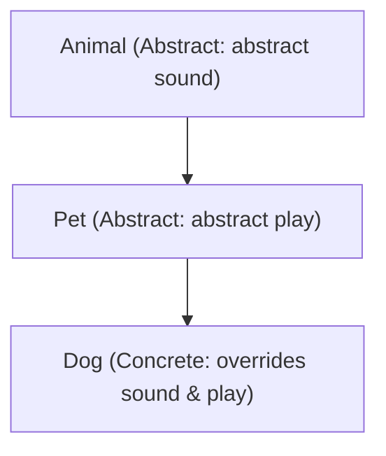
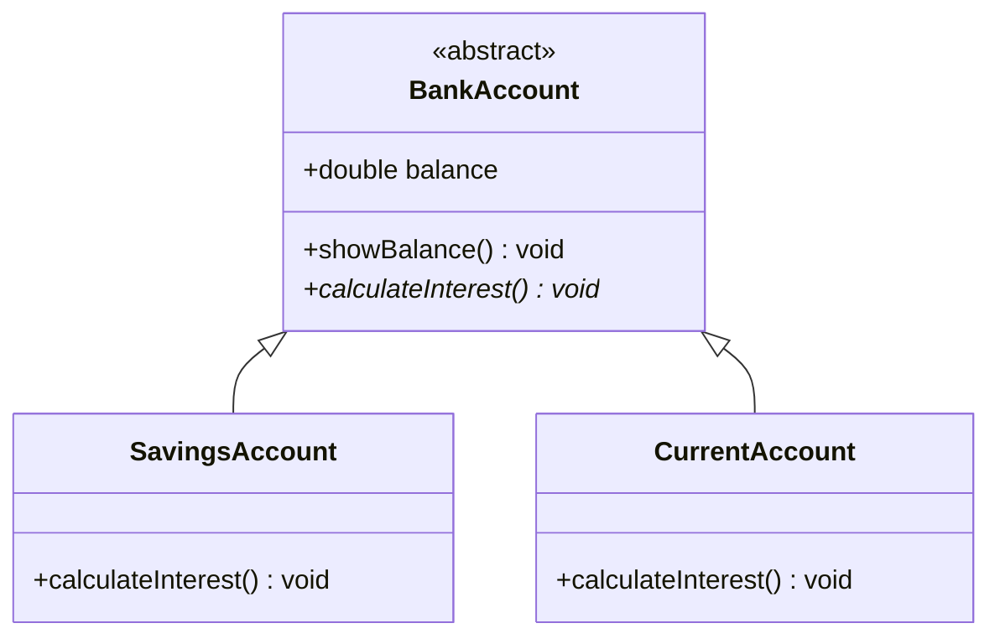
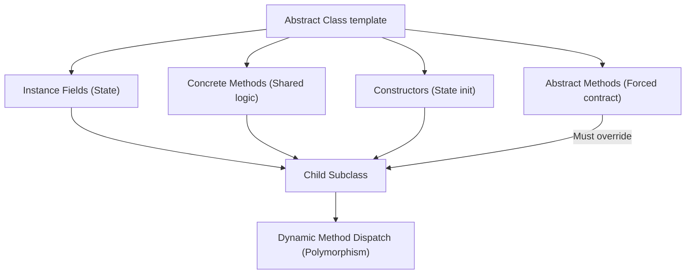

# Abstract Classes in Java (Part 3)

## Internal JVM and Compiler Mechanics

Understanding how the Java compiler and the JVM manage abstract classes is an essential topic for advanced Java developers.

Consider this example:
```java
abstract class Animal {
    abstract void sound();
}

class Dog extends Animal {
    @Override
    void sound() {
        System.out.println("Dog Barks");
    }
}
```

When you compile this file, the compiler produces two separate bytecode `.class` files:
1. `Animal.class`
2. `Dog.class`

The compiler adds the `ACC_ABSTRACT` flag to the class header inside `Animal.class`. When the JVM encounters a `new` instantiation invocation, it inspects this flag:



If we try to compile `new Animal()`, the compiler checks the abstract flag and halts compilation immediately:
```text
Compilation Error: Animal is abstract; cannot be instantiated
```

---

## Memory Allocation for Polymorphic Abstract References

When you create a child subclass object using a parent abstract class reference:
```java
Animal animal = new Dog();
```
The reference variable resides on the Stack, while the actual object resides on the Heap. The object contains memory cells allocated for all variables declared in the parent class along with fields declared in the child class:



---

## Advanced Structural Rules

### 1. Can an abstract class contain only concrete methods?
Yes. If you want to prevent direct instantiation of a class but do not need any abstract method contracts, declaring the class template `abstract` is a standard design choice:

```java
abstract class Vehicle {
    void start() {
        System.out.println("Vehicle started...");
    }
}
```

### 2. Can an abstract class contain only abstract methods?
Yes. This creates a pure interface-like blueprint class, but unlike an interface, it is still restricted by Java's single inheritance rule.

### 3. Can an abstract class extend another abstract class?
Yes. Subclasses at the bottom of the inheritance hierarchy are required to implement all abstract methods accumulated throughout the chain.



```java
abstract class Animal {
    abstract void sound();
}

abstract class Pet extends Animal {
    abstract void play();
}

class Dog extends Pet {
    void sound() { System.out.println("Barks"); }
    void play() { System.out.println("Plays catch"); }
}
```

### 4. Can an abstract class implement an interface?
Yes. An abstract class is not forced to implement the interface's abstract methods. It can pass that responsibility down to its concrete subclasses.

```java
interface Playable {
    void play();
}

abstract class Toy implements Playable {
    // Valid: Does not need to implement play() immediately
}

class ActionFigure extends Toy {
    public void play() {
        System.out.println("Playing with action figure...");
    }
}
```

---

## Real-World Case Study: Banking Accounts

Consider a banking system. All accounts share standard traits (account number, balance, deposit, withdraw) but calculate interest differently:



### Implementation:
```java
abstract class BankAccount {
    double balance = 10000;

    void showBalance() {
        System.out.println("Current Balance: $" + balance);
    }

    abstract void calculateInterest();
}

class SavingsAccount extends BankAccount {
    @Override
    void calculateInterest() {
        System.out.println("Savings Interest: 5% applied. Earned: $" + (balance * 0.05));
    }
}
```

---

## Abstract Class vs. Concrete Class

| Feature | Abstract Class | Concrete Class |
| :--- | :--- | :--- |
| **Instantiation** | ❌ No (`new Parent()` fails) | ✅ Yes (`new Child()` succeeds) |
| **Abstract Methods** | ✅ Allowed | ❌ Not Allowed |
| **Concrete Methods** | ✅ Allowed | ✅ Allowed |
| **Constructors** | ✅ Allowed | ✅ Allowed |
| **Inheritance** | ✅ Can be extended | ✅ Can be extended (unless `final`) |

---

## Common Compilation Pitfalls

### 1. Marking Abstract Methods as Private:
```java
private abstract void sound(); // Compiler Error: illegal combination of modifiers
```
* **Reason**: Private methods cannot be seen by child subclasses, meaning they can never be overridden, making `abstract` impossible.

### 2. Combining Abstract and Final:
```java
final abstract class Animal { } // Compiler Error: illegal combination of modifiers
```
* **Reason**: `abstract` requires subclasses to extend the template, while `final` blocks all subclass inheritance. They are direct opposites.

---

## Abstract Class Concept Flow



---

## Key Takeaways

* The compiler flags abstract classes with `ACC_ABSTRACT` to block direct instantiation.
* Abstract subclasses are not required to implement parent interface methods immediately.
* Methods cannot combine `abstract` with `private` or `final`.
* Abstract classes bridge the gap between complete implementation and pure interface contracts.

---

**Back to Module Home:** [Abstract Features](README.md)
