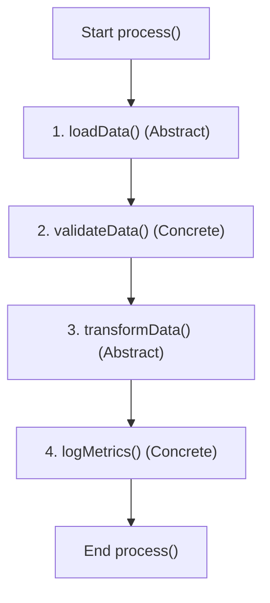
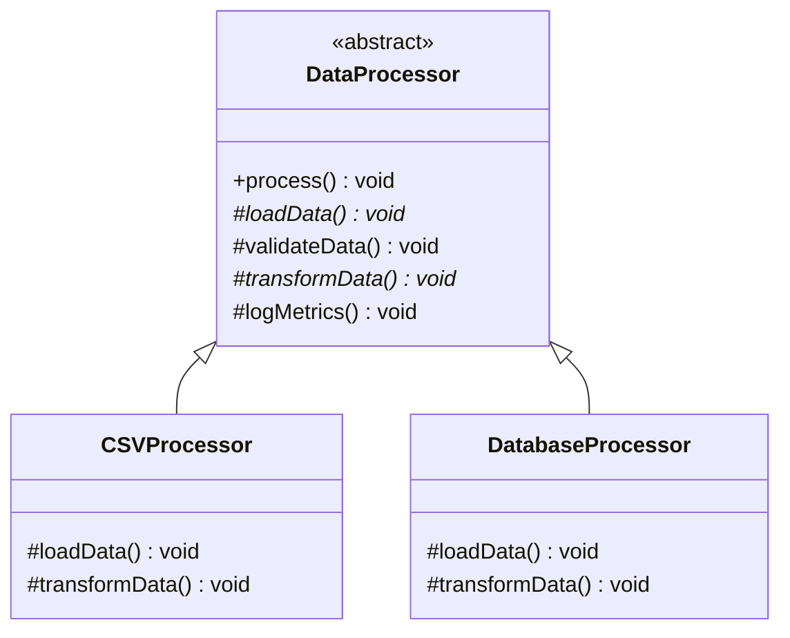

# Template Method Pattern Using an Abstract Class

## Problem Statement

An enterprise-level data processing engine needs a system to:
1. Ingest data from different sources (CSV files, Database streams, XML endpoints).
2. Validate the incoming data.
3. Transform the data into a standardized JSON format.
4. Log processing execution metrics.

The **processing steps must always occur in the exact same sequence**. However, the way data is loaded and transformed depends entirely on the data source. 

This is a classic use case for the **Template Method Pattern**, implemented via a parent **Abstract Class**.

---

## Why Use an Abstract Class for the Template Method?

Every data source follows the same core workflow:



Only two steps vary per source:
* Loading data.
* Transforming data.

The remaining validation and logging steps are common. An abstract class lets us implement common steps once (code reuse) while forcing subclasses to define the custom loading and transforming steps.

---

## Solution Design

We create an abstract parent class `DataProcessor` that defines the template execution sequence as a `final` method:



---

## Java Code Implementation

```java
abstract class DataProcessor {
    // Template Method: final prevents subclasses from altering the execution order
    public final void process() {
        loadData();
        validateData();
        transformData();
        logMetrics();
    }

    // Abstract methods: Subclasses must provide custom implementation
    protected abstract void loadData();
    protected abstract void transformData();

    // Concrete methods: Shared default implementation
    protected void validateData() {
        System.out.println("Validating data integrity...");
    }

    protected void logMetrics() {
        System.out.println("Logging execution metrics...");
    }
}

class CSVProcessor extends DataProcessor {
    @Override
    protected void loadData() {
        System.out.println("Loading data from CSV file...");
    }

    @Override
    protected void transformData() {
        System.out.println("Transforming CSV records to JSON...");
    }
}

class DatabaseProcessor extends DataProcessor {
    @Override
    protected void loadData() {
        System.out.println("Connecting to Database and reading tables...");
    }

    @Override
    protected void transformData() {
        System.out.println("Transforming database result set to JSON...");
    }
}

public class Main {
    public static void main(String[] args) {
        System.out.println("----- CSV Processing Run -----");
        DataProcessor csv = new CSVProcessor();
        csv.process();

        System.out.println("\n----- Database Processing Run -----");
        DataProcessor db = new DatabaseProcessor();
        db.process();
    }
}
```

### Execution Output:
```text
----- CSV Processing Run -----
Loading data from CSV file...
Validating data integrity...
Transforming CSV records to JSON...
Logging execution metrics...

----- Database Processing Run -----
Connecting to Database and reading tables...
Validating data integrity...
Transforming database result set to JSON...
Logging execution metrics...
```

---

## Why is `process()` Declared Final?

Declaring the template method `process()` as `final` ensures **subclasses cannot override it**. This guarantees that the core algorithm's execution sequence is immutable. Without `final`, a subclass could accidentally skip key steps (such as `validateData()`), breaking system-wide constraints.

---

## Advantages of this Pattern

* **Algorithm Enforcement**: Ensures child classes follow a strict sequence of steps.
* **Reduces Duplication**: Common tasks (validation, logging) are implemented once in the parent class.
* **Controlled Customization**: Subclasses customize specific extension hooks without needing to understand the orchestrating process control flow.
* **Open/Closed Principle**: We can easily add a new source (e.g. `XMLProcessor`) by extending `DataProcessor` without altering existing code.

---

## Interview Questions (FAQ)

### Which design pattern is used to construct reusable algorithm frameworks?
The **Template Method Pattern**, which uses abstract classes to define the skeleton of an algorithm, deferring some steps to subclasses.

### Why use an abstract class instead of an interface here?
An interface defines behavior contracts but does not manage state or dictate default execution flow across concrete steps. An abstract class allows us to implement shared concrete methods (`validateData()`, `logMetrics()`) alongside abstract declarations.

---

## Key Takeaways

* The Template Method Pattern establishes a skeleton framework for workflows.
* `final` is used on template methods to preserve execution sequence.
* Abstract methods represent customized behavior hooks.
* Concrete methods represent shared, reusable baseline implementations.

---

**Back to Module Home:** [Abstract Features](README.md)
