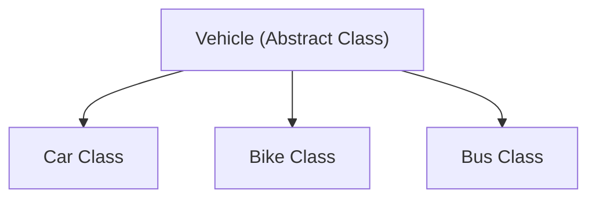
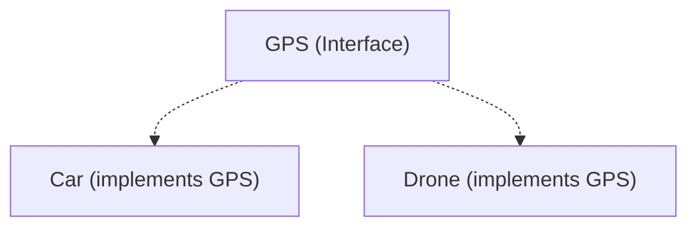

# Abstract Class vs Interface in Java (Part 1)

## Introduction

One of the most frequently asked Java interview questions is:
> **What is the difference between an Abstract Class and an Interface?**

Although both are core constructs used to achieve **abstraction** in Java, they are designed for completely different architectural purposes:
* **Abstract Class**: Tailored for **code reuse** and **partial implementation** inside a single parent-child hierarchy family.
* **Interface**: Tailored to define an API **contract** that multiple, potentially unrelated classes must follow.

---

## Why Do We Need Both?

Imagine designing a **Vehicle Management System**. We have different vehicles: `Car`, `Bike`, and `Bus`.

### 1. Where an Abstract Class Fits:
All vehicles share common structural fields (fuel capacity, engine state) and shared routines (starting, stopping). They belong to the same "is-a" taxonomy family (a Car is-a Vehicle). An abstract parent class `Vehicle` is ideal here to host shared variables and concrete code logic.



### 2. Where an Interface Fits:
Now suppose we also want to add features like `GPSTracking` and `BluetoothConnectivity`. These are capabilities or descriptors. Not every vehicle belongs to the same family (e.g. a Phone also has Bluetooth), but we want specific classes to support these behaviors. An interface defines these capabilities as an independent contract.



---

## Comparison Matrix: Abstract Class vs. Interface

| Feature | Abstract Class | Interface |
| :--- | :--- | :--- |
| **Keyword** | `abstract class` | `interface` |
| **Instantiation** | ❌ Not Allowed | ❌ Not Allowed |
| **Constructors** | ✅ Yes | ❌ No |
| **Instance Variables**| ✅ Yes | ❌ No (Only `public static final` constants) |
| **Abstract Methods** | ✅ Yes | ✅ Yes (implicitly abstract by default) |
| **Concrete Methods** | ✅ Yes | ✅ Yes (using `default` and `static` keywords) |
| **Inheritance** | Extended via `extends` | Implemented via `implements` |
| **Multiple Inheritance**| ❌ No (Single class inheritance only) | ✅ Yes (Can implement multiple interfaces) |
| **Primary Goal** | Shared state and code reuse | Architectural contract API definition |

---

## Technical Differences Deep-Dive

### 1. Declaration Syntax
* **Abstract Class**: Uses the `abstract class` modifier.
* **Interface**: Uses the `interface` keyword.

```java
// Abstract Class Template
abstract class Animal {
    abstract void sound(); // abstract keyword required
}

// Interface Template
interface Pet {
    void play(); // implicitly public and abstract
}
```

### 2. Object Instantiation
Neither can be instantiated directly using the `new` operator. Both compile into intermediate JVM bytecode `.class` templates but will throw compiler errors if instantiated:
```java
// Animal a = new Animal(); // Compiler Error: Animal is abstract and cannot be instantiated
// Pet p = new Pet();       // Compiler Error: Pet is abstract and cannot be instantiated
```

### 3. Constructors
* **Abstract Class**: Can contain constructors to initialize inherited fields across subclass instances.
* **Interface**: Cannot contain constructors. Since they cannot hold instance states (fields), interface constructors serve no purpose.

```java
abstract class Animal {
    Animal() {
        System.out.println("Animal Parent Constructor Called");
    }
}

class Dog extends Animal {
    Dog() {
        super(); // Implicitly chains constructors
        System.out.println("Dog Child Constructor Called");
    }
}
```

### 4. Instance Variables vs. Constants
* **Abstract Class**: Can declare standard instance variables (fields) with any access modifiers (private, protected, public).
* **Interface**: Can only contain static constants. Any variable declared inside an interface block is implicitly converted to `public static final`.

```java
interface College {
    int FEES = 50000; // Implicitly: public static final int FEES = 50000;
}
```

### 5. Method Specifications
* **Abstract Class**: Can contain both abstract (no body) and concrete methods.
* **Interface**: Traditionally only allowed abstract methods. In modern Java versions (Java 8+), they can also contain concrete `default` and `static` methods.

```java
abstract class Shape {
    abstract void draw(); // Abstract method
    void erase() { System.out.println("Erasing..."); } // Concrete method
}

interface Printable {
    void print(); // Abstract method
    default void format() { System.out.println("Formatting page..."); } // Concrete default method
}
```

---

## Key Takeaways

* Abstract classes emphasize class relationships and code reusability.
* Interfaces define capability rules and contracts across unrelated types.
* Abstract classes support constructors and instance fields; interfaces support constants only.
* Both constructs prohibit direct object instantiation using `new`.

---

**Back to Module Home:** [Abstract Features](README.md)
