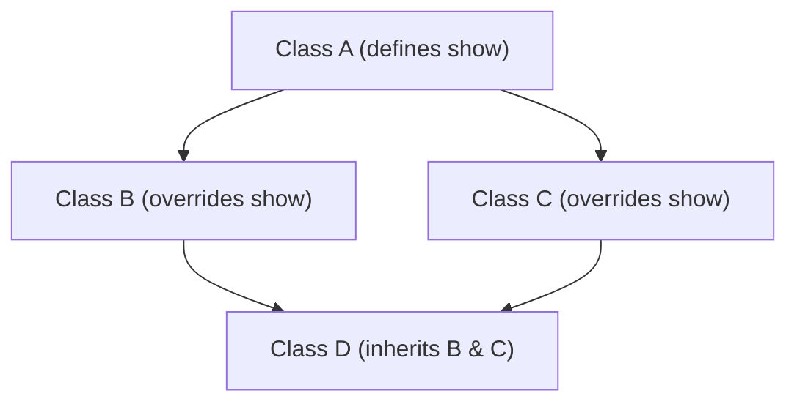
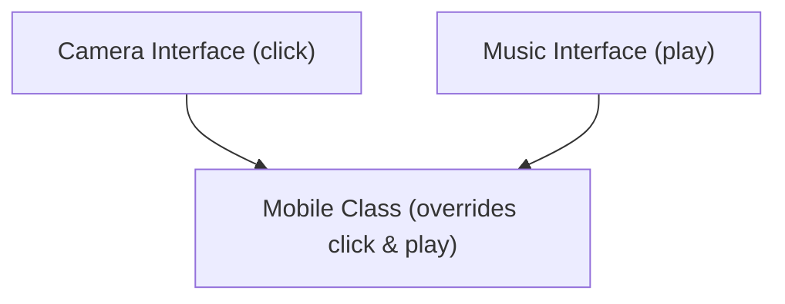
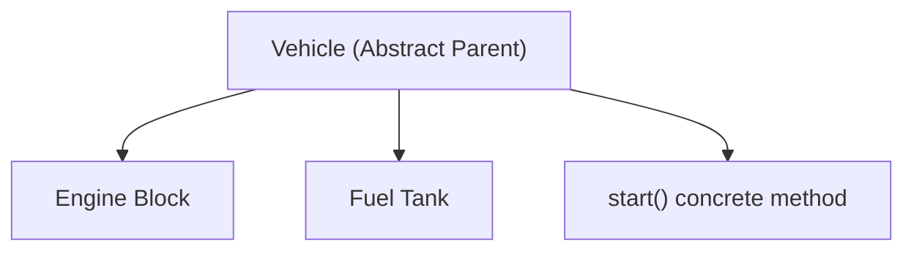
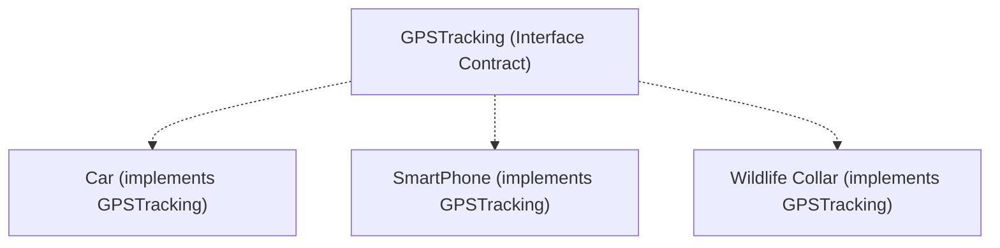
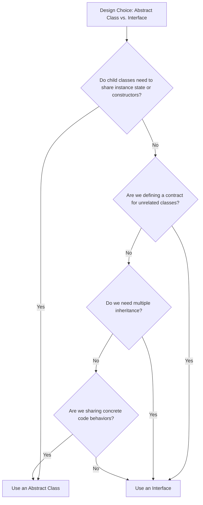

# Abstract Class vs Interface in Java (Part 2)

## Final Methods in Abstract Classes vs. Interfaces

### 1. Abstract Class:
An abstract class can contain `final` methods. This is useful when the parent class wants to provide a fixed implementation that child classes are permitted to inherit but strictly forbidden from overriding:

```java
abstract class Animal {
    final void sleep() {
        System.out.println("Animals sleep at night.");
    }
    abstract void sound();
}

class Dog extends Animal {
    @Override
    void sound() {
        System.out.println("Dog Barks");
    }
    // Trying to override sleep() will throw a compiler error
}
```

### 2. Interface:
Interfaces cannot contain `final` methods (with the exception of private static helper methods, which are implicitly final inside the interface container). Interface methods are fundamentally designed to be overridden by implementing subclasses to establish a contract.

---

## Multiple Inheritance: The Diamond Problem

Java **does not allow multiple inheritance of classes** to prevent ambiguity issues known as the **Diamond Problem**:



If class `D` inherits from both `B` and `C`, calling `d.show()` creates ambiguity. The JVM cannot decide whether to execute `B.show()` or `C.show()`, resulting in a compiler error.

### Why Interfaces Allow Multiple Inheritance:
Interfaces traditionally held only method declarations with no implementations. If a class implements two interfaces containing matching method signatures, only a single concrete override exists inside the subclass, eliminating any method resolution conflict:



---

## Architectural Purpose Comparison

### 1. Code Reuse (Abstract Class)
The primary driver for choosing an abstract class is **code reuse**. It allows related subclasses in a single hierarchy to share common states (fields) and concrete methods:



### 2. API Contract (Interface)
The primary driver for choosing an interface is to define an API **contract**. It allows completely unrelated classes to implement a common capability:



---

## Design Pattern Decision Tree



---

## Scenario: Payment Application Architecture

Suppose you are building a payment integration platform supporting Credit Cards, UPI, and Net Banking.

* **When to choose an Abstract Class**:
  If all payment processors share transaction states (e.g. `transactionId`, `amount`, `validateToken()`), use an abstract parent class `PaymentProcessor` to host these shared routines.
* **When to choose an Interface**:
  If payment processors only share a simple action hook (`pay()`) and do not share any state logic or constructors, use an interface `Payable`.

---

## Architectural Decision Checklist

| Requirement | Choose |
| :--- | :--- |
| **Share common state variables (fields)** | **Abstract Class** |
| **Share common constructor routines** | **Abstract Class** |
| **Implement multiple capability templates** | **Interface** |
| **Force subclasses to run fixed parent logic** | **Abstract Class** (using `final` methods) |
| **Establish loose coupling across modules** | **Interface** |

---

## Key Takeaways

* Abstract classes allow `final` methods; interfaces do not.
* The Diamond Problem prevents multiple inheritance of classes in Java.
* Interfaces allow multiple type inheritance because they eliminate implementation ambiguity.
* Choose abstract classes for code reuse; choose interfaces for behavior contracts.

---

**Back to Module Home:** [Abstract Features](README.md)
