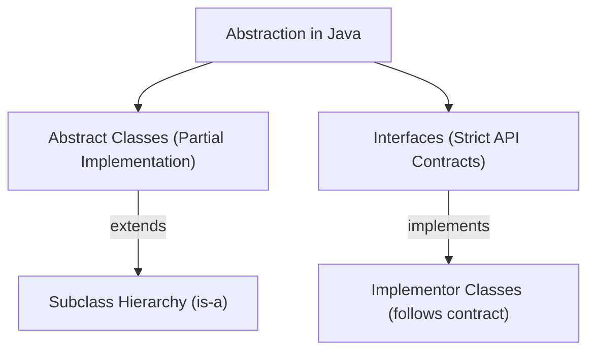

# Module 08: Abstract Features of Java

Welcome to the **Abstract Features of Java** module! This guide outlines the learning objectives, lesson structure, core concepts, and interview FAQs for implementing abstraction, building interfaces, coding abstract classes, and enforcing design contracts in Java applications.

---

## Learning Objectives

By the end of this module, you will understand:
1. **Abstraction**: The architectural separation of *what* a class does from *how* it does it.
2. **Interfaces**: Defining pure contracts, implementing multiple type inheritance, and leveraging Java 8/9 features (default, static, and private methods).
3. **Abstract Classes**: Declaring class-level templates, constructor chaining, and runtime polymorphism via Dynamic Method Dispatch.
4. **Design Patterns**: Applying the **Template Method Pattern** using abstract classes to enforce fixed execution workflows.
5. **Comparison**: Choosing the correct abstraction mechanism based on code reuse vs. API contracts.

---

## Lessons Map

| Lesson | Title | Description |
| :---: | :--- | :--- |
| **01** | [Interfaces in Java (Part 1)](01_Interfaces-Part1.md) | Pure contracts, syntax, upcasting reference variables, and multiple interface inheritance. |
| **02** | [Interfaces in Java (Part 2)](02_Interfaces-Part2.md) | Modern default/static/private methods, functional interfaces, lambda integration, and marker interfaces. |
| **03** | [Abstract Classes (Part 1)](03_Abstract-Classes-Part1.md) | Blueprint concepts, eliminating redundancy, and compiler/JVM ACC_ABSTRACT constraints. |
| **04** | [Abstract Classes (Part 2)](04_Abstract-Classes-Part2.md) | Subclass constructor chaining, final methods, static methods, and instance fields. |
| **05** | [Abstract Classes (Part 3)](05_Abstract-Classes-Part3.md) | JVM class loader checks, polymorphic memory layouts, and banking system case study. |
| **06** | [Template Method Pattern](06_Template-Method-Pattern.md) | Enforcing fixed algorithm execution sequences using abstract templates. |
| **07** | [Abstract Class vs. Interface (Part 1)](07_Abstract-Class-vs-Interface-Part1.md) | Key structural differences (syntax, constructors, variables, constants, and concrete methods). |
| **08** | [Abstract Class vs. Interface (Part 2)](08_Abstract-Class-vs-Interface-Part2.md) | Diamond Problem mechanics, code reuse vs. contracts, and design decision trees. |

---

## Core Concepts Overview

### Abstraction Mechanics:

### Design Decision Quick-Reference:
* **Choose Abstract Classes** when classes are closely related and share state (fields) or constructors.
* **Choose Interfaces** when unrelated classes need a common capability contract or multiple type inheritance.

---

## Interview Questions (FAQ)

### What is the Diamond Problem?
It is an ambiguity issue in multiple inheritance where a class inherits conflicting implementations of the same method from two different parent classes. Java prevents this by allowing only single class inheritance.

### Can an abstract class implement an interface?
Yes. An abstract class does not need to override the interface's methods immediately; it can pass that requirement down to its concrete subclasses.

---

*Abstraction. Contracts. Polymorphism.*
