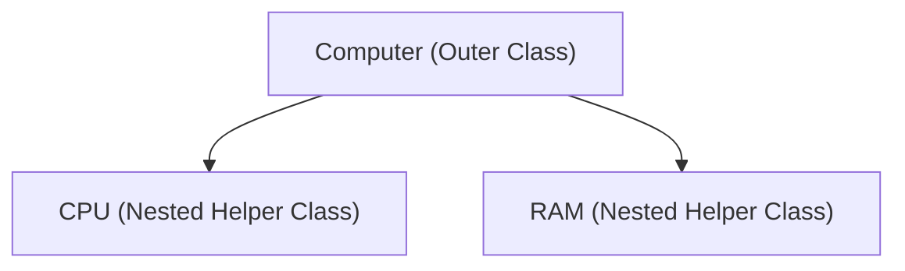
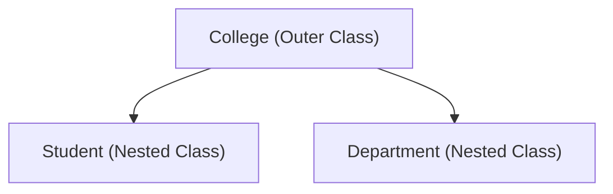
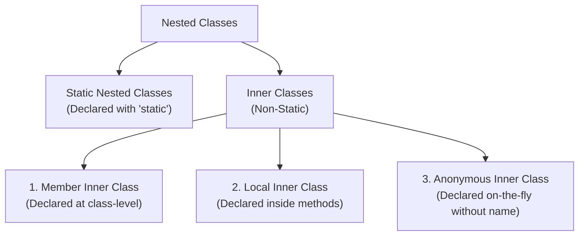
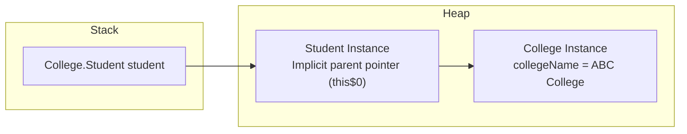

# Nested Classes in Java

## Introduction

As Java applications grow larger, classes occasionally require helper classes that are tightly coupled to their own operation. Instead of creating separate top-level source files, Java allows defining a class directly inside another class block. 

These are known as **Nested Classes**. Nested classes help group related components logically, improve encapsulation, and keep codebases clean and maintainable.

---

## Why Do We Need Nested Classes?

Imagine a computer system. It contains components like a CPU, RAM, and Motherboard. A CPU has no functional purpose outside the context of its containing computer. 



Similarly, in a College Management System, a `Student` or a `Department` class can be nested inside the `College` class container because they only exist inside that domain.



---

## Types of Nested Classes

Java categorizes nested classes into two main groups, depending on whether the nested class is declared static or non-static:



---

## Syntax and Basic Example

### 1. Declaring an Inner Class:
```java
class College {
    // Outer class private state
    private String collegeName = "ABC College";

    // Non-static member inner class
    class Student {
        void display() {
            // Directly accesses outer class's private field
            System.out.println("Student belongs to: " + collegeName);
        }
    }
}
```

### 2. Instantiating the Inner Class:
Because a member inner class is non-static, it is bound to the instance state of the outer class. Creating an inner class object requires first creating an instance of the outer class:
```java
public class Main {
    public static void main(String[] args) {
        // Step 1: Instantiate the outer class
        College college = new College();

        // Step 2: Instantiate the inner class using outer instance pointer
        College.Student student = college.new Student();

        // Step 3: Invoke inner class routines
        student.display(); // Prints: Student belongs to: ABC College
    }
}
```

---

## Compiler and JVM Internal Mechanics

When compiling nested classes, the Java compiler produces separate bytecode `.class` files for each class declaration. It uses the `$` separator to indicate containment relationships:
```text
College.class          // Outer class bytecode
College$Student.class  // Inner class bytecode
```

### Memory Allocation:
An inner class instance holds an implicit reference to its outer class instance. On the Heap, the inner class object maintains a hidden pointer (`this$0`) pointing back to the outer class instance that created it:



---

## Advantages and Disadvantages

### Advantages:
* **Direct Access**: Inner classes can directly access all members of their outer class, including `private` fields and methods, without violating encapsulation rules.
* **Organized Namespace**: Groups classes that are only used in one place, avoiding polluting the global package namespace.
* **Improved Encapsulation**: Hides helper classes completely inside outer classes, preventing external packages from accessing them.

### Disadvantages:
* **Increased Complexity**: Overusing nested classes can make files excessively long and harder to parse.
* **Tight Coupling**: Changes to the outer class structure can easily break dependent inner class logic.

---

## Nested Classes vs. Inheritance

A common point of confusion is comparing nested classes with inheritance:
* **Inheritance** represents an **"is-a"** relationship (e.g., a Dog is-a Animal).
* **Nested Classes** represent a **containment ("has-a")** relationship (e.g., a Computer has-a CPU). The inner class serves as a localized component of the outer context.

---

## Key Takeaways

* Nested classes are classes declared inside another class block.
* Non-static nested classes (Inner Classes) hold an implicit pointer to their containing outer class instance.
* The compiler generates separate class files using the `Outer$Inner.class` naming syntax.
* Grouping related helpers inside parent classes improves encapsulation and maintains package sanity.

---

**Back to Module Home:** [Advanced Java Class Concepts](README.md)
