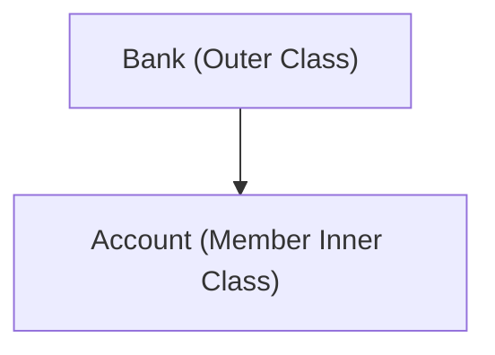
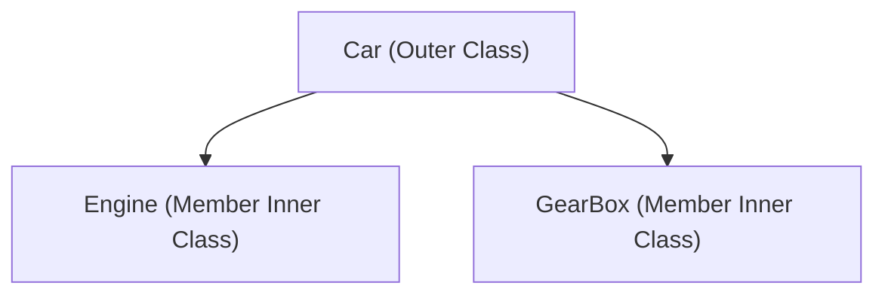
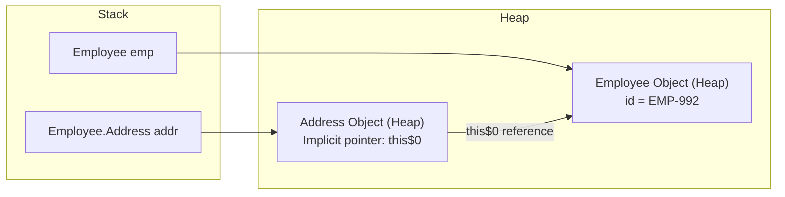

# Member Inner Classes in Java

## Introduction

A **Member Inner Class** is a non-static class declared directly inside another class block, behaving like a member field or method of the outer class. 

Unlike standard top-level classes, a Member Inner Class is tightly bound to its outer class instances. It has direct access to all variables and methods of its enclosing outer class, including `private` fields and methods, without needing to create helper accessors.

---

## Why Do We Need Member Inner Classes?

Consider a banking domain. A `Customer` or `Account` exists only because of the enclosing `Bank`.



Similarly, an `Engine` makes sense only inside the context of a `Car`:



---

## Member Inner Class Characteristics

* **Non-Static**: Declared inside a class without the `static` keyword.
* **Instance Bound**: You cannot instantiate the inner class without an active outer class instance.
* **Access Level**: Directly accesses outer class variables and methods, including private members.
* **No Static Declarations**: A member inner class cannot declare `static` methods or static fields (unless they are marked `static final` compile-time constants).

---

## Syntax and Basic Example

### 1. Declaring Outer and Inner Class:
```java
class Employee {
    private String id = "EMP-992";

    // Non-static member inner class
    class Address {
        void display() {
            // Directly reads private parent field
            System.out.println("Employee: " + id + " resides in Sector 5");
        }
    }
}
```

### 2. Instantiating via Enclosing Object:
To instantiate `Address`, you must chain `new` off an active `Employee` instance pointer:
```java
public class Main {
    public static void main(String[] args) {
        // Step 1: Create the outer class object
        Employee emp = new Employee();

        // Step 2: Chain instantiation off the outer object reference
        Employee.Address addr = emp.new Address();

        // Step 3: Invoke inner method
        addr.display(); // Prints: Employee: EMP-992 resides in Sector 5
    }
}
```

---

## Memory Allocation and Bytecode Representation

During compilation, the compiler generates two separate class files:
1. `Employee.class` (Outer Class)
2. `Employee$Address.class` (Inner Class)

### Stack and Heap Allocation Layout:
The inner class object holds a compiler-generated reference pointer (`this$0`) pointing back to the active outer object that initialized it:



---

## Shadowing and Scope Resolving

If the inner class declares a variable with the same name as an outer class variable, the local inner variable shadows the outer variable. You can resolve the shadowed outer variable using the syntax `OuterClass.this.variableName`:

```java
class Company {
    String name = "Global Corp";

    class Department {
        String name = "Engineering";

        void printNames() {
            System.out.println("Local Department: " + name); // Resolves to local variable
            System.out.println("Enclosing Company: " + Company.this.name); // Resolves to outer variable
        }
    }
}
```

---

## Member Inner Class vs. Normal Class

| Feature | Member Inner Class | Normal Top-Level Class |
| :--- | :--- | :--- |
| **Enclosing Scope** | Declared inside another class block | Declared directly inside a package |
| **Instance Dependency**| Requires an active outer class instance | Instantiated independently |
| **Private Member Access**| Direct access to enclosing private fields | Restrained by standard visibility modifiers |
| **Static Fields/Methods**| ❌ No (Only constants allowed) | ✅ Yes |

---

## Common Mistakes

### 1. Declaring static methods inside a member inner class:
```java
class Outer {
    class Inner {
        // static void show() { } // Compiler Error: static declarations not allowed in inner classes
    }
}
```

### 2. Bypassing the enclosing instance:
```java
// Address a = new Address(); // Compiler Error: enclosing instance of type Employee is required
```

---

## Key Takeaways

* Member inner classes are non-static classes declared inside outer class boundaries.
* Instantiating inner classes requires an active enclosing outer instance.
* The inner instance retains a hidden pointer (`this$0`) pointing to the outer instance.
* Enclosing outer scopes can be addressed explicitly using `OuterClass.this`.

---

**Back to Module Home:** [Advanced Java Class Concepts](README.md)
