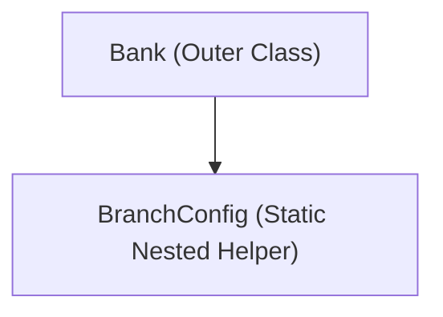
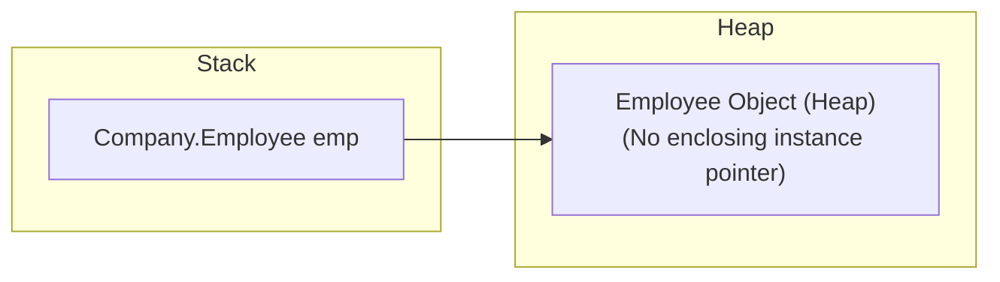

# Static Nested Classes in Java

## Introduction

A **Static Nested Class** is a nested class declared inside another class block using the `static` keyword. 

Unlike a Member Inner Class, a Static Nested Class **does not hold an implicit reference to an instance of its outer class**. Instead, it behaves exactly like any normal top-level class, except that it is nested inside the outer class's namespace. Because of this, it can be instantiated directly without creating an instance of the outer class.

---

## Why Do We Need Static Nested Classes?

Consider a `Bank` class. The bank has static rules or database configuration structures (`BranchConfig`) that are logically related to the bank but do not need access to private transaction fields of specific `Bank` objects:



Declaring the helper class as `static` decouples it from individual parent objects, reducing memory overhead by avoiding unnecessary enclosing instance pointer references.

---

## Static Nested Class Characteristics

* **Keyword**: Declared using the `static` modifier.
* **No Enclosing Reference**: Does not hold an implicit reference (`this$0`) to the outer class instance.
* **Access Rules**: Can directly access **only static members** of the outer class. To access non-static instance fields, it must explicitly instantiate the outer class.
* **Declarations**: Permitted to declare both static and instance methods/fields.
* **Instantiation**: Created directly via `new OuterClass.NestedClass()`.

---

## Syntax and Basic Example

### 1. Declaring a Static Nested Class:
```java
class Company {
    static String companyName = "AlphaTech";
    String nonStaticField = "Some instance state";

    // Static nested class
    static class Employee {
        void display() {
            // Direct access to outer static variables is allowed
            System.out.println("Company Name: " + companyName);

            // System.out.println(nonStaticField); // Compiler Error: non-static field cannot be accessed from static context
        }
    }
}
```

### 2. Instantiating Independently:
No instance of `Company` is required to create an `Employee` object:
```java
public class Main {
    public static void main(String[] args) {
        // Instantiate static nested class directly
        Company.Employee emp = new Company.Employee();
        emp.display(); // Prints: Company Name: AlphaTech
    }
}
```

---

## Memory Allocation and Bytecode Representation

Just like inner classes, compiling static nested classes produces separate bytecode files:
* `Company.class`
* `Company$Employee.class`

### Stack and Heap Allocation Layout:
Because there is no implicit pointer (`this$0`) linking back to the outer class, the nested object exists completely independently on the Heap:



---

## Member Inner Class vs. Static Nested Class

| Feature | Member Inner Class | Static Nested Class |
| :--- | :--- | :--- |
| **Static Keyword** | ❌ No | ✅ Yes |
| **Requires Outer Object** | ✅ Yes | ❌ No |
| **Enclosing Reference (`this$0`)**| ✅ Yes | ❌ No |
| **Access Enclosing Instance State**| Direct access allowed | Must explicitly instantiate outer class |
| **Memory Footprint** | Slightly higher (holds enclosing reference)| Lower (independent) |

---

## Common Mistakes

### 1. Referencing non-static fields directly:
```java
class Outer {
    int instanceVar = 100;
    static class Nested {
        // void show() { System.out.println(instanceVar); } // Compiler Error
    }
}
```

### 2. Using the member inner instantiation syntax:
```java
// Company.Employee emp = companyInstance.new Employee(); // Compiler Error: qualified new cannot be applied to static nested class
```

---

## Key Takeaways

* Static nested classes belong to the outer class name, not its objects.
* They can be instantiated independently of any outer class instance.
* They can only directly access static variables and methods of the outer class.
* They are ideal for grouping utility classes, configurations, and helper components (such as the Builder pattern).

---

**Back to Module Home:** [Advanced Java Class Concepts](README.md)
