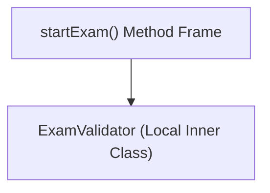
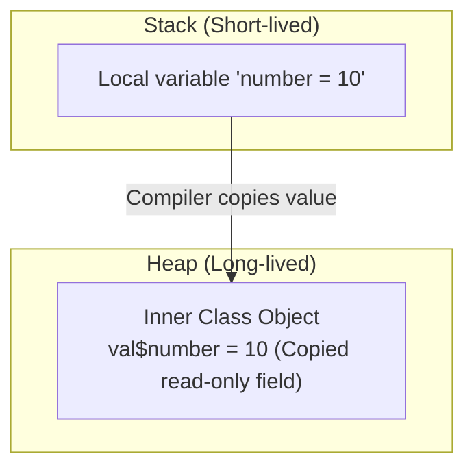

# Local Inner Classes in Java

## Introduction

A **Local Inner Class** is a non-static class declared inside a block of code, typically inside a **method body, constructor, or initialization block** of another class.

Unlike member inner classes, a Local Inner Class is visible and accessible **only within the block of code in which it is declared**. Once execution leaves that scope, the class cannot be instanced or referenced. This makes it ideal for declaring temporary, single-use helper classes.

---

## Why Do We Need Local Inner Classes?

Imagine an **Online Examination System**. Inside the `startExam()` method, we need a validator object to verify a student's ID and connection details. Creating a separate top-level class `ExamValidator.java` pollutes the package namespace for a component that is only used inside this single method.



Nesting `ExamValidator` directly inside `startExam()` encapsulates the validation rules, ensuring no other methods in the class can bypass the rules or instantiate the validator.

---

## Local Inner Class Characteristics

* **Scope-Restricted**: Visible only inside the declaring method or block.
* **Non-Static**: Cannot contain static methods or static fields (except `static final` constants).
* **Access Level**:
  * Direct access to all fields and methods of the enclosing outer class.
  * Direct access to local method variables **only if they are final or effectively final**.

---

## Syntax and Basic Example

### 1. Declaring a Class inside a Method:
```java
class College {
    void showStudentList() {
        // Local Inner Class
        class Student {
            void display() {
                System.out.println("Displaying Student Record...");
            }
        }

        // Instantiation: must occur inside the method block, AFTER the class declaration
        Student s = new Student();
        s.display();
    }
}
```

### 2. Calling the Enclosing Method:
```java
public class Main {
    public static void main(String[] args) {
        College c = new College();
        c.showStudentList(); // Instantiates Student locally and executes display()
    }
}
```

---

## Memory Mechanics: Why Local Variables Must Be Final

One of the most important concepts regarding local inner classes is the rule:
> **Any local method variable accessed by a local inner class must be marked `final` or be *effectively final* (assigned only once).**

### Why does this rule exist? (Memory Lifetime Mismatch)
1. **The Stack Frame Lifecycle**: Local variables reside on the Thread Stack inside the method's activation record. When the method finishes execution, its stack frame is popped and all local variables are destroyed.
2. **The Heap Lifecycle**: The local inner class instance resides on the Heap. It may outlive the method execution (e.g. if it is registered as an event handler or returned).
3. **The Solution (Compiler Copying)**: Since the stack variables will be destroyed, the compiler copies the local variables into hidden constructor fields inside the inner class.
4. **Why Immutability is Enforced**: If the outer method or the inner class could modify these variables, the copied value and the actual variable would get out of sync. To prevent this discrepancy, Java requires the variable to be read-only (`final` or effectively final).



### Invalid Modification Example (Compiler Error):
```java
void show() {
    int value = 50; // Local variable
    value++; // Modified! No longer effectively final

    class Demo {
        void print() {
            // System.out.println(value); // Compiler Error: local variables referenced from an inner class must be final
        }
    }
}
```

---

## Compiler and Bytecode Representation

The compiler generates separate `.class` files, prefixing the name with a number to distinguish it from member inner classes:
* `College.class`
* `College$1Student.class` (The `1` indicates it is a local class declared inside a method)

---

## Local Inner Class vs. Member Inner Class

| Feature | Local Inner Class | Member Inner Class |
| :--- | :--- | :--- |
| **Declared Inside** | A method, constructor, or block | Directly inside a class block |
| **Scope Boundary** | Restricted to the declaring block | Visible to the entire outer class |
| **Access Local Variables**| ✅ Yes (if final/effectively final) | ❌ No local variables exist |
| **Compiler Class Name** | `Outer$1Inner.class` | `Outer$Inner.class` |

---

## Common Mistakes

### 1. Referencing the class outside the method:
```java
void methodA() {
    class Helper { }
}
void methodB() {
    // Helper h = new Helper(); // Compiler Error: Helper is not visible in methodB
}
```

### 2. Modifying local variables inside the inner class:
```java
void run() {
    int count = 0;
    class Counter {
        void increment() {
            // count++; // Compiler Error: local variable cannot be modified
        }
    }
}
```

---

## Key Takeaways

* Local inner classes are declared inside method blocks.
* They are hidden from all scopes outside the enclosing method.
* Local variables accessed by the inner class must remain final or effectively final to prevent memory sync issues.
* The compiler labels them as `Outer$1Inner.class`.

---

**Back to Module Home:** [Advanced Java Class Concepts](README.md)
