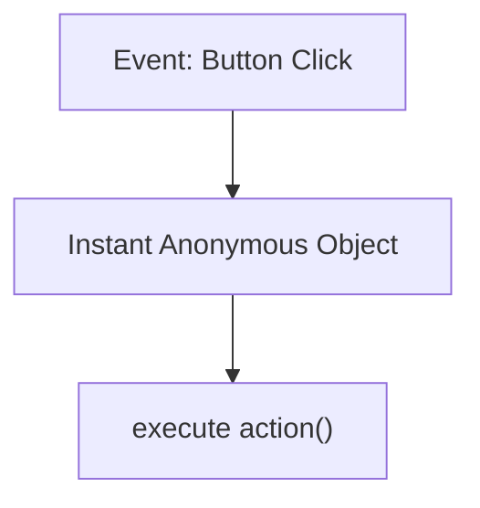
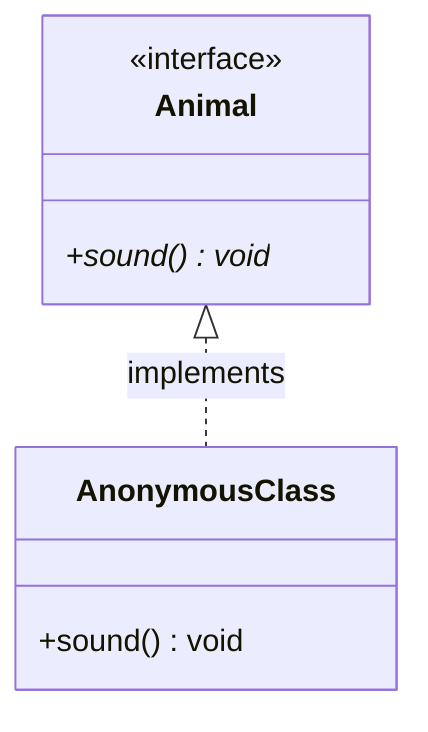
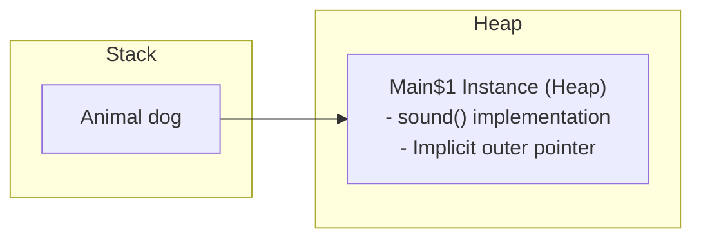

# Anonymous Inner Classes in Java

## Introduction

An **Anonymous Inner Class** is a nested class defined **without a class name** that is declared and instantiated in a single expression. 

When you need to override a method or implement a simple interface for a single, one-time execution, creating a separate top-level class or even a local class is unnecessary. Anonymous inner classes let you write the implementation body directly at the point of object instantiation, reducing code clutter.

---

## Why Do We Need Anonymous Inner Classes?

Imagine a school event where a teacher needs a student to make a quick announcement. Rather than forming a permanent, named student committee (which would be analogous to creating a dedicated class file like `AnnouncementMaker.java`), the teacher simply calls on a student on the spot. Once the announcement is over, the temporary association dissolves.



Similarly, in GUI programming (such as button click listeners) or task threading (Runnable instances), anonymous classes implement immediate behaviors on-the-fly.

---

## Anonymous Inner Class Characteristics

* **Unnamed**: Has no class name identifier.
* **Instant Instantiation**: Declared and instantiated simultaneously using the `new` operator.
* **No Constructors**: Because it has no class name, it cannot define a constructor. However, it can declare **Instance Initializer Blocks** to initialize state variables.
* **Single Type Rule**: Can implement exactly one interface OR extend exactly one parent class (abstract or concrete). It cannot do both, nor can it implement multiple interfaces.

---

## Syntax and Basic Example

### 1. Implementing an Interface:
```java
interface Animal {
    void sound();
}

public class Main {
    public static void main(String[] args) {
        // Creating an anonymous class that implements the Animal interface
        Animal dog = new Animal() {
            @Override
            public void sound() {
                System.out.println("Dog Barks");
            }
        };

        dog.sound(); // Prints: Dog Barks
    }
}
```



---

## Memory Allocation and Bytecode Representation

When compiling an anonymous class, the compiler automatically generates a synthetic class file named after the enclosing class followed by a sequential number:
* `Main.class`
* `Main$1.class` (The first anonymous class defined in Main)
* `Main$2.class` (The second anonymous class, and so on)

### Heap Allocation Layout:
Like local inner classes, the anonymous class instance retains a pointer to the outer class variable stack frame on the Heap, resolving local variables that are marked final or effectively final:



---

## Instance Initializer Blocks (Constructor Alternative)

Since anonymous inner classes have no name, you cannot declare a constructor. If you need initialization logic, use an **Instance Initializer Block** (denoted by `{ }` inside the class body):

```java
interface Game {
    void play();
}

public class Main {
    public static void main(String[] args) {
        Game chess = new Game() {
            // Instance Initializer Block runs during object allocation
            {
                System.out.println("Initializing Chess Board...");
            }

            @Override
            public void play() {
                System.out.println("Making first move...");
            }
        };

        chess.play();
    }
}
```

---

## Comparative Matrix

### 1. Anonymous Class vs. Local Class vs. Normal Class:

| Feature | Anonymous Class | Local Inner Class | Normal Class |
| :--- | :--- | :--- | :--- |
| **Class Name** | ❌ No | ✅ Yes | ✅ Yes |
| **Declared Inside** | Inside an expression | Inside a method block | Directly inside a package |
| **Constructors** | ❌ No (Uses initializer blocks) | ✅ Yes | ✅ Yes |
| **Reusability** | ❌ Single-use only | ❌ Within method block | ✅ Universal |

### 2. Anonymous Class vs. Lambda Expression (Java 8+):

| Feature | Anonymous Class | Lambda Expression |
| :--- | :--- | :--- |
| **Inheritance Support**| Can extend classes/interfaces | Functional Interfaces (Single Abstract Method) only |
| **Fields & State** | Can declare instance fields | Cannot declare state variables (stateless) |
| **Syntax Overhead** | High boilerplate | Extremely concise |

---

## Common Mistakes

### 1. Trying to declare constructors:
```java
Animal dog = new Animal() {
    // Animal() { } // Compiler Error: constructor cannot be declared
};
```

### 2. Creating multiple instances of the same anonymous class:
```java
// There is no named type to reference for a second new call:
// Main$1 obj = new Main$1(); // Compiler Error: Main$1 is a compiler-generated symbol
```

---

## Key Takeaways

* Anonymous inner classes are declared and instantiated in a single step.
* They have no class name and cannot declare constructor signatures.
* Use instance initializers `{ }` for setup logic.
* The compiler names them sequentially: `EnclosingClass$1.class`.

---

**Back to Module Home:** [Advanced Java Class Concepts](README.md)
