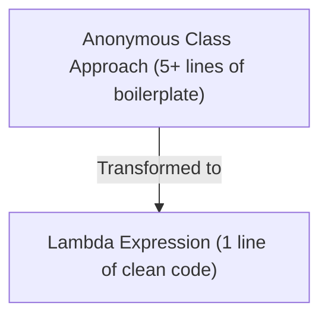
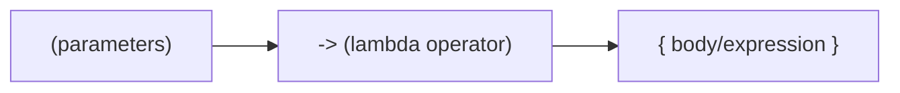
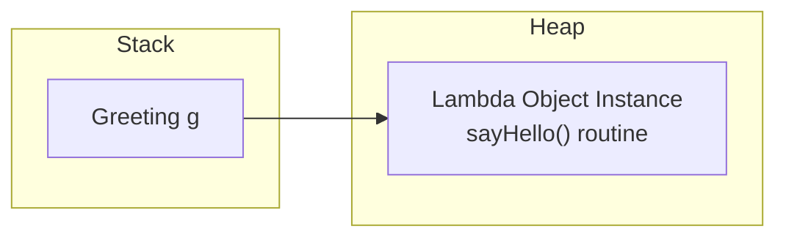

# Lambda Expressions in Java

## Introduction

**Lambda Expressions** were introduced in **Java 8** and represent one of the most significant upgrades in Java's history. They brought **Functional Programming** capabilities to a traditionally Object-Oriented language.

Before Java 8, implementing an interface with a single method required writing verbose boilerplate code—either by creating a dedicated concrete class or using an Anonymous Inner Class. Lambda Expressions eliminate this noise, producing shorter, cleaner, and more readable code.

---

## The Syntax Shift: Verbose to Concise

Suppose we have a functional interface representing a greeting contract:
```java
interface Greeting {
    void sayHello();
}
```

### 1. Anonymous Inner Class approach (Old way):
```java
Greeting g = new Greeting() {
    @Override
    public void sayHello() {
        System.out.println("Hello World");
    }
};
```

### 2. Lambda Expression approach (New way):
```java
Greeting g = () -> System.out.println("Hello World");
```



---

## What is a Lambda Expression?

A **Lambda Expression** is an anonymous function (a method without a name, return type declaration, or access modifiers) that provides the inline implementation of a functional interface.



---

## Requirements: Functional Interfaces

Lambda expressions can only be used to implement **Functional Interfaces**. A Functional Interface (also called a Single Abstract Method or SAM Interface) contains **exactly one abstract method**.

```java
@FunctionalInterface
interface Calculator {
    int add(int a, int b); // Exactly one abstract method
}
```

---

## Lambda Syntax Variations

Depending on the number of parameters and return statement complexity, the syntax varies:

### 1. Zero Parameters:
```java
// Empty parentheses are required
Greeting g = () -> System.out.println("Hi");
```

### 2. Single Parameter:
```java
// Parentheses are optional for a single parameter
Square s = number -> System.out.println(number * number);
```

### 3. Multiple Parameters (with type inference):
```java
// Types can be omitted (inferred by the compiler) or declared explicitly
Addition sum1 = (a, b) -> a + b;
Addition sum2 = (int a, int b) -> a + b;
```

### 4. Multiple Lines with Return Statement:
If the lambda body contains more than one statement, curly braces `{ }` and the `return` keyword are mandatory:
```java
Multiply m = (a, b) -> {
    int result = a * b;
    return result;
};
```

---

## Memory Allocation: Behind the Scenes

Unlike anonymous inner classes (which compile to physical class files like `Main$1.class` and get instantiated on the heap), the JVM uses a bytecode instruction called **`invokedynamic`** (introduced in Java 7) to generate and bind the lambda call site dynamically at runtime. This avoids loading extra class files and reduces memory overhead.

### Stack and Heap Layout:
At execution time, the JVM represents the lambda as a lightweight object on the Heap:



---

## Common Mistakes

### 1. Omitting return keyword when using braces:
```java
// Compiler Error: missing return statement
// Addition sum = (a, b) -> { a + b; }; 

// Correct:
Addition sum = (a, b) -> { return a + b; };
```

### 2. Applying lambda to non-functional interfaces:
```java
interface Multi {
    void one();
    void two();
}
// Multi m = () -> { }; // Compiler Error: Multi is not a functional interface
```

---

## Key Takeaways

* Lambda expressions provide inline implementations for functional interfaces.
* A functional interface contains exactly one abstract method.
* Parentheses are optional for single parameters; type declarations are inferred.
* Braces `{ }` and `return` are required for multi-statement bodies.
* Under the hood, lambdas utilize `invokedynamic` to optimize memory allocations.

---

**Back to Module Home:** [Advanced Java Class Concepts](README.md)
