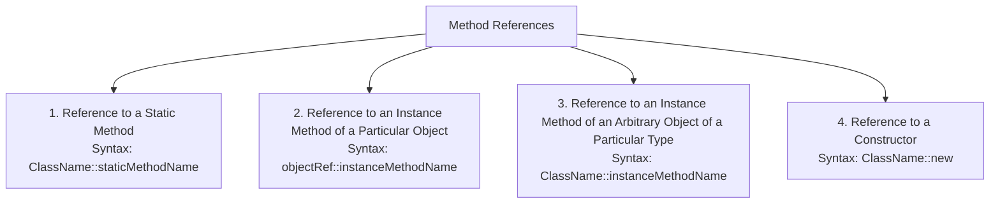
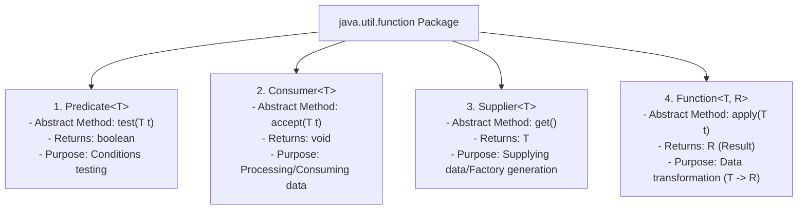

# Method References and Built-in Functional Interfaces in Java

## Introduction

In some situations, a Lambda Expression does nothing more than call an existing method. For example:
```java
// Lambda Expression calling an existing println method
str -> System.out.println(str)
```

To make the code even more readable and compact, Java 8 introduced **Method References** using the double colon `::` operator:
```java
// Method Reference alternative
System.out::println
```

Method References serve as shorthand syntax for lambdas that simply delegate to an existing method.

---

## Types of Method References

Method references are categorized into four distinct types depending on the target method's scope:



---

## Code Examples: Method References

### 1. Static Method Reference:
```java
interface Printer {
    void printMessage();
}

class MessageUtility {
    static void displayGreeting() {
        System.out.println("Hello, welcome to Method References!");
    }
}

public class Main {
    public static void main(String[] args) {
        // Lambda: Printer p = () -> MessageUtility.displayGreeting();
        Printer p = MessageUtility::displayGreeting; // Static Method Reference
        p.printMessage();
    }
}
```

### 2. Reference to an Instance Method of a Particular Object:
```java
class Greeter {
    void greet() {
        System.out.println("Welcome User!");
    }
}

public class Main {
    public static void main(String[] args) {
        Greeter greeter = new Greeter();
        
        // Lambda: Runnable r = () -> greeter.greet();
        Runnable r = greeter::greet; // Instance Method Reference
        r.run();
    }
}
```

### 3. Constructor Reference:
You can reference a constructor using the `new` keyword, which is useful for factory patterns:
```java
class Student {
    Student() {
        System.out.println("Student Object Instantiated on Heap");
    }
}

interface StudentFactory {
    Student create();
}

public class Main {
    public static void main(String[] args) {
        // Lambda: StudentFactory factory = () -> new Student();
        StudentFactory factory = Student::new; // Constructor Reference
        Student s = factory.create();
    }
}
```

---

## Built-in Functional Interfaces (`java.util.function`)

To prevent developers from needing to declare custom functional interfaces for standard tasks, Java 8 introduced a comprehensive suite of built-in functional interfaces inside the `java.util.function` package:



---

## Code Examples: Built-in Functional Interfaces

### 1. Predicate Example (Conditional Testing):
```java
import java.util.function.Predicate;

public class Main {
    public static void main(String[] args) {
        // Evaluates if an integer is even
        Predicate<Integer> isEven = n -> n % 2 == 0;
        System.out.println(isEven.test(10)); // Prints: true
        System.out.println(isEven.test(7));  // Prints: false
    }
}
```

### 2. Consumer Example (Processing Inputs):
```java
import java.util.function.Consumer;

public class Main {
    public static void main(String[] args) {
        Consumer<String> logger = msg -> System.out.println("LOG: " + msg);
        logger.accept("Connection Established"); // Prints: LOG: Connection Established
    }
}
```

### 3. Supplier Example (Data Retrieval):
```java
import java.util.function.Supplier;

public class Main {
    public static void main(String[] args) {
        Supplier<Double> randomValue = Math::random;
        System.out.println(randomValue.get()); // Prints a random double
    }
}
```

### 4. Function Example (Data Transformation):
```java
import java.util.function.Function;

public class Main {
    public static void main(String[] args) {
        // Maps String to its character length
        Function<String, Integer> stringLength = String::length;
        System.out.println(stringLength.apply("JavaProgramming")); // Prints: 15
    }
}
```

---

## Comparison: Lambda vs. Method Reference

| Metric | Lambda Expression | Method Reference |
| :--- | :--- | :--- |
| **Syntax** | `str -> System.out.println(str)` | `System.out::println` |
| **Flexibility** | Highly flexible (allows modifying args inline) | Rigid (only passes arguments straight through)|
| **Readability** | Good | Excellent (extremely concise) |

---

## Key Takeaways

* Method references (`::`) provide shorthand syntax for lambdas that simply delegate to existing methods.
* They support static methods, instance methods, and constructor references (`::new`).
* The `java.util.function` package provides standard built-in functional interfaces: `Predicate` (conditional testing), `Consumer` (data sink), `Supplier` (data source), and `Function` (data mapper).

---

**Back to Module Home:** [Advanced Java Class Concepts](README.md)
