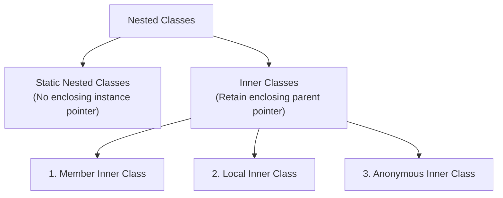

# Module 09: Advanced Java Class Concepts

Welcome to the **Advanced Java Class Concepts** module! This guide outlines the learning objectives, lesson structure, core concepts, and interview FAQs for implementing nested classes, inner classes, anonymous instances, lambda expressions, and method references in Java.

---

## Learning Objectives

By the end of this module, you will understand:
1. **Nested Classes**: Grouping related helper classes inside outer namespaces.
2. **Inner Classes**: Structuring member, local, and anonymous inner classes.
3. **Memory Lifecycles**: How local variables accessed by local classes must be final or effectively final.
4. **Functional Programming**: Implementing functional interfaces and lambda syntax configurations.
5. **Method References**: Optimizing lambda expressions using shorthand references (`::`).

---

## Lessons Map

| Lesson | Title | Description |
| :---: | :--- | :--- |
| **01** | [Nested Classes](01_Nested-Classes.md) | Syntax overview, compiler-generated separate class files, and package organization. |
| **02** | [Member Inner Classes](02_Member-Inner-Classes.md) | Non-static member nested instances, private field sharing, and scope shadowing resolution using `OuterClass.this`. |
| **03** | [Static Nested Classes](03_Static-Nested-Classes.md) | Decoupled static subclasses, static members, and independent memory lifetimes. |
| **04** | [Local Inner Classes](04_Local-Inner-Classes.md) | Methods and constructors scope boundaries, stack framings, and final/effectively final rules. |
| **05** | [Anonymous Inner Classes](05_Anonymous-Inner-Classes.md) | Definition-on-the-fly anonymous objects, GUI listeners, and instance initializer block constructors. |
| **06** | [Lambda Expressions](06_Lambda-Expressions.md) | Concise lambda syntax, parameter conversions, and lightweight `invokedynamic` allocations. |
| **07** | [Method References](07_Method-References.md) | Shorthand static, instance, constructor references (`::`), and the `java.util.function` package. |

---

## Core Concepts Overview

### Nested Class Hierarchy:

---

## Interview Questions (FAQ)

### Why does a member inner class require an outer class instance to initialize?
Because a member inner class is non-static, it is bound to the instance state of the enclosing class. The inner object retains an implicit pointer (`this$0`) pointing to the parent instance on the Heap.

### What is the difference between an anonymous inner class and a lambda expression?
An anonymous class can extend concrete or abstract classes and implement interfaces with multiple methods. A lambda expression is limited to functional interfaces (exactly one abstract method) but has much lower syntax overhead and leverages `invokedynamic` for performance.

---

*Depth. Encapsulation. Functional integration.*
