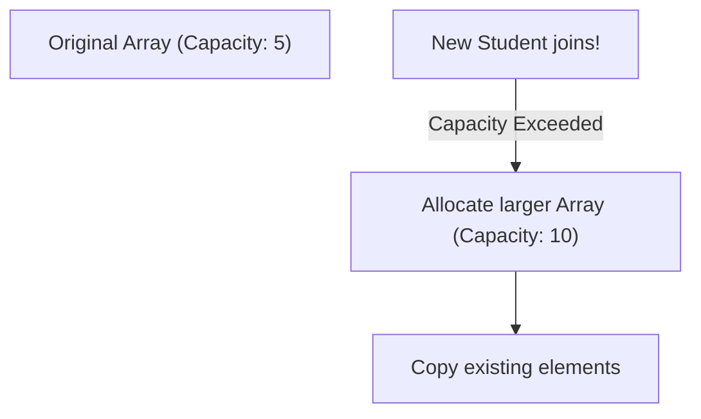
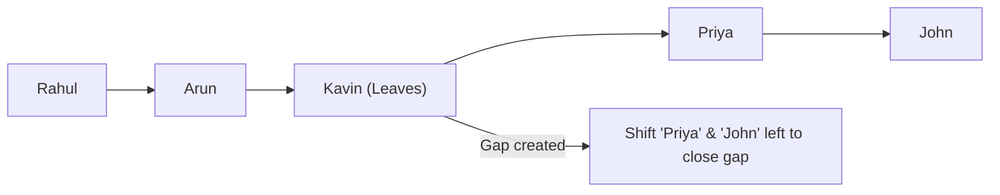
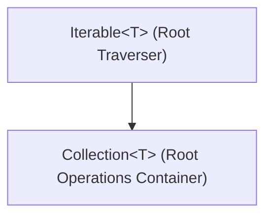

# Java Collection Framework (JCF) Introduction: Part 1

## Introduction

In typical software systems, we regularly process groups of related data objects—such as lists of bank accounts, active customer orders, or student enrollments. 

Before Java 1.2, developers had to manage collections of data using traditional Arrays or vector/hashtable utilities. These early structures had significant constraints. 

To unify and optimize data management, Java introduced the **Java Collection Framework (JCF)**—a standardized architecture of interfaces, implementations, and algorithms for managing collections of objects dynamically.

---

## The Core Problem with Arrays

Arrays are the most basic data structures in Java, but they suffer from three key limitations in dynamic applications:

### 1. Fixed Size (Static Capacity):
Once allocated, an array's capacity cannot grow or shrink. If you allocate a student array for 5 elements, and a 6th student joins, you must manually allocate a larger array, copy the old elements, and update references.



### 2. Manual Insertion/Deletion is Expensive:
If you want to remove an element from the middle of an array, you must manually shift all subsequent elements to close the gap:



### 3. Lack of Ready-Made Algorithms:
Sorting, searching, and reversing array elements requires writing manual loop structures, leading to repetitive boilerplate code.

---

## Features and Advantages of JCF

* **Dynamic Resizing**: Collections dynamically grow and shrink automatically as elements are added or removed.
* **Standardized Architecture**: Interfaces like `List`, `Set`, and `Queue` provide a uniform API, making code reusable and consistent.
* **Highly Optimized Implementations**: Classes such as `ArrayList` and `LinkedList` are pre-tuned for speed and memory efficiency.
* **Reduced Development Effort**: Focus on business logic rather than writing basic data structures.

---

## The Root of the Hierarchy: Iterable and Collection

All core collection classes in Java inherit from the **`Iterable`** and **`Collection`** interfaces (except for Maps, which form their own separate hierarchy).



### 1. The `Iterable` Interface:
The top-most interface in the hierarchy. Any class that implements `Iterable<T>` can be traversed using the enhanced `for-each` loop:

```java
public interface Iterable<T> {
    Iterator<T> iterator(); // Returns an Iterator instance
}
```

#### Example traversal using Iterable:
```java
import java.util.ArrayList;
import java.util.Iterator;

public class Main {
    public static void main(String[] args) {
        ArrayList<String> names = new ArrayList<>();
        names.add("Rahul");
        names.add("Arun");
        names.add("Priya");

        // Option A: Traversing using Iterator
        Iterator<String> it = names.iterator();
        while (it.hasNext()) {
            System.out.println(it.next());
        }

        // Option B: Shorthand using Enhanced for-each loop
        for (String name : names) {
            System.out.println(name);
        }
    }
}
```

---

## Core Collection Methods

The `Collection` interface defines essential operations shared by all list, set, and queue structures:

| Method | Return Type | Description |
| :--- | :--- | :--- |
| `add(E e)` | `boolean` | Appends/inserts element `e` into the collection. |
| `remove(Object o)`| `boolean` | Removes a single instance of `o` from the collection. |
| `size()` | `int` | Returns the number of active elements. |
| `clear()` | `void` | Flushes all elements, resetting size to 0. |
| `contains(Object o)`| `boolean` | Evaluates if `o` is present (using `equals()`). |
| `isEmpty()` | `boolean` | Evaluates if the collection size is 0. |

---

## Key Takeaways

* Arrays are fast but suffer from static capacity constraints and require manual shifting for insertions and deletions.
* The Java Collection Framework provides standard interfaces, implementations, and algorithms for managing collections.
* The `Iterable` interface is the root traverser, enabling enhanced `for-each` loops.
* The `Collection` interface defines the base API operations for all lists, sets, and queues.

---

**Back to Module Home:** [Collection Framework Index](README.md)
