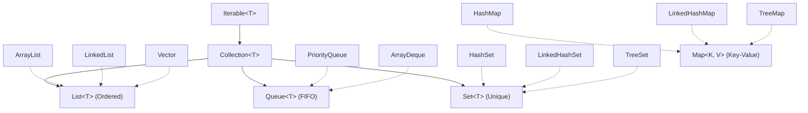

# Java Collection Framework (JCF) Introduction: Part 2

## Introduction

In the previous part, we discussed the disadvantages of static arrays and the base properties of the `Iterable` and `Collection` interfaces. 

In this chapter, we map the entire hierarchy of the **Java Collection Framework (JCF)**. We will look at how interfaces are grouped, explore their individual purposes, and distinguish between direct collection objects and key-value Map structures.

---

## The JCF Interface & Implementation Hierarchy

The hierarchy is split into two distinct branches:
1. **The Collection Hierarchy**: Handles single objects.
2. **The Map Hierarchy**: Handles key-value pairs (which does not inherit from `Collection` but is considered a core part of JCF).

---

## Understanding the Sub-Interfaces

### 1. The `List` Interface:
A `List` is an ordered collection that permits **duplicate elements** and allows precise control over where elements are inserted via index pointers.
* **Key Classes**:
  * `ArrayList`: Backed by a resizable array. Ideal for search-heavy operations.
  * `LinkedList`: Backed by doubly linked nodes. Ideal for frequent insertions and deletions.
  * `Vector`: Thread-safe, synchronized predecessor to ArrayList.

### 2. The `Queue` Interface:
Designed to hold elements prior to processing. Typically orders elements in a **First-In, First-Out (FIFO)** sequence.
* **Key Classes**:
  * `PriorityQueue`: Sorts elements based on natural order or a custom Comparator.
  * `ArrayDeque`: Double-ended queue allowing insertion/deletion at both ends.

### 3. The `Set` Interface:
A collection that **cannot contain duplicate elements**. It models the mathematical set abstraction.
* **Key Classes**:
  * `HashSet`: Uses hashing for storage. Offers constant-time performance but does not guarantee order.
  * `LinkedHashSet`: Maintains a doubly linked list running through elements, preserving insertion order.
  * `TreeSet`: Stores elements in a sorted tree structure.

### 4. The `Map` Interface:
A `Map` maps unique keys to values. It is a separate hierarchy because it does not model a collection of individual objects, but rather a collection of pairs.
* **Key Classes**:
  * `HashMap`: Stores key-value pairs without order.
  * `TreeMap`: Sorts pairs based on natural key order.

---

## Comparison: Collection vs. Map

| Metric | Collection Interface | Map Interface |
| :--- | :--- | :--- |
| **Hierarchy Root** | Inherits from `Iterable` | Stands as a separate root interface |
| **Data Format** | Single elements (`E`) | Key-Value pairs (`K, V`) |
| **Duplicate Support**| Allowed in `List`, rejected in `Set` | Duplicate values allowed; keys must be unique |
| **Access Method** | By element value or index pointer | By unique key |

---

## Key Takeaways

* The JCF is split into two major roots: `Collection` (for single objects) and `Map` (for key-value associations).
* `List` provides indexed ordering and permits duplicate entries.
* `Set` prohibits duplicate entries.
* `Queue` structures data for processing, typically using FIFO order.
* `Map` maps unique keys to values using hash tables or tree structures.

---

**Back to Module Home:** [Collection Framework Index](README.md)
