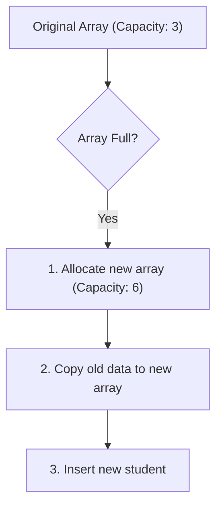
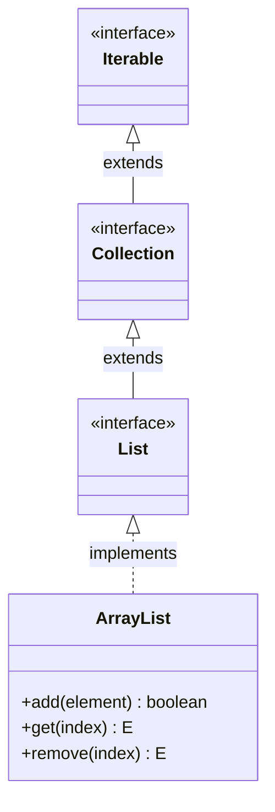

# ArrayList in Java: Basics

## Introduction

One of the most frequently used classes in the Java Collection Framework is **`ArrayList`**. 

Whenever we need to store multiple objects that can grow or shrink dynamically, `ArrayList` is the standard go-to implementation. Unlike arrays, which have a fixed capacity, an `ArrayList` automatically resizes itself when new elements are added or removed.

---

## Why Do We Need ArrayList?

Consider a school registration system. Initially, we store student records in a standard array:
```java
String[] students = new String[3];
```

If a fourth student joins, the array is full. We must manually create a larger array, copy the old elements, and switch references:



An `ArrayList` eliminates this manual shifting overhead by automatically resizing its capacity in the background.

---

## ArrayList Class Characteristics

* **Dynamic Resizing**: Automatically handles element scaling on demand.
* **Ordered Collection**: Maintains insertion order; elements are retrieved in the order they were inserted.
* **Allows Duplicates**: You can store multiple identical elements in the same list.
* **Allows Nulls**: The value `null` can be inserted and stored.
* **Index-Based Access**: Accesses elements in constant time ($\mathcal{O}(1)$) using integer index keys (starting at 0).
* **Object Store**: Can only store object references (uses Wrapper classes for primitive types).

---

## Inheritance and Hierarchy

`ArrayList` implements the `List` interface, which in turn inherits from the `Collection` and `Iterable` interfaces:



---

## Syntax and Basic Example

Always declare lists using the generic interface type `List` on the reference variable for clean encapsulation:

```java
import java.util.ArrayList;
import java.util.List;

public class Main {
    public static void main(String[] args) {
        // Declaring a type-safe List of String
        List<String> fruits = new ArrayList<>();

        // Adding elements
        fruits.add("Apple");
        fruits.add("Banana");
        fruits.add("Orange");

        // Print the List representation
        System.out.println(fruits); // Output: [Apple, Banana, Orange]
    }
}
```

---

## ArrayList Constructors

The `ArrayList` class provides three constructors:

1. **Default Constructor**: Creates an empty list with an initial capacity of 10.
   ```java
   List<Integer> list = new ArrayList<>();
   ```
2. **Initial Capacity Constructor**: Creates an empty list with a specific initial capacity. Ideal when the approximate size of the data is known beforehand, reducing unnecessary resize operations.
   ```java
   List<Integer> list = new ArrayList<>(50);
   ```
3. **Collection Constructor**: Initializes the list with elements copied from another collection.
   ```java
   List<String> list = new ArrayList<>(oldCollection);
   ```

---

## Array vs. ArrayList Comparison

| Metric | Primitive Array | `ArrayList` |
| :--- | :--- | :--- |
| **Size Constraint** | Fixed capacity (static allocation) | Dynamically resizable |
| **Data Types** | Stores both primitives and objects | Stores objects only (requires wrapper objects) |
| **Length Identifier** | `length` field | `size()` method |
| **Built-in Methods** | None (requires loops / Arrays helper) | Extensive CRUD methods (`add()`, `remove()`, etc.) |

---

## Key Takeaways

* `ArrayList` is a dynamic array implementation of the `List` interface.
* It maintains element insertion order and permits duplicates and `null` values.
* Declare variables using the `List` interface type rather than the concrete `ArrayList` type for flexibility.
* Generics ensure type safety at compile time, preventing runtime `ClassCastException` issues.

---

**Back to Module Home:** [Collection Framework Index](../README.md)
