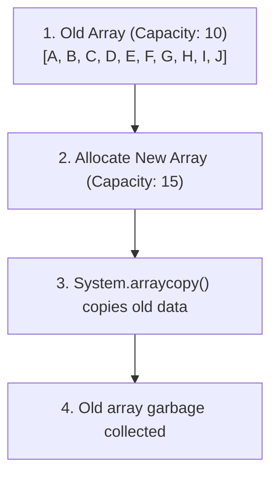
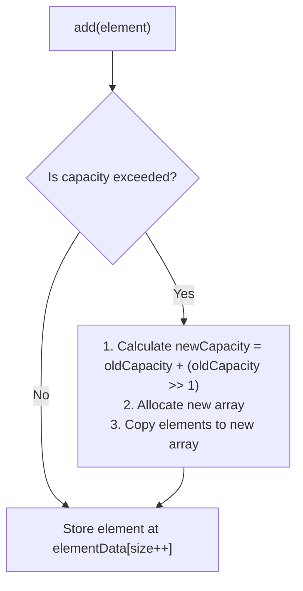

# ArrayList in Java: Internal Workings

## Introduction

To write highly performant Java applications, you must understand the internal memory mechanics of the data structures you use. While `ArrayList` behaves like a dynamic list, its underlying structure is a standard primitive array of objects (`Object[] elementData`).

This guide details the internal resizing formulas, capacity vs. size allocation on the heap, and the time complexity trade-offs of CRUD operations.

---

## Capacity vs. Size

A common point of confusion is the difference between an ArrayList's **Capacity** and its **Size**:

* **Capacity**: The length of the underlying primitive array (`elementData.length`). This is the maximum number of elements the list can hold without resizing.
* **Size**: The number of elements currently stored in the list.

```mermaid
graph TD
    subgraph elementData Array (Capacity: 10)
        Item0["[0]: A"]
        Item1["[1]: B"]
        Item2["[2]: C"]
        Item3["[3]: null"]
        Item4["[4]: null"]
        Item5["[5]: null"]
        Item6["[6]: null"]
        Item7["[7]: null"]
        Item8["[8]: null"]
        Item9["[9]: null"]
    end
    
    style Item0 fill:#4f4,stroke:#333
    style Item1 fill:#4f4,stroke:#333
    style Item2 fill:#4f4,stroke:#333
    style Item3 fill:#f44,stroke:#333
    style Item4 fill:#f44,stroke:#333
    style Item5 fill:#f44,stroke:#333
    style Item6 fill:#f44,stroke:#333
    style Item7 fill:#f44,stroke:#333
    style Item8 fill:#f44,stroke:#333
    style Item9 fill:#f44,stroke:#333
```

In the diagram above:
* **Size** = 3 (A, B, C are active objects).
* **Capacity** = 10 (Total array slots allocated in memory).

---

## Dynamic Resizing and the Growth Formula

When you instantiate a list using the default constructor `new ArrayList<>()`, the internal array is initialized to a shared empty array placeholder.

Upon adding the **first element**, the list initializes the internal array with a default capacity of **10**.

### The 1.5x Growth Formula:
When the 11th element is added, the capacity is exceeded. The JVM automatically resizes the list using the following bitwise formula:

$$\text{New Capacity} = \text{Old Capacity} + (\text{Old Capacity} \gg 1)$$

$$\text{New Capacity} \approx \text{Old Capacity} \times 1.5$$

For example, resizing follows this sequence: $10 \rightarrow 15 \rightarrow 22 \rightarrow 33 \rightarrow 49 \rightarrow 73 \dots$

### Heap Allocation During Resizing:
Resizing requires allocating a brand new array on the Heap and copying the elements from the old array using `System.arraycopy()`. The old array is then dereferenced and garbage collected:



---

## The Internal Mechanics of `add(E element)`



---

## Time Complexity and Memory Trade-offs

Understanding these internal array manipulations reveals why certain operations are fast and others are slow:

### 1. Why `get(index)` is Fast ($\mathcal{O}(1)$):
Because the elements are stored in a contiguous array, the JVM calculates the exact memory address of any element instantly using offset arithmetic:

$$\text{Address} = \text{Base Address} + (\text{Index} \times \text{Reference Size})$$

No node traversing is required.

### 2. Why `remove(index)` and `add(index, element)` are Slow ($\mathcal{O}(N)$):
Removing or inserting an element in the middle requires shifting all subsequent elements to the left or right to prevent gaps:

```text
Before remove(1):
Index:  0    1    2    3
Value: [A]  [B]  [C]  [D]

After remove(1):
Index:  0    1    2    3
Value: [A]  [C]  [D]  [null]   <-- Shifted Left (Gap closed)
```

This shifting is done via `System.arraycopy()`, which is expensive on large arrays.

---

## Key Takeaways

* `ArrayList` is backed by a standard Object array (`Object[] elementData`).
* Size is the number of active elements; Capacity is the internal array's length.
* Resizing increases the capacity by **1.5x** using bitwise shifting (`oldCapacity >> 1`).
* `get()` and `set()` operations run in constant time ($\mathcal{O}(1)$).
* `add(index)` and `remove()` require element shifting, running in linear time ($\mathcal{O}(N)$).

---

**Back to Module Home:** [Collection Framework Index](../README.md)
