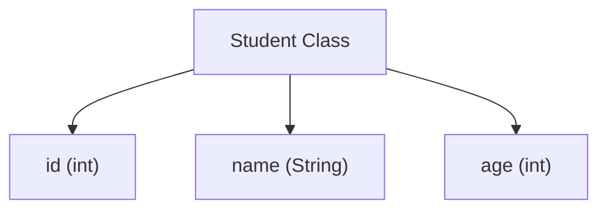
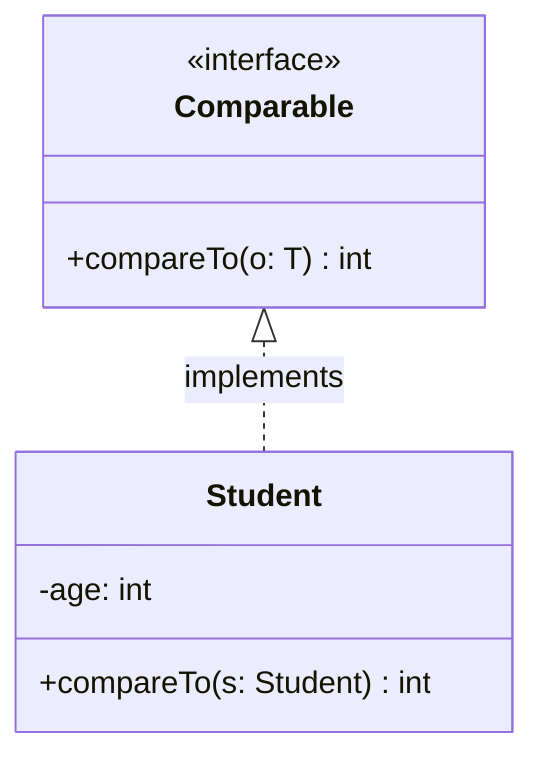
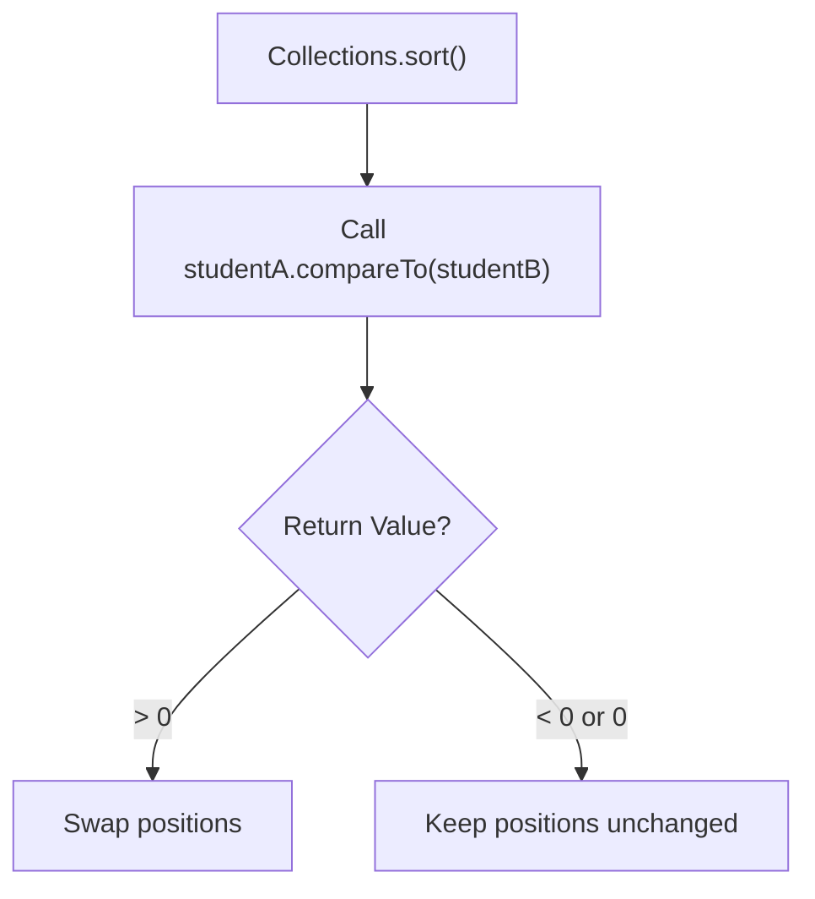

# Comparable vs. Comparator in Java: Part 1 (Comparable)

## Introduction

In standard Java applications, sorting collections of primitive data types (like numbers or characters) is trivial because Java has a built-in understanding of natural numeric and alphabetical sorting. 

However, when sorting collections of **custom objects** (like a List of `Student` or `Product` instances), Java cannot determine the correct criteria. Should the students be sorted by roll number, name, or age?

To resolve this, Java provides two core sorting interfaces:
1. **`java.lang.Comparable`** (Defines a class's default, natural sorting order).
2. **`java.util.Comparator`** (Defines custom, alternative sorting rules external to the class).

This guide focuses on implementing **`Comparable`** for natural ordering.

---

## Why Do We Need Comparable?

Consider a `Student` custom object:



Without explicit instructions, calling `Collections.sort(studentList)` will throw a compilation error because Java does not know which field to use for comparisons. By implementing `Comparable`, a class defines its own sorting criteria.

---

## What is Comparable?

The **`Comparable`** interface is located in the `java.lang` package. When a class implements `Comparable`, it defines its own default ordering (known as **Natural Ordering**).



### The `compareTo()` Method:
The `Comparable` interface declares exactly one method:
```java
public int compareTo(T o);
```

This method compares the current instance (`this`) with the passed argument `o`.

---

## The return value contract of `compareTo()`

| Return Value | Meaning | Action Taken |
| :--- | :--- | :--- |
| **Negative Integer** | `this` is **smaller** than `o` | No swap (remains in order) |
| **Zero (0)** | `this` is **equal** to `o` | No swap |
| **Positive Integer** | `this` is **greater** than `o` | Swap elements |

---

## Syntax and Practical Example

### 1. Declaring Comparable on a Class:
To compare by age, we subtract the parameter's age from our own age:
```java
import java.util.ArrayList;
import java.util.Collections;

class Student implements Comparable<Student> {
    private String name;
    private int age;

    public Student(String name, int age) {
        this.name = name;
        this.age = age;
    }

    // Overriding compareTo to sort by age in ascending order
    @Override
    public int compareTo(Student other) {
        // Ascending sort logic:
        return this.age - other.age; 
    }

    @Override
    public String toString() {
        return name + " (" + age + ")";
    }
}
```

### 2. Executing the Sort:
```java
public class Main {
    public static void main(String[] args) {
        ArrayList<Student> students = new ArrayList<>();
        students.add(new Student("Rahul", 20));
        students.add(new Student("Arun", 18));
        students.add(new Student("Priya", 19));

        Collections.sort(students); // Internally calls compareTo()

        System.out.println(students); 
        // Output: [Arun (18), Priya (19), Rahul (20)]
    }
}
```

---

## Internal Sorting Mechanics

When you call `Collections.sort()`, the Java library executes a hybrid sorting algorithm (like TimSort). The algorithm calls `compareTo()` repeatedly on pairs of objects to determine if a swap is necessary:



---

## Limitations of Comparable

* **Single Sorting Order**: You can define only one natural ordering (e.g. if sorted by age, you cannot easily sort by name).
* **Class Modification Required**: You must modify the source code of the class to implement the interface, which is impossible for third-party library classes.

---

## Key Takeaways

* `Comparable` belongs to the `java.lang` package.
* It is implemented by a class on itself to declare its **natural ordering**.
* It exposes the `compareTo(T o)` method.
* Returning `this.age - other.age` sorts elements in ascending order.
* To sort using alternative or multiple fields, you must use the `Comparator` interface.

---

**Back to Module Home:** [Collection Framework Index](README.md)
