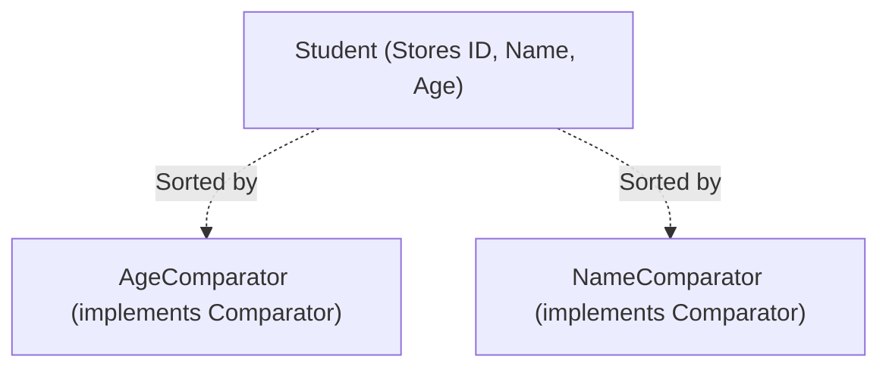

# Comparable vs. Comparator in Java: Part 2 (Comparator)

## Introduction

In the previous part, we explored the `Comparable` interface, which defines the default, natural sorting order for custom objects. 

However, in many real-world applications (like e-commerce systems), you need the flexibility to sort the same list of objects by multiple different fields—such as sorting products by price, rating, or release date. 

Because a class can only implement `Comparable` once (defining one natural sorting order), Java provides the **`java.util.Comparator`** interface to represent custom, alternative sorting behaviors external to the class.

---

## What is a Comparator?

A **`Comparator`** is an interface located in the `java.util` package. Unlike `Comparable`, a `Comparator` implementation is defined in a separate class outside the target data model class:



---

## The `compare()` Method Contract

The `Comparator` interface exposes a single abstract method:
```java
public int compare(T o1, T o2);
```

### Return Values:
* **Negative Integer**: `o1` is **smaller** than `o2` (retains order).
* **Zero (0)**: `o1` is **equal** to `o2` (retains order).
* **Positive Integer**: `o1` is **greater** than `o2` (swaps positions).

---

## Syntax and Practical Examples

### 1. The Core Data Class (No Comparable implemented):
```java
class Student {
    int id;
    String name;
    int age;

    public Student(int id, String name, int age) {
        this.id = id;
        this.name = name;
        this.age = age;
    }

    @Override
    public String toString() {
        return id + ": " + name + " (" + age + ")";
    }
}
```

### 2. Creating Custom Comparator Classes:
```java
import java.util.Comparator;

// Comparator to sort by age
class AgeComparator implements Comparator<Student> {
    @Override
    public int compare(Student s1, Student s2) {
        return s1.age - s2.age;
    }
}

// Comparator to sort by name alphabetically
class NameComparator implements Comparator<Student> {
    @Override
    public int compare(Student s1, Student s2) {
        return s1.name.compareTo(s2.name);
    }
}
```

### 3. Sorting Using the Comparators:
```java
import java.util.ArrayList;
import java.util.Collections;

public class Main {
    public static void main(String[] args) {
        ArrayList<Student> students = new ArrayList<>();
        students.add(new Student(101, "Rahul", 20));
        students.add(new Student(103, "Arun", 18));
        students.add(new Student(102, "Priya", 19));

        // Sort by Age
        Collections.sort(students, new AgeComparator());
        System.out.println("Sorted by Age: " + students);

        // Sort by Name
        Collections.sort(students, new NameComparator());
        System.out.println("Sorted by Name: " + students);
    }
}
```

---

## Modernizing Comparator Implementations

Creating separate comparator classes can pollute your package directory. Java offers two modern alternatives:

### 1. Anonymous Inner Classes (Pre-Java 8):
```java
Collections.sort(students, new Comparator<Student>() {
    @Override
    public int compare(Student s1, Student s2) {
        return s1.age - s2.age;
    }
});
```

### 2. Lambda Expressions (Java 8+):
Since `Comparator` is a functional interface, it can be written as a clean, single-line expression:
```java
Collections.sort(students, (s1, s2) -> s1.age - s2.age);
```

---

## Decision Matrix: Comparable vs. Comparator

| Feature | `Comparable` | `Comparator` |
| :--- | :--- | :--- |
| **Package** | `java.lang` | `java.util` |
| **Method** | `compareTo(T o)` | `compare(T o1, T o2)` |
| **Sorting Type** | Natural default ordering | Custom, alternative ordering |
| **Location** | Implemented directly inside the class | Implemented in separate helper classes |
| **Flexibility** | Exactly one sorting rule | Multiple alternative sorting rules |
| **Source Impact** | Requires modifying the target class source | Does not require modifying the target class |

---

## Key Takeaways

* Use `Comparable` to define the single default sort order for a class.
* Use `Comparator` to define multiple, alternative sorting logic external to the class.
* Since Java 8, `Comparator` is a Functional Interface, allowing concise lambda definitions.
* You pass a comparator directly as a second argument to `Collections.sort(list, comparator)`.

---

**Back to Module Home:** [Collection Framework Index](README.md)
