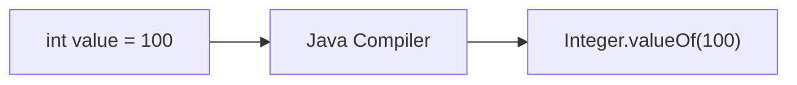
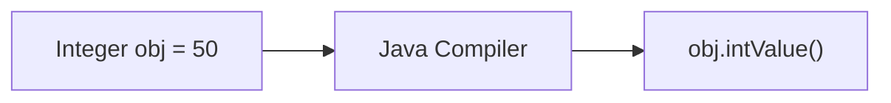

# Autoboxing and Unboxing in Java

## Introduction

Java implements a dual data type system containing:
1. **Primitive Data Types**: Fast, memory-efficient values stored directly on the stack (e.g. `int`, `double`, `boolean`).
2. **Reference Data Types (Objects)**: Rich classes stored on the heap containing fields, methods, and monitor metadata (e.g. `Integer`, `Double`, `Boolean`).

While primitives are fast, they cannot be stored directly inside the **Java Collection Framework** structures (like `ArrayList`, `HashSet`, or `HashMap`), which only operate on object references.

To bridge this gap, Java provides **Wrapper Classes** alongside **Autoboxing** and **Unboxing** mechanisms to convert automatically between primitives and objects.

---

## Primitive Types and Wrapper Classes

Every primitive type in Java has a corresponding object counterpart in the `java.lang` package:

| Primitive | Size in Memory | Wrapper Class |
| :--- | :--- | :--- |
| `byte` | 1 Byte | `Byte` |
| `short` | 2 Bytes | `Short` |
| `int` | 4 Bytes | `Integer` |
| `long` | 8 Bytes | `Long` |
| `float` | 4 Bytes | `Float` |
| `double` | 8 Bytes | `Double` |
| `char` | 2 Bytes | `Character` |
| `boolean` | JVM Dependent | `Boolean` |

---

## Boxing and Autoboxing

**Boxing** is the process of converting a primitive value into its corresponding wrapper class object. 

### 1. Manual Boxing (Pre-Java 5):
Historically, you had to explicitly wrap the primitive value by invoking the static factory method `valueOf()`:
```java
int number = 100;
Integer wrapped = Integer.valueOf(number); // Manual Boxing
```

### 2. Autoboxing (Modern Java):
**Autoboxing** is the automatic conversion performed by the Java compiler when a primitive value is assigned to a wrapper class variable:
```java
Integer value = 100; // Autoboxing
```

Under the hood during compilation, the compiler automatically inserts the call to `valueOf()`:



---

## Unboxing and Autounboxing

**Unboxing** is the reverse process—converting an instance of a wrapper object back into its corresponding primitive value.

### 1. Manual Unboxing:
```java
Integer obj = Integer.valueOf(50);
int num = obj.intValue(); // Manual Unboxing
```

### 2. Autounboxing:
The compiler automatically extracts the primitive value during calculations or assignment to primitive variables:
```java
Integer obj = 50;
int num = obj; // Autounboxing
```

The compiler automatically calls the appropriate primitive accessor method (e.g. `intValue()`, `doubleValue()`):



---

## Collections Integration Example

When working with collections, autoboxing and autounboxing operate seamlessly behind the scenes:

```java
import java.util.ArrayList;

public class Main {
    public static void main(String[] args) {
        // ArrayList only holds Objects, not primitive ints
        ArrayList<Integer> marks = new ArrayList<>();

        // 1. Autoboxing: Primitive 95 is converted to Integer.valueOf(95)
        marks.add(95); 
        marks.add(82);

        // 2. Autounboxing: Integer is converted back to primitive int
        int firstMark = marks.get(0); 
        System.out.println("First mark: " + firstMark); // Prints: 95
    }
}
```

---

## Performance & Overhead Warnings

While autoboxing makes code writing highly convenient, it introduces hidden resource overhead:

1. **Object Allocation Cost**: Boxing allocates objects on the Heap. Running boxing inside tight loop cycles creates substantial garbage collector pressure.
2. **NullPointerException (NPE) Risk**: Primitive types cannot represent `null`. If you attempt to autounbox a wrapper variable containing `null`, Java will throw a `NullPointerException`:

```java
Integer value = null;
// int num = value; // Throws NullPointerException!
```

---

## Key Takeaways

* Primitives are values stored directly on the stack; wrappers are full objects stored on the heap.
* **Autoboxing** automatically converts primitive data to wrapper objects (`Integer.valueOf()`).
* **Autounboxing** automatically extracts primitive values from wrapper objects (`intValue()`).
* Autounboxing a wrapper instance containing `null` results in a `NullPointerException`.
* Use primitives in high-performance loops to avoid garbage collector pressure.

---

**Back to Module Home:** [Collection Framework Index](README.md)
