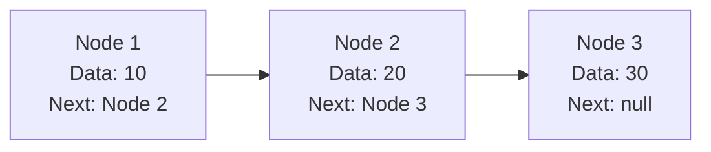
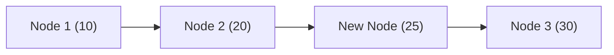

# LinkedList in Java: Introduction & Creation

## Introduction

An **ArrayList** provides dynamic sizing but is backed by a standard primitive array. Because of this, inserting or removing elements in the middle of an ArrayList requires shifting elements, which becomes expensive on large datasets.

To solve this modification bottleneck, Java provides the **`java.util.LinkedList`** class. A LinkedList stores elements as **nodes** connected by pointers, rather than in continuous memory slots.

---

## Why LinkedList? (Node vs. Array Memory)

An array stores elements in **continuous memory locations**. If we want to insert a value in the middle, all subsequent elements must shift right.

```text
Continuous Array Memory:
+----+----+----+----+----+
| 10 | 20 | 30 | 40 | 50 |
+----+----+----+----+----+
```

A **LinkedList** stores nodes dynamically anywhere on the heap. Each node contains the data element and references pointing to the neighbors.



Inserting an element only requires updating reference pointers, avoiding expensive element-shifting overhead.



---

## Syntax and Basic Creation

To use a LinkedList, import the class from the `java.util` package:
```java
import java.util.LinkedList;
```

### 1. Creating an Empty LinkedList:
Always specify **Generics** to ensure compile-time type safety:
```java
LinkedList<String> names = new LinkedList<>();
```

### 2. Initializing from Another Collection:
You can pass an existing collection directly into the LinkedList constructor:
```java
import java.util.ArrayList;
import java.util.LinkedList;

public class Main {
    public static void main(String[] args) {
        ArrayList<String> arrayList = new ArrayList<>();
        arrayList.add("Java");
        arrayList.add("Python");

        // LinkedList initialized with arrayList elements
        LinkedList<String> list = new LinkedList<>(arrayList);
        System.out.println(list); // Prints: [Java, Python]
    }
}
```

---

## Creating LinkedList of Custom Objects

You can store user-defined objects inside a LinkedList just like standard types:

```java
class Student {
    String name;
    
    Student(String name) {
        this.name = name;
    }
    
    @Override
    public String toString() {
        return name;
    }
}

public class Main {
    public static void main(String[] args) {
        LinkedList<Student> students = new LinkedList<>();
        students.add(new Student("Sanjay"));
        students.add(new Student("Rahul"));
        
        System.out.println(students); // Prints: [Sanjay, Rahul]
    }
}
```

---

## Performance Comparison: ArrayList vs. LinkedList

| Feature | ArrayList | LinkedList |
| :--- | :--- | :--- |
| **Underlying Structure** | Resizable Primitive Array | Doubly Linked Nodes |
| **Random Access (`get(index)`)**| ⚡ $\mathcal{O}(1)$ (Instant) | 🐢 $\mathcal{O}(N)$ (Requires traversal) |
| **Insertion/Deletion at ends** | $\mathcal{O}(1)$ (amortized) | ⚡ $\mathcal{O}(1)$ |
| **Insertion/Deletion in middle**| 🐢 $\mathcal{O}(N)$ (Shifting cost) | ⚡ $\mathcal{O}(1)$ (pointer swap once node is found) |
| **Memory Overhead** | Low (data elements only) | High (stores `next` and `prev` pointers) |

---

## Key Takeaways

* A LinkedList stores elements as connected nodes anywhere in memory.
* Inserting and deleting elements is highly efficient because it only requires pointer updates.
* Search/retrieval is slower than ArrayList because LinkedList must traverse nodes sequentially.
* Under the hood, Java implements a **Doubly Linked List** structure.

---

**Back to Module Home:** [Collection Framework Index](../README.md)
