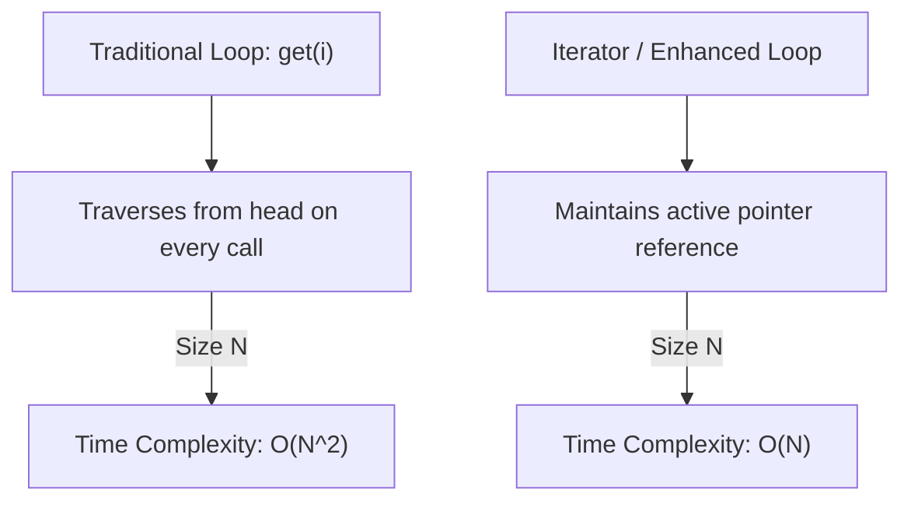

# Iteration in a LinkedList

## Introduction

After learning how to manage elements, the next critical operation is **iteration** (visiting and processing each node sequentially). Java provides several ways to traverse a LinkedList. Choosing the wrong method, however, can introduce massive performance penalties due to how LinkedList searches nodes internally.

---

## 1. Iteration Techniques

### Method A: Enhanced `for-each` Loop (Recommended for simple read-only operations):
```java
import java.util.LinkedList;

public class Main {
    public static void main(String[] args) {
        LinkedList<String> list = new LinkedList<>();
        list.add("Apple");
        list.add("Banana");
        list.add("Orange");

        for (String item : list) {
            System.out.println(item);
        }
    }
}
```

### Method B: Iterator (Safe for element removal):
```java
import java.util.Iterator;
import java.util.LinkedList;

public class Main {
    public static void main(String[] args) {
        LinkedList<String> list = new LinkedList<>();
        list.add("Apple");
        list.add("Banana");

        Iterator<String> it = list.iterator();
        while (it.hasNext()) {
            String item = it.next();
            if ("Banana".equals(item)) {
                it.remove(); // Safe removal
            }
        }
    }
}
```

### Method C: Java 8 `forEach` (Concise style):
```java
list.forEach(System.out::println);
```

---

## The $\mathcal{O}(N^2)$ Performance Anti-Pattern (Traditional `for` loop)

> [!WARNING]
> **Never iterate through a LinkedList using a traditional `for` loop with `get(i)`!**
> 
> ```java
> // DANGER: Extremely inefficient traversal!
> for (int i = 0; i < list.size(); i++) {
>     System.out.println(list.get(i)); 
> }
> ```

### Why is this slow?
Because a LinkedList does not support index-based direct offset access. Every time `list.get(i)` is called, the list must traverse sequentially from the `head` node up to index `i`. 

If the list contains $N$ elements, the iterations take:
* Index 0: 1 node visited
* Index 1: 2 nodes visited
* Index 2: 3 nodes visited
* ...
* Index $N-1$: $N$ nodes visited

The total number of operations is:

$$1 + 2 + 3 + \dots + N = \frac{N(N+1)}{2} \approx \mathcal{O}(N^2)$$

Using a traditional `for` loop turns a simple $\mathcal{O}(N)$ print traversal into a quadratic $\mathcal{O}(N^2)$ operation!



---

## Comparative Matrix

| Traversal Method | Under the Hood | Time Complexity | Safety (Removals) |
| :--- | :--- | :--- | :--- |
| **Traditional `for` loop**| Calls `get(i)` | 🐢 $\mathcal{O}(N^2)$ | ❌ Dangerous |
| **Enhanced `for-each`**| Uses `Iterator` | ⚡ $\mathcal{O}(N)$ | ❌ Throws `ConcurrentModificationException` |
| **`Iterator`** | Uses active pointer reference | ⚡ $\mathcal{O}(N)$ | ✅ Safe (via `it.remove()`) |
| **`forEach()`** | Uses internal Iterator | ⚡ $\mathcal{O}(N)$ | ❌ Throws `ConcurrentModificationException` |

---

## Key Takeaways

* Never traverse a LinkedList using a traditional index `for` loop; it causes quadratic $\mathcal{O}(N^2)$ time complexity.
* Use `Iterator` or the enhanced `for-each` loop to achieve linear $\mathcal{O}(N)$ traversal time complexity.
* `Iterator` maintains a direct pointer variable to the current node, avoiding resetting search traversals from the head.

---

**Back to Module Home:** [Collection Framework Index](../README.md)
