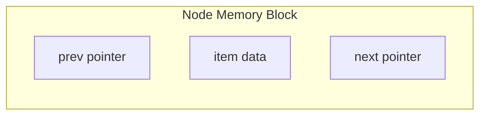
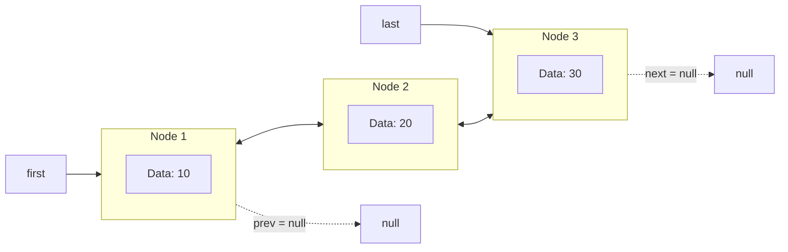
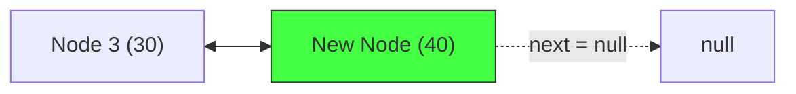
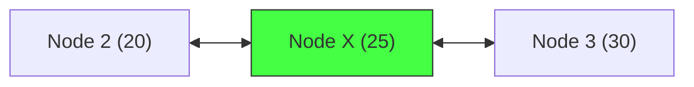
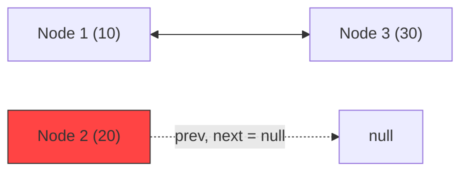

# LinkedList in Java: Internal Workings

## Introduction

Understanding how a `LinkedList` works internally is crucial for choosing the right collection type and writing performant Java code. While an `ArrayList` is backed by a single contiguous array, Java's `LinkedList` is implemented as a **Doubly Linked List** of independent nodes.

This guide explains the inner static `Node` class, pointer updates during insertions/deletions, and the Heap memory model of doubly linked structures.

---

## The Node Structure

Every element in a LinkedList is wrapped inside an instance of a private static helper class: **`Node<E>`**.

```java
// Conceptual definition inside java.util.LinkedList:
private static class Node<E> {
    E item;       // The actual data object reference
    Node<E> next; // Pointer reference to the next node in the list
    Node<E> prev; // Pointer reference to the previous node in the list

    Node(Node<E> prev, E element, Node<E> next) {
        this.item = element;
        this.next = next;
        this.prev = prev;
    }
}
```



---

## Doubly Linked List Representation

A `LinkedList` instance maintains three variables:
* `Node<E> first` (points to the first node, or `null` if empty)
* `Node<E> last` (points to the last node, or `null` if empty)
* `int size` (number of elements currently in the list)



---

## Pointer Updates: Adding Elements

### 1. Appending to the End (`add` or `addLast`):
When a new node `N` containing data `40` is added to a list containing three elements:
1. A new `Node` object is allocated on the heap.
2. The new node's `prev` pointer is set to the current `last` node (Node 3).
3. The current `last` node's `next` pointer is updated to point to the new node `N`.
4. The list's `last` pointer is updated to point to the new node `N`.



---

## Pointer Updates: Inserting in the Middle

Suppose we want to insert **Node X** (containing `25`) between **Node 2** (`20`) and **Node 3** (`30`):
1. **Node X** is instantiated on the heap.
2. **Node X**'s `prev` is set to Node 2, and its `next` is set to Node 3.
3. Node 2's `next` pointer is updated to point to **Node X**.
4. Node 3's `prev` pointer is updated to point to **Node X**.

No elements are shifted in memory; only the four reference variables are updated:



---

## Pointer Updates: Removing Elements

Suppose we want to remove **Node 2** (`20`) from the list:
1. Locate Node 2 via traversal.
2. Update Node 1's `next` pointer to point directly to Node 3.
3. Update Node 3's `prev` pointer to point directly to Node 1.
4. Set Node 2's `next`, `prev`, and `item` to `null` to facilitate garbage collection.



---

## Key Takeaways

* Java's `LinkedList` is implemented as a Doubly Linked List of `Node<E>` objects.
* Each node holds a reference to the previous node, the next node, and the actual data item.
* Reference variables `first` and `last` point to the head and tail nodes respectively.
* Adding/inserting elements does not trigger memory moves or copy shifts; only reference variables are swapped.

---

**Back to Module Home:** [Collection Framework Index](../README.md)
