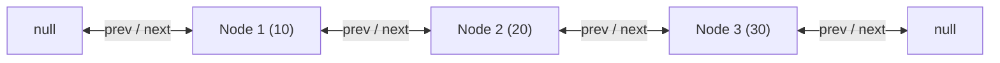
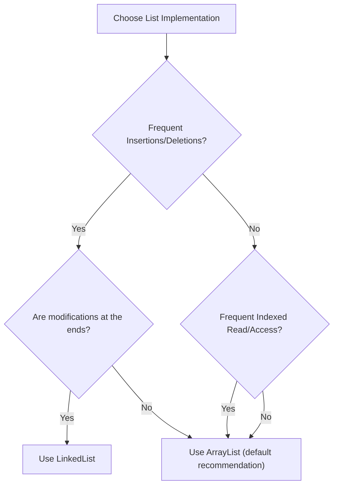

# ArrayList vs. LinkedList in Java

## Introduction

Both `ArrayList` and `LinkedList` implement the `List` interface in the Java Collection Framework. They both maintain insertion order, permit duplicates, accept `null` values, and allow index-based operations.

However, their underlying **internal structures, memory allocation schemes, and algorithmic complexities** are fundamentally different. Understanding these details is critical for writing high-performance code and answering common interview questions.

---

## 1. Structural Comparison

### ArrayList: Resizable Primitive Array
Stores data in a single, contiguous array block on the Heap.

```text
ArrayList Memory Layout (Contiguous):
+----+----+----+----+----+
| 10 | 20 | 30 | 40 | 50 |
+----+----+----+----+----+
```

### LinkedList: Doubly Linked List
Stores data in fragmented node blocks scattered across the Heap, linked via references.



---

## 2. Time Complexity Matrix

| Operation | `ArrayList` | `LinkedList` | Explanation |
| :--- | :--- | :--- | :--- |
| **`get(index)`** | ⚡ $\mathcal{O}(1)$ | 🐢 $\mathcal{O}(N)$ | Array has instant math offset address calculations; list must traverse node-by-node. |
| **`set(index, E)`** | ⚡ $\mathcal{O}(1)$ | 🐢 $\mathcal{O}(N)$ | Array has instant update; list must traverse to locate the target node first. |
| **`add(element)`** | $\mathcal{O}(1)$ (amortized) | ⚡ $\mathcal{O}(1)$ | Array may resize (1.5x copy cost); list simply appends node at the `last` pointer. |
| **`add(index, E)`** | 🐢 $\mathcal{O}(N)$ | 🐢 $\mathcal{O}(N)$ | Array shifts subsequent elements; list traverses to the index then swaps pointers. |
| **`remove(index)`** | 🐢 $\mathcal{O}(N)$ | 🐢 $\mathcal{O}(N)$ | Array shifts subsequent elements left; list traverses to the index then deletes node. |

---

## 3. Memory Overhead

* **ArrayList**: Low memory overhead. The memory footprint consists only of the elements stored plus a small amount of unused capacity slots at the end of the array.
* **LinkedList**: High memory overhead. For every element stored, the JVM allocates a `Node` wrapper containing two reference pointers (`next` and `prev`). This means storing a list of integers as a `LinkedList` consumes significantly more memory than an `ArrayList`.

---

## 4. Decision Flowchart



---

## Key Takeaways

* Use **`ArrayList`** as the default list choice unless you have a specific reason not to.
* Use **`LinkedList`** only when insertions and deletions at the head/tail are highly frequent, and index-based access is rare.
* LinkedList uses more memory due to pointer objects; ArrayList uses a contiguous chunk, which is cache-friendly.

---

**Back to Module Home:** [Collection Framework Index](../README.md)
