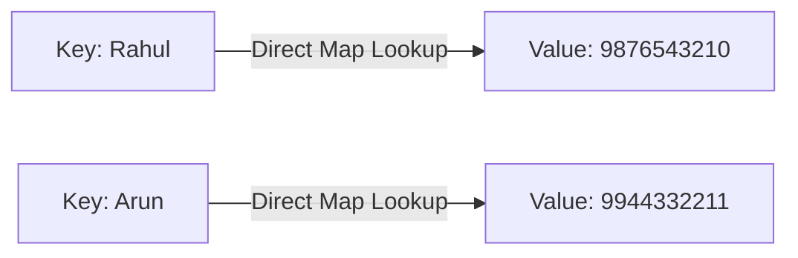

# HashMap in Java: Basics and Creation

## Introduction

In typical software systems, we regularly store and look up data using unique identifiers (keys)—such as finding account details using an account number, looking up a student's name using a student ID, or looking up product details using a SKU code.

While lists (`ArrayList` or `LinkedList`) store elements sequentially, searching for an element in a list requires traversing all elements, which runs in linear time ($\mathcal{O}(N)$).

To solve this lookup bottleneck, Java provides the **Map interface**, and its most widely used implementation: **`HashMap`**. A `HashMap` stores data in **Key-Value pairs** and provides near-instantaneous search, insertion, and deletion operations on average ($\mathcal{O}(1)$).

---

## Why Do We Need HashMap?

Consider a phone book. If we store phone numbers in an array or a list, searching for "Rahul" requires scanning entries sequentially:

```text
List Search (O(N) traversal):
[Rahul | 9876...] -> [Arun | 9944...] -> [Priya | 9812...] -> [Kavin | 9965...]
```

A `HashMap` indexes names as unique keys and maps them directly to their corresponding phone number value, locating the element immediately:



---

## HashMap Characteristics

* **Key-Value Storage**: Data is stored as key-value pairs (`Map.Entry<K, V>`).
* **Unique Keys**: Keys must be unique. If a duplicate key is added, the new value overrides the existing one.
* **Duplicate Values**: Values can be duplicated.
* **Allows Nulls**: Allows **one null key** and **multiple null values**.
* **Unordered**: Does not guarantee any specific order of keys (it uses a hashing algorithm that changes order when resized).
* **Non-Synchronized**: Not thread-safe.

---

## Syntax and Basic Creation

To use `HashMap`, import the class from `java.util`:
```java
import java.util.HashMap;
import java.util.Map;
```

Always declare map variables using the generic `Map` interface type for flexibility:
```java
Map<KeyType, ValueType> mapName = new HashMap<>();
```

### Example: Creating a HashMap:
```java
import java.util.HashMap;
import java.util.Map;

public class Main {
    public static void main(String[] args) {
        // Creating a Map of Student ID (Integer) to Student Name (String)
        Map<Integer, String> students = new HashMap<>();
        
        System.out.println(students); // Output: {}
    }
}
```

---

## HashMap Constructors

The `HashMap` class provides four constructors:

1. **Default Constructor**: Creates an empty map with an initial capacity of 16 and a load factor of 0.75.
   ```java
   Map<String, String> map = new HashMap<>();
   ```
2. **Initial Capacity Constructor**: Creates a map with a specific initial capacity.
   ```java
   Map<String, String> map = new HashMap__(32);
   ```
3. **Capacity & Load Factor Constructor**: Sets custom initial capacity and load factor.
   ```java
   Map<String, String> map = new HashMap__(32, 0.8f);
   ```
4. **Copy Constructor**: Initializes the map with key-value entries from another map.
   ```java
   Map<String, String> map = new HashMap__(oldMap);
   ```

---

## Key Takeaways

* `HashMap` implements the `Map` interface and stores data as key-value pairs.
* Keys must be unique; duplicate keys overwrite previous values.
* Allows one `null` key and multiple `null` values.
* It does not maintain any insertion or sorted ordering of keys.

---

**Back to Maps Home:** [Map Index](../README.md)
