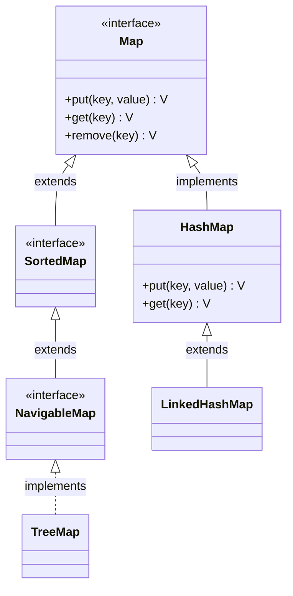

# Introduction to HashMap in Java

## Overview

In software development, we frequently need to store and retrieve data based on unique identifiers (keys)—such as matching user profiles with usernames, grades with student IDs, or shopping carts with session IDs.

The **Java Collection Framework (JCF)** provides the `Map` interface to represent this key-value association, and its most widely used implementation is **`HashMap`**. A `HashMap` stores data in **Key-Value pairs** (as `Map.Entry<K, V>` instances) and provides fast search, insertion, and deletion operations.

---

## The Map Interface Hierarchy

The `Map` interface is independent of the `Collection` root interface, but is a core member of the Java Collections Framework:

---

## HashMap Characteristics

* **Key-Value Storage**: Maps keys to values. Each key is associated with exactly one value.
* **Unique Keys**: Keys must be unique. Inserting a duplicate key replaces the existing value and returns the old value.
* **Duplicate Values**: Values can be duplicated across different keys.
* **Allows Nulls**: Permits **exactly one null key** and **multiple null values**.
* **Unordered**: Does not guarantee any specific iteration order of keys (and the order can change when the map is resized).
* **Non-Synchronized**: It is not thread-safe. For concurrent environments, use `ConcurrentHashMap`.

---

## Key Takeaways

* `HashMap` is a hash-table-based implementation of the `Map` interface.
* Keys act as unique lookup identifiers mapping to a target data object.
* It does not maintain any insertion or sorted order.

---

**Back to HashMap Home:** [HashMap Index](README.md)
