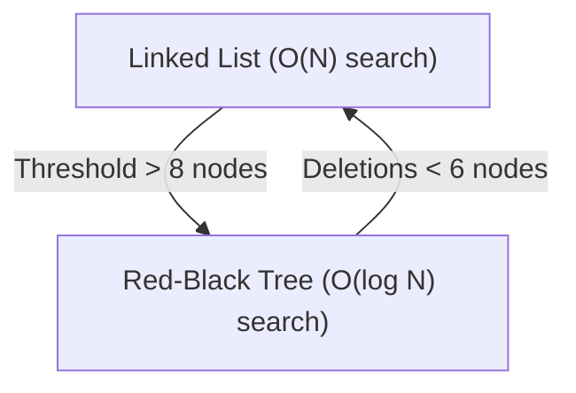

# HashMap in Java: Internal Workings

## Introduction

Understanding the internal workings of `HashMap` is one of the most popular topics in Java interviews. Developers frequently write `put()` and `get()` calls without knowing how the JVM manages buckets, hashing, and hash collisions under the hood.

This guide details the internal data structures, hashing calculations, load factors, and JDK 8 Red-Black Tree threshold optimizations.

---

## The Internal Data Structure

Internally, a HashMap uses an array of Nodes:
```java
transient Node<K,V>[] table;
```

Each element in this table array is a **bucket**. A bucket is either empty (`null`) or points to the head node of a Singly Linked List (or a Red-Black Tree in Java 8+).

```mermaid
graph TD
    subgraph Bucket Array (elementData table)
        Bucket0["[0]: Node Link"]
        Bucket1["[1]: null"]
        Bucket2["[2]: Node Link"]
        Bucket3["[3]: null"]
    end
    
    NodeA["Node A (Key: Rahul)"]
    NodeB["Node B (Key: Arun)"]
    NodeC["Node C (Key: Priya)"]
    
    Bucket0 --> NodeA
    NodeA --> NodeB
    Bucket2 --> NodeC
```

### The Node Class Fields:
```java
static class Node<K,V> implements Map.Entry<K,V> {
    final int hash; // Inlined hash value of the key
    final K key;    // The unique key
    V value;        // The mapped value
    Node<K,V> next; // Pointer reference to the next node in the collision link
}
```

---

## Step-by-Step Execution of `put(K key, V value)`

When you call `map.put("Rahul", "9876543210")`, the JVM executes the following stages:

### Step 1: Calculate Hash Code
It calls the key's `hashCode()` method and applies a perturbation hash function to distribute the bits evenly (reducing collisions):
```java
static final int hash(Object key) {
    int h;
    return (key == null) ? 0 : (h = key.hashCode()) ^ (h >>> 16);
}
```

### Step 2: Calculate Bucket Index
It calculates the exact array bucket index using a bitwise AND operation (which is much faster than modulo division `%`):
$$\text{Index} = \text{hash} \ \& \ (n - 1)$$
*(where $n$ is the current table array capacity, always a power of 2, like 16).*

### Step 3: Handle Collisions
* **No Collision**: If `table[index]` is `null`, a new `Node` object is created and inserted directly in that array slot.
* **Hash Collision**: If two different keys produce the same bucket index, it is a collision.
  1. The JVM traverses the linked list at that bucket, comparing keys using `equals()`.
  2. If a matching key is found, the value is overridden.
  3. If no matching key exists, the new node is appended to the list.

---

## Java 8 Optimization: Treeifying Buckets

Historically, if many keys collided in the same bucket, the linked list would grow long. This degraded lookup speed from $\mathcal{O}(1)$ to $\mathcal{O}(N)$ linear time.

In **Java 8**, the compiler optimizes this:
* If the number of nodes in a single bucket exceeds the **Treeify Threshold (8)**, AND the total table capacity is at least **64**, the linked list is converted (treeified) into a balanced **Red-Black Tree**.
* This changes lookup complexity in that bucket from linear $\mathcal{O}(N)$ to logarithmic **$\mathcal{O}(\log N)$**.
* If deletions shrink the bucket size back down to **6**, the tree is converted back into a standard linked list.



---

## Load Factor and Rehashing

* **Initial Capacity**: Default is 16.
* **Load Factor**: Default is 0.75 (75%).
* **Threshold**: $\text{Capacity} \times \text{Load Factor} = 16 \times 0.75 = 12$.

When the map size exceeds the threshold (e.g. 12 entries), the list doubles its capacity ($16 \rightarrow 32$) and rehashing occurs: **every single key's bucket index is recalculated** using the new capacity ($n-1$) and moved to its new bucket.

---

## Key Takeaways

* `HashMap` uses an array of Singly Linked List nodes internally.
* Index calculation uses bitwise `hash & (n-1)`.
* In Java 8, lists are treeified into Red-Black Trees if a bucket exceeds **8 nodes** and total capacity is at least **64**.
* Resizing doubles the bucket capacity and triggers rehashing for all elements.
* `HashMap` lookup runs in $\mathcal{O}(1)$ time on average, degrading to $\mathcal{O}(\log N)$ or $\mathcal{O}(N)$ under extreme collision rates.

---

**Back to Maps Home:** [Map Index](../README.md)
