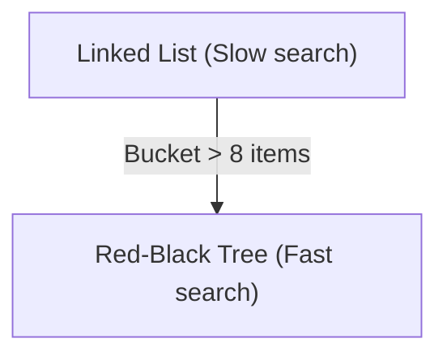

# Internal Working of HashMap

## Introduction

Under the hood, a `HashMap` stores elements in an internal array of **buckets**. Each bucket is either empty, points to a single node, or points to a chain of nodes.

---

## 1. What is Hashing and HashCode?

Every object in Java inherits a method called **`hashCode()`**. 

Think of a **HashCode** as a digital fingerprint: it is a unique integer value calculated from the object's contents.

When you add a key-value entry:
1. The map calls `key.hashCode()` to get the key's fingerprint.
2. It uses this fingerprint to calculate a **bucket index** in the internal array.
3. The entry is placed inside that bucket index slot.

```text
Key Object ──> hashCode() ──> Bucket Index ──> Stored in Array Slot
```

---

## 2. Hash Collisions

Sometimes, two completely different keys calculate to the **exact same bucket index**. This is called a **Hash Collision**.

To handle collisions, HashMap uses **Chaining**:
* Multiple entries are linked together at that bucket index in a Singly Linked List:

```text
Array Slot [0] ──> [Key: Rahul | Val: 21] ──> [Key: Amit | Val: 25] (Linked list chain)
```

---

## 3. Java 8 Optimization: Treeifying

If a linked list chain at a single bucket grows too long, searching through it becomes slow ($\mathcal{O}(N)$).

In **Java 8**, if a bucket size exceeds **8 elements**, Java automatically converts the linked list into a **Red-Black Tree**. This keeps lookups fast even under high collision rates ($\mathcal{O}(\log N)$ complexity).



---

**Back to HashMap Home:** [HashMap Index](README.md)
