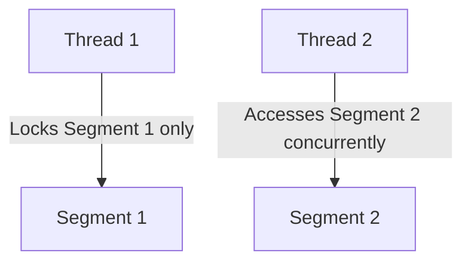

# HashMap vs. Hashtable

## Introduction

Both `HashMap` and `Hashtable` store data in key-value pairs, but they represent different generations of Java collections.

---

## Comparison Table

| Feature | `HashMap` | `Hashtable` |
| :--- | :--- | :--- |
| **Thread Safety** | ❌ No (Not synchronized) | ✅ Yes (Synchronized methods) |
| **Null Key/Value** | ✅ Yes (Allowed) | ❌ No (Throws `NullPointerException`) |
| **Performance** | ⚡ Fast (No synchronization locks) | 🐢 Slow (Object locking overhead) |
| **Iterator Type** | Fail-Fast | Fail-Safe (Enumeration) |
| **Introduction** | Java 1.2 | Legacy class (Java 1.0) |

---

## The Thread-Safety Bottleneck

`Hashtable` synchronizes by locking the **entire map object** on every call. This means only one thread can access the map at a time, creating a severe performance bottleneck.

### The Modern Solution: `ConcurrentHashMap`
For modern concurrent applications, use **`ConcurrentHashMap`** (from `java.util.concurrent`) instead of `Hashtable`. It uses segment-level locking (lock stripping) to allow multiple threads to read and write concurrently:

---

**Back to HashMap Home:** [HashMap Index](README.md)
