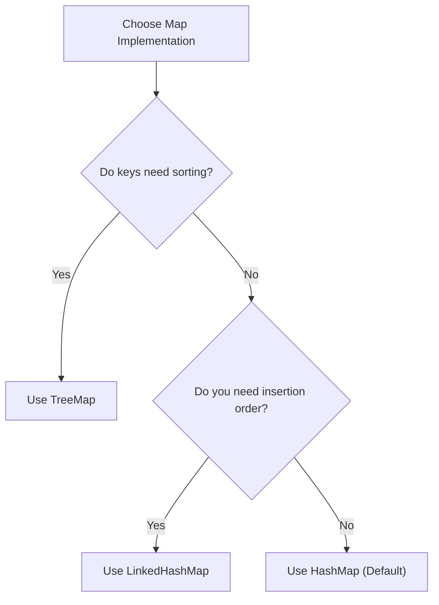

# HashMap vs. LinkedHashMap vs. TreeMap

## Introduction

Java provides three primary implementations of the `Map` interface. Choosing the right one depends on whether you need ordering.

---

## Comparison Table

| Feature | `HashMap` | `LinkedHashMap` | `TreeMap` |
| :--- | :--- | :--- | :--- |
| **Internal Model** | Hashing buckets | Hash buckets + Linked list | Red-Black Tree |
| **Ordering** | ❌ None (Unordered) | ✅ Insertion / Access Order | ✅ Sorted Keys |
| **Null Key Allowed?**| ✅ Yes (One key) | ✅ Yes (One key) | ❌ No (Throws NPE) |
| **Search Time** | ⚡ `O(1)` average | ⚡ `O(1)` average | 🐢 `O(log N)` guaranteed |
| **Memory Footprint** | Low | Medium | High (Stores tree pointers) |

---

## Decision Flowchart

---

**Back to HashMap Home:** [HashMap Index](README.md)
