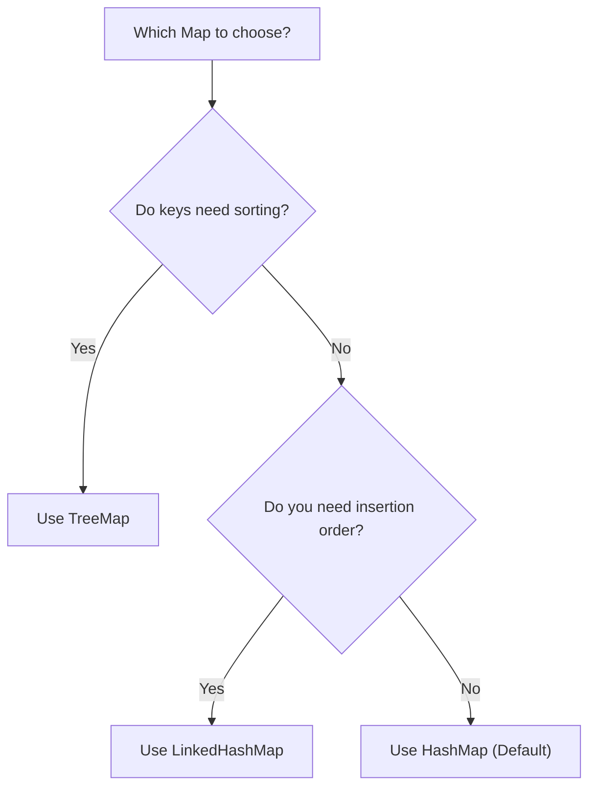

# HashMap vs. LinkedHashMap vs. TreeMap

## Introduction

Java provides three primary implementations of the `Map` interface. Choosing the right one depends on whether you need ordering.

---

## Comparison Table

| Feature | `HashMap` | `LinkedHashMap` | `TreeMap` |
| :--- | :--- | :--- | :--- |
| **Internal Model** | Hashing buckets | Hash buckets + Linked list | Red-Black Tree |
| **Ordering** | ❌ Unordered | ✅ Insertion Order | ✅ Sorted Keys |
| **Null Keys** | ✅ Allowed (One) | ✅ Allowed (One) | ❌ Not Allowed (Throws NPE) |
| **Search Time** | ⚡ $\mathcal{O}(1)$ average | ⚡ $\mathcal{O}(1)$ average | 🐢 $\mathcal{O}(\log N)$ |

---

## Quick Choice Guide

---

**Back to HashMap Home:** [HashMap Index](README.md)
