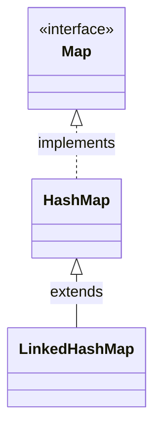

# Introduction to LinkedHashMap in Java

## Overview

While `HashMap` offers fast operations (`O(1)` on average), it is completely unordered. In many applications, preserving the order of entries is required.

To solve this, Java provides **`LinkedHashMap`**. A `LinkedHashMap` extends `HashMap` and implements the `Map` interface, maintaining a doubly linked list running through all its entries. This allows you to iterate through the map in the exact order elements were inserted.

---

## Class Inheritance Hierarchy

---

## LinkedHashMap Characteristics

* **Ordered**: Maintains a doubly linked list running through its elements, preserving either **insertion order** or **access order**.
* **HashMap Performance**: Retains fast lookup, insertion, and deletion speeds (`O(1)`).
* **Null Support**: Permits one null key and multiple null values.
* **Memory Footprint**: Slightly higher memory overhead than a standard `HashMap` because each entry contains extra pointers (`before` and `after`) to maintain the list links.

---

**Back to LinkedHashMap Home:** [LinkedHashMap Index](README.md)
