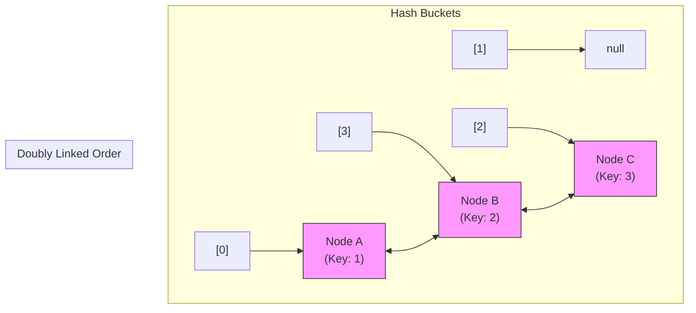

# LinkedHashMap: Internal Workings and Comparison

## Introduction

While `LinkedHashMap` behaves exactly like a `HashMap` at the API layer, its internal memory architecture contains double-pointer extensions. This guide details how the JVM links nodes across buckets, how access ordering operates, and when to use `LinkedHashMap` over a standard `HashMap`.

---

## The Internal Entry Structure

Internally, `LinkedHashMap` defines a static inner subclass of Node: **`Entry<K, V>`**:

```java
// Conceptual definition inside java.util.LinkedHashMap:
static class Entry<K,V> extends HashMap.Node<K,V> {
    Entry<K,V> before, after; // Pointers maintaining the doubly linked list

    Entry(int hash, K key, V value, Node<K,V> next) {
        super(hash, key, value, next);
    }
}
```

Every entry node is simultaneously placed inside a bucket index (for fast hashing lookup) and linked to `before` and `after` entries (for fast insertion/access ordering traversal):



---

## Implementing an LRU Cache with `LinkedHashMap`

A major feature of `LinkedHashMap` is its built-in hook for implementing **LRU (Least Recently Used) Caching**:

```java
protected boolean removeEldestEntry(Map.Entry<K,V> eldest)
```

The default implementation of this method returns `false` (meaning the map grows indefinitely). By overriding it, you can direct the map to discard the oldest elements automatically when a capacity limit is exceeded:

```java
import java.util.LinkedHashMap;
import java.util.Map;

class LRUCache<K, V> extends LinkedHashMap<K, V> {
    private final int capacity;

    public LRUCache(int capacity) {
        // Must enable accessOrder=true for LRU behavior
        super(capacity, 0.75f, true);
        this.capacity = capacity;
    }

    @Override
    protected boolean removeEldestEntry(Map.Entry<K, V> eldest) {
        // If current size exceeds limits, remove oldest entry (head)
        return size() > capacity;
    }
}

public class Main {
    public static void main(String[] args) {
        LRUCache<String, Integer> cache = new LRUCache<>(3);
        cache.put("One", 1);
        cache.put("Two", 2);
        cache.put("Three", 3);
        
        System.out.println(cache); // {One=1, Two=2, Three=3}

        cache.get("One"); // Access "One" - moves it to tail
        cache.put("Four", 4); // Exceeds capacity 3 -> Triggers removal of "Two" (oldest)

        System.out.println(cache); // Output: {Three=3, One=1, Four=4}
    }
}
```

---

## HashMap vs. LinkedHashMap Comparison

| Feature | `HashMap` | `LinkedHashMap` |
| :--- | :--- | :--- |
| **Ordering** | ❌ Unordered | ✅ Insertion / Access Order |
| **Memory Overhead** | Low (Only Entry nodes) | Higher (Needs `before` & `after` pointers per Entry) |
| **Iteration Speed** | Iterates through total bucket capacity | Iterates through doubly linked list nodes directly |
| **Use Cases** | Default map, high-speed lookup | Caching (LRU), ordered catalogs |

---

## Key Takeaways

* `LinkedHashMap.Entry` extends `HashMap.Node` by adding `before` and `after` pointers.
* Memory consumption is higher due to storing two extra references per entry node.
* Override `removeEldestEntry` in subclass definitions to build fully functional **LRU caches** easily.

---

**Back to Maps Home:** [Map Index](../README.md)
