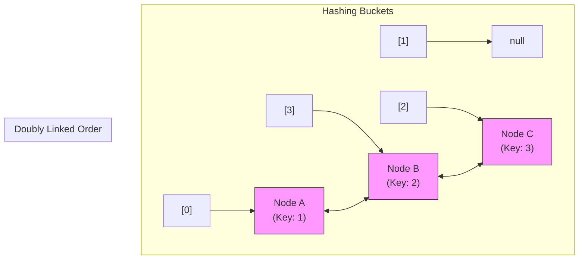

# Internal Working of LinkedHashMap

## The Hybrid Architecture

Under the hood, `LinkedHashMap` extends `HashMap` by overlaying a **doubly linked list** on top of the standard hash table bucket array.

Instead of standard `HashMap.Node` objects, the map instantiates **`LinkedHashMap.Entry`** nodes:

```java
// Conceptual entry definition inside LinkedHashMap:
static class Entry<K,V> extends HashMap.Node<K,V> {
    Entry<K,V> before, after; // Pointers maintaining iteration order

    Entry(int hash, K key, V value, Node<K,V> next) {
        super(hash, key, value, next);
    }
}
```



Each node is stored in a bucket index (for `O(1)` hashing lookups) and maintains references to the previous and next elements (for order preservation).

---

## LRU Caching Hooks

`LinkedHashMap` provides a built-in eviction hook for building **LRU (Least Recently Used) Caches**:

```java
protected boolean removeEldestEntry(Map.Entry<K,V> eldest)
```

By default, this method returns `false`. You can override it to remove the eldest entry (the head of the doubly linked list) when the map exceeds a maximum capacity:

```java
import java.util.LinkedHashMap;
import java.util.Map;

class LRUCache<K, V> extends LinkedHashMap<K, V> {
    private final int capacity;

    public LRUCache(int capacity) {
        super(capacity, 0.75f, true); // true sets accessOrder mode
        this.capacity = capacity;
    }

    @Override
    protected boolean removeEldestEntry(Map.Entry<K, V> eldest) {
        return size() > capacity; // Evict eldest entry when capacity is exceeded
    }
}
```

---

**Back to LinkedHashMap Home:** [LinkedHashMap Index](README.md)
