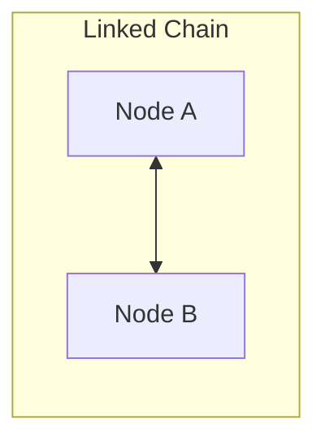

# Internal Working of LinkedHashMap

## The Hybrid Structure

Under the hood, `LinkedHashMap` is a **hybrid data structure**:
1. It maintains a standard `HashMap` hash table bucket array for indexing.
2. It adds two extra pointers, `before` and `after`, to every Entry node object.

This creates a **Doubly Linked List** running through all the map entries, independent of their bucket slots:

```text
Bucket [0] ──> Node A (before=null, after=Node B)
Bucket [1] ──> null
Bucket [2] ──> Node B (before=Node A, after=null)
```



---

## Memory Overhead

Because every Node must store a `before` and `after` pointer reference, a `LinkedHashMap` consumes more heap memory than a standard `HashMap`.

---

## LRU Caching Mechanics

When access-ordering mode is enabled, calling `get()` or `put()` triggers a pointer swap: the node is detached from its current place in the doubly linked list and re-attached at the end of the list.

---

**Back to LinkedHashMap Home:** [LinkedHashMap Index](README.md)
