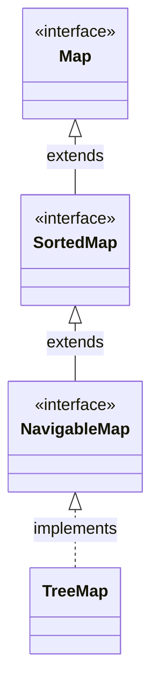

# Introduction to TreeMap in Java

## Overview

A `TreeMap` is a sorted implementation of the `Map` interface in Java. 

Unlike `HashMap` (unordered) and `LinkedHashMap` (insertion order), `TreeMap` maintains its keys in **sorted order**. By default, it sorts keys according to their natural ordering (e.g. numerical or alphabetical), or by a custom `Comparator` provided at creation time.

---

## Class Inheritance Hierarchy

---

## TreeMap Invariants

* **Key Sorting**: Keys are automatically sorted during insertion.
* **Guaranteed Complexity**: backed by a Red-Black Tree, it guarantees logarithmic **`O(log N)`** time complexity for `get()`, `put()`, and `remove()`.
* **No Null Keys**: **Does not allow null keys** (throws `NullPointerException` because it must compare keys to sort them).

---

**Back to TreeMap Home:** [TreeMap Index](README.md)
