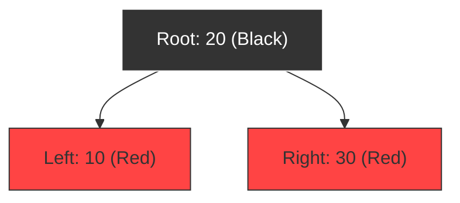

# TreeMap: Internal Workings and Comparison

## Introduction

Unlike `HashMap` and `LinkedHashMap`, which use hashing bucket tables, `TreeMap` uses a tree structure. This guide explains the internal implementation of `TreeMap` as a **Red-Black Tree** (a self-balancing binary search tree), details balancing properties, and contrasts the three Map implementations.

---

## What is a Red-Black Tree?

A **Red-Black Tree** is a type of self-balancing binary search tree (BST). Each node in the tree stores a color attribute (either **Red** or **Black**). 

The tree maintains balance through color rules and node rotations, ensuring that no search path from the root to a leaf node is more than twice as long as any other path.



---

## Core Red-Black Tree Rules

To guarantee logarithmic $\mathcal{O}(\log N)$ lookup and insertion speeds, the Red-Black Tree enforces five strict invariants:

1. **Node Color**: Every node is colored either red or black.
2. **Root Rule**: The root node is always black.
3. **Nil Rule**: Every leaf node (represented as `NIL` or empty nodes) is black.
4. **Red Parent Rule**: A red node cannot have a red child (red nodes cannot be adjacent).
5. **Black Height Rule**: Every path from a node to any of its descendant NIL leaves must contain the exact same number of black nodes.

---

## Balancing: Rotations and Color Flips

When a new key is added, it is initially colored **red** and placed using standard binary search tree rules. If this insertion violates any Red-Black invariants, the tree rebalances itself using two operations:

### 1. Color Flips:
Recoloring parent/uncle nodes to satisfy color rules.

### 2. Node Rotations:
Rotating nodes left or right to re-align depth paths.

```text
Left Rotation Example:
    A (Parent)                  B
     \                         / \
      B (Child)      --->     A   C
       \
        C
```

---

## HashMap vs. LinkedHashMap vs. TreeMap Comparison

| Feature | `HashMap` | `LinkedHashMap` | `TreeMap` |
| :--- | :--- | :--- | :--- |
| **Internal Data Model** | Array + Bucket Links | Array + Linked Nodes | Red-Black Tree |
| **Time Complexity** | ⚡ $\mathcal{O}(1)$ average | ⚡ $\mathcal{O}(1)$ average | 🐢 $\mathcal{O}(\log N)$ guaranteed |
| **Key Ordering** | Unordered | Insertion / Access Order | Sorted (Comparable/Comparator) |
| **Null Key Allowed?** | ✅ Yes (One key) | ✅ Yes (One key) | ❌ No (Throws `NullPointerException`) |
| **Memory Footprint** | Low | Medium | High (Stores tree pointers) |

---

## Key Takeaways

* `TreeMap` is backed by a balanced Red-Black Binary Search Tree.
* The tree balances itself dynamically using color flips and rotations.
* Lookup, insertion, and deletion are guaranteed to run in $\mathcal{O}(\log N)$ logarithmic time.
* Never use custom objects as keys in a `TreeMap` unless they implement `Comparable` or you provide a custom `Comparator` to avoid throwing a `ClassCastException`.

---

**Back to Maps Home:** [Map Index](../README.md)
